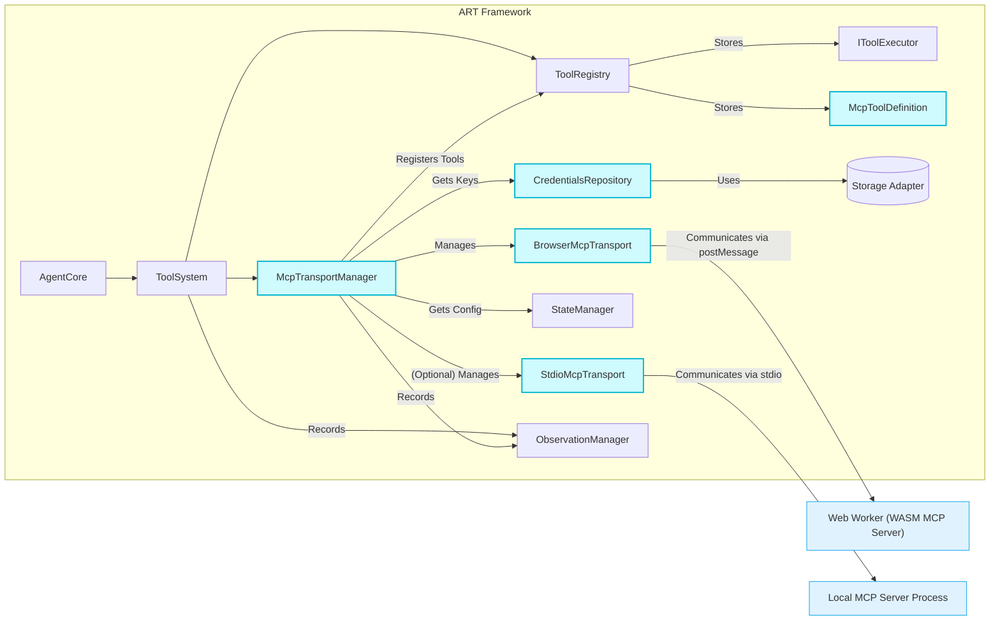

# ART Framework: MCP Integration Strategy (WASM-Focused)

**Version:** 1.0
**Date:** 2025-04-05

## 1. Intent & Goals

*   **Intent:** Integrate support for the Model Context Protocol (MCP) into the Agent Runtime (ART) framework. The primary focus is enabling ART agents running entirely client-side (in the browser) to utilize external tools provided by MCP servers compiled to WebAssembly (WASM) and executed within Web Workers.
*   **Goals:**
    *   Allow ART agents to discover and execute tools defined by MCP servers.
    *   Prioritize seamless integration with existing ART subsystems (`ToolSystem`, `ToolRegistry`, `StateManager`, `StorageSystem`, `ObservationSystem`, `UISystem`).
    *   Provide a secure mechanism for managing configuration and credentials (like API keys) required by MCP servers, suitable for a client-side environment.
    *   Offer a straightforward developer and end-user experience for adding, configuring, and enabling MCP servers/tools within ART applications.
    *   Maintain ART's modularity and browser-first design principles.

## 2. Final Revised Strategy

This strategy incorporates feedback regarding WASM focus, `ToolRegistry` modification, API key storage, and Web Worker lifecycle management.

1.  **MCP Tool Representation & Registration:**
    *   MCP tools will **not** implement `IToolExecutor`.
    *   The `ToolRegistry` will be modified internally to store a union type keyed by `toolName`: `IToolExecutor | McpToolDefinition`.
        *   `IToolExecutor`: Represents native ART tools.
        *   `McpToolDefinition`: A new interface holding the `ToolSchema` fetched from the MCP server and necessary metadata (e.g., `mcpServerName` it belongs to).
    *   This avoids extending core interfaces while allowing the registry to manage both tool types.

2.  **Execution Flow:**
    *   The `ToolSystem` will use a type guard (e.g., checking for `execute` method vs. `mcpServerName` property) on the object retrieved from `ToolRegistry`.
        *   If `IToolExecutor`, execute natively.
        *   If `McpToolDefinition`, delegate the `ParsedToolCall` and context (`threadId`, `traceId`, `callId`) to the `McpTransportManager`.

3.  **`McpTransportManager` (New Component):**
    *   **Purpose:** Manages connections, communication, and lifecycle for all configured MCP servers.
    *   **Responsibilities:**
        *   Maintain an internal registry of configured MCP servers (`McpServerConfig`) and their active `Transport` instances (including Web Workers for WASM).
        *   Handle requests from `ToolSystem`, routing them to the correct server via the appropriate `Transport`.
        *   Manage `Transport` and associated Web Worker lifecycle (instantiation, communication channel setup, termination) based on configuration and framework events.
        *   Format MCP responses/errors into standard ART `ToolResult` objects.
        *   Retrieve necessary credentials (e.g., API keys) via the `CredentialsRepository`.
        *   Record relevant events (`TOOL_EXECUTION`, connection status/errors) via `ObservationManager`.

4.  **`Transport` Implementations & Environmental Constraints:**
    *   Implement concrete classes adhering to the MCP SDK's `Transport` interface.
    *   **`BrowserMcpTransport` (Primary Focus):** Handles communication between the main ART browser thread and a WASM-based MCP server running in a Web Worker using browser mechanisms (`postMessage`, `MessageChannel`). **This enables the core goal of running MCP tools entirely client-side.**
    *   **`StdioMcpTransport` (Secondary - Developer/Node.js Context):** Communicates with local MCP servers running as child processes via stdio. **Can only function when ART itself runs within a Node.js environment.** Will be treated as an optional feature.
    *   **`HttpMcpTransport` (Future Flexibility):** For remote MCP servers.

5.  **Configuration & Security (API Keys):**
    *   **`McpServerConfig`:** Define structure including `name`, `type: 'wasm' | 'stdio' | 'http'`, `connectionDetails: { workerUrl?, command?, args?, url? }`, `requiresApiKey: boolean`. The `workerUrl` is crucial for `wasm` type.
    *   **Storage:** Store `McpServerConfig` instances (globally or per-thread via `StateManager`).
    *   **API Keys:** Use ART's **Storage System**. Introduce a `CredentialsRepository` (using the configured `StorageAdapter`, likely `IndexedDBStorageAdapter` for browsers) to securely store and retrieve API keys associated with specific MCP servers or `threadId`s. The `McpTransportManager` will use this repository.

6.  **Developer/User Experience (Tool Addition & Registry):**
    *   **ART-Managed Registry (Optional):** An external list (e.g., JSON) of known MCP servers (like a hypothetical WASM Tavily), including their `McpServerConfig` templates (specifying `type: 'wasm'`, `workerUrl`, `requiresApiKey: true`, etc.).
    *   **Framework API:** `art.mcp.addServer(config: McpServerConfig)`:
        *   Interacts with `McpTransportManager`.
        *   Handles connection based on `config.type` (instantiating Worker for `wasm`, spawning process for `stdio` *if in Node.js*, etc.). Throws errors for unsupported types in the current environment (e.g., `stdio` in browser).
        *   Fetches server's tool definitions asynchronously.
        *   Registers tools (`McpToolDefinition`) with `ToolRegistry` upon successful connection and schema retrieval.
        *   Coordinates API key input/storage via `CredentialsRepository` if `config.requiresApiKey` is true.
    *   **UI Integration:** Applications can display the registry, allow manual configuration, call `art.mcp.addServer`, and use sockets (`ObservationSocket`, potentially a new `McpStatusSocket`) for feedback (connection status, key prompts, errors). UI should clearly indicate environmental limitations (e.g., greying out `stdio` servers in a browser context).
    *   **Tool Enablement:** Use existing `ThreadConfig.enabledTools` via `StateManager`.

7.  **Integration with ART:**
    *   Leverage `Storage System` (Credentials), `StateManager` (Config/Enablement), `Observation System` (Logging), `UI System` (Feedback) to provide a cohesive experience. ART does **not** adapt/compile Node.js servers to WASM; it connects to pre-existing WASM servers.

## 3. Architecture Overview

## 4. Potential Challenges

1.  **WASM Execution Environment:** Managing Web Worker lifecycle (instantiation from URL, communication via `MessageChannel`, termination, error handling) reliably within `McpTransportManager` / `BrowserMcpTransport`. Ensuring errors within the worker propagate correctly.
2.  **API Key Security (Client-Side):** Securely storing keys using `IndexedDB` via `CredentialsRepository` is feasible but inherently less secure than server-side handling. Requires careful implementation and user awareness.
3.  **Stdio Server Management (Node.js Context):** If supporting `StdioMcpTransport`, reliably managing child processes (startup, shutdown, error handling, resource cleanup) is complex.
4.  **Dynamic Tool Registration:** Handling the asynchronous nature of fetching schemas upon connection. Tools might not be immediately available in `ToolRegistry`.
5.  **Configuration Complexity:** Managing different server types (`wasm`, `stdio`, `http`) and their specific connection details (`workerUrl`, `command`, etc.).
6.  **User Experience for Limitations:** Clearly communicating environmental constraints (e.g., `stdio` servers unusable in browsers) in the UI and framework APIs.
7.  **WASM Server Availability:** The success relies on the existence of MCP servers compiled/adapted for WASM. The adaptation process itself is outside ART's scope.
8.  **Dependency Management (WASM):** Ensuring WASM binaries/worker scripts are correctly located and loaded by the application using ART.
