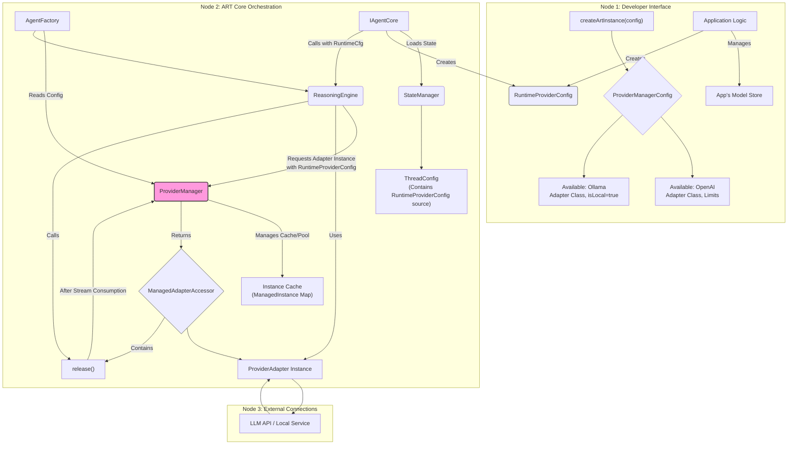

## Product Requirements Document: ART Multi-Provider Architecture


**1. Introduction**

*   **1.1. Purpose:** This document outlines the requirements for enhancing the ART framework to support the dynamic selection and use of multiple Large Language Model (LLM) providers within a single ART instance at runtime. This moves ART from a single-provider-per-instance model to a flexible, multi-provider architecture.
*   **1.2. Goals:**
    *   Allow developers to configure an ART instance with a set of *available* LLM provider adapters (built-in or custom).
    *   Enable the selection of a specific provider, model, and associated configuration *at runtime* for each `agent.process()` call, driven by application logic (e.g., user selection stored in `ThreadConfig`).
    *   Introduce a central `ProviderManager` component to manage the lifecycle (instantiation, caching/pooling, destruction) of `ProviderAdapter` instances based on configurable rules.
    *   Implement robust instance management, including concurrency limits for API-based providers and strict singleton enforcement for local providers.
    *   Maintain the decoupling and modularity principles of ART.
*   **1.3. Scope:**
    *   **In Scope:**
        *   Modifications to ART core components (`AgentFactory`, `ReasoningEngine`, `IAgentCore` implementations).
        *   Introduction of new core components (`ProviderManager`).
        *   Definition of new configuration structures (`ProviderManagerConfig`, `RuntimeProviderConfig`).
        *   Updates to relevant interfaces (`CallOptions`, `IProviderManager`).
        *   Implementation of instance management logic (pooling, singleton, idle timeout, queueing).
        *   Updating documentation to reflect the new architecture.
    *   **Out of Scope:**
        *   Implementation of specific UI components for provider/model selection within example applications.
        *   The mechanism by which the consuming application stores and retrieves model lists or constructs the `RuntimeProviderConfig` (e.g., application database, JSON files). ART only defines the *structure* it expects.
        *   Adding new specific `ProviderAdapter` implementations beyond modifying existing ones if needed for testing.
        *   Fundamental changes to the `ProviderAdapter` interface itself (though its lifecycle is now managed differently).

**2. Current State & Problem Statement**

Currently, ART requires the developer to choose and configure a single LLM provider (`ReasoningConfig`) when initializing the ART instance via `createArtInstance`. This locks the entire instance to that specific provider (e.g., OpenAI). This is restrictive for applications wanting to:

*   Offer users a choice of different LLMs (e.g., GPT-4, Claude 3, Llama 3).
*   Dynamically switch models based on task requirements (e.g., using a cheaper model for simple tasks, a powerful one for complex reasoning).
*   Utilize local models (like Ollama) alongside API-based models within the same application session.

The current architecture necessitates creating multiple ART instances to handle different providers, which is inefficient and complex to manage.

**3. Proposed Solution**

We will introduce a new central component, the `ProviderManager`, responsible for managing access to multiple `ProviderAdapter` implementations.

*   **Initialization:** `createArtInstance` will be configured with a `ProviderManagerConfig` listing *available* provider adapter classes and global management rules (concurrency limits, idle timeouts). No adapters are instantiated at this stage.
*   **Runtime Selection:** During an `agent.process()` call, the `IAgentCore` implementation will determine the desired provider, model, and specific configuration (`RuntimeProviderConfig`) based on application state (e.g., `ThreadConfig`, `AgentProps`).
*   **On-Demand Instantiation:** The `IAgentCore` passes the `RuntimeProviderConfig` within `CallOptions` to the `ReasoningEngine`.
*   **Managed Access:** The `ReasoningEngine` requests a ready-to-use adapter instance from the `ProviderManager`, providing the `RuntimeProviderConfig`.
*   **`ProviderManager` Logic:** The `ProviderManager` checks its cache/pool, respects concurrency/singleton rules, potentially queues requests, and either returns an existing suitable instance or creates a new one. It returns a `ManagedAdapterAccessor` which includes the adapter and a `release` function.
*   **Execution & Release:** The `ReasoningEngine` uses the provided adapter instance. A wrapper mechanism ensures the instance's `release()` method (provided by the accessor) is called *after* the LLM call (and stream consumption) is fully completed or errors out, making the instance available for reuse or eviction according to the rules.

**4. Detailed Requirements**

*   **4.1. Configuration Changes:**
    *   `AgentFactoryConfig`: Replace `reasoning: ReasoningConfig` with `providers: ProviderManagerConfig`.
    *   Define `ProviderManagerConfig` interface (see Section 6).
    *   Define `AvailableProviderEntry` interface (see Section 6).
    *   Define `RuntimeProviderConfig` interface (see Section 6).
    *   Modify `CallOptions` interface: Add `providerConfig: RuntimeProviderConfig` (required).

*   **4.2. `ProviderManager` Component (`IProviderManager`, `ProviderManagerImpl`):**
    *   **Interface (`IProviderManager`):** Define methods `getAvailableProviders(): string[]` and `getAdapter(config: RuntimeProviderConfig): Promise<ManagedAdapterAccessor>`. (See Section 6).
    *   **Implementation (`ProviderManagerImpl`):**
        *   Accept `ProviderManagerConfig` in constructor.
        *   Store available provider entries.
        *   Implement `getAvailableProviders`.
        *   Implement `getAdapter` incorporating the instance management logic (4.6).
        *   Implement internal methods for queue processing and idle eviction.
        *   Maintain internal state: map of managed instances, request queue.

*   **4.3. `ReasoningEngine` (`ReasoningEngineImpl`) Modifications:**
    *   Remove dependency on a single, pre-configured `ProviderAdapter`.
    *   Inject `IProviderManager`.
    *   Modify `call(prompt: ArtStandardPrompt, options: CallOptions)`:
        *   Extract `providerConfig` from `options`.
        *   Request adapter via `providerManager.getAdapter(providerConfig)`.
        *   Implement the releasing generator pattern (using `try...finally` around the `for await...of` consumption of the adapter's stream) to guarantee the `accessor.release()` function is called upon stream completion/error/breakage.

*   **4.4. `IAgentCore` Modifications (e.g., `PESAgent`, `ReActAgent`):**
    *   Must be updated to determine the required `RuntimeProviderConfig` before *each* call to `reasoningEngine.call`.
    *   Source this config from `ThreadConfig` (loaded via `StateManager`) and/or `AgentProps.configOverrides`. The application layer is responsible for populating `ThreadConfig`.
    *   Construct the `CallOptions` object including the `providerConfig` field.

*   **4.5. `ProviderAdapter` Interface & Implementations:**
    *   The core `ProviderAdapter` interface (`providerName`, `call()`) remains unchanged.
    *   Adapter constructors now receive options *at runtime* via the `ProviderManager` based on the `RuntimeProviderConfig.adapterOptions`.
    *   Optional: Adapters *may* implement a `shutdown(): Promise<void>` method for graceful cleanup, which the `ProviderManager` *will* call before destroying an instance (e.g., during idle eviction or local provider replacement).

*   **4.6. Instance Management Logic (within `ProviderManagerImpl.getAdapter` and `release`):**
    *   **Instance Identification:** Use a `configSignature` (stable hash/string of `providerName`, `modelId`, key `adapterOptions`) to uniquely identify and cache/reuse specific instance configurations.
    *   **Caching:** Store created instances (`ManagedInstance`) keyed by `configSignature`. Reuse idle instances with matching signatures.
    *   **API Provider Pooling:**
        *   Enforce `maxParallelApiInstancesPerProvider` limit based on *active* instances for a given `providerName`.
        *   If limit reached, queue incoming requests for that provider.
        *   When an instance is `release()`d, check the queue for that provider and fulfill the oldest request if possible.
    *   **API Instance Idle Timeout & Eviction:**
        *   When an API instance is `release()`d, start an idle timer (`apiInstanceIdleTimeoutSeconds`).
        *   If the timer expires and the instance is still idle, evict it: call `adapter.shutdown?.()`, remove from cache.
        *   If `getAdapter` reuses an idle instance, clear its idle timer.
    *   **Local Provider Singleton Enforcement:**
        *   Allow only *one* local provider instance (`isLocal: true`) to be *active* across the entire `ProviderManager` at any time.
        *   If `getAdapter` is called for a local provider:
            *   Check if any *other* local provider instance is currently `active`. If yes, throw a specific error (e.g., `LocalProviderConflictError`).
            *   Check if an instance with the *same* `configSignature` exists but is `active`. If yes, throw a specific error (e.g., `LocalInstanceBusyError`).
            *   If an instance with a *different* `configSignature` (but still local) exists and is `idle`, evict the idle one (call `shutdown?.()`, remove) before creating the new one.
        *   Local instances do not have an idle timeout; they persist until replaced or ART shuts down.
    *   **`ManagedAdapterAccessor`:** The `getAdapter` method must return an object containing the `adapter` instance and a `release` function specific to that acquisition. The `release` function signals to the `ProviderManager` that the current operation using that instance slot is complete.

*   **4.7. Error Handling:**
    *   Implement specific error types for:
        *   Unknown provider name requested.
        *   Local provider conflict (another local provider is active).
        *   Local instance busy (the specific requested local instance is active).
        *   API provider queue timeout (optional, if queueing implemented with timeout).
        *   Adapter instantiation errors.
    *   `ReasoningEngine` should propagate these errors appropriately.

*   **4.8. Application Responsibilities (Clarification):**
    *   The application using ART is solely responsible for:
        *   Discovering and managing the list of available models for each provider.
        *   Providing the UI for model selection.
        *   Constructing the `RuntimeProviderConfig` object with the correct `providerName`, `modelId`, and `adapterOptions` (including API keys, etc.).
        *   Storing/retrieving this configuration (e.g., within `ThreadConfig` managed via `StateManager`).

**5. Architecture Diagram**



**6. Interface Definitions**

```typescript
// --- Configuration Interfaces ---

/** Entry defining an available provider adapter */
interface AvailableProviderEntry {
    name: string; // Unique key, e.g., 'openai', 'anthropic', 'ollama_local'
    adapter: new (options: any) => ProviderAdapter; // The adapter class
    baseOptions?: any; // Optional base config (rarely needed if options are per-call)
    isLocal?: boolean; // Default: false. Determines singleton vs. pooling behavior.
}

/** Configuration for the ProviderManager passed during ART initialization */
interface ProviderManagerConfig {
    availableProviders: AvailableProviderEntry[];
    /** Max concurrent ACTIVE instances per API-based provider NAME. Default: 5 */
    maxParallelApiInstancesPerProvider?: number;
    /** Time in seconds an API adapter instance can be idle before being eligible for removal. Default: 300 */
    apiInstanceIdleTimeoutSeconds?: number;
}

/** Configuration passed AT RUNTIME for a specific LLM call */
interface RuntimeProviderConfig {
    providerName: string; // Must match a name in AvailableProviderEntry
    modelId: string; // Specific model identifier (e.g., 'gpt-4o', 'llama3:latest')
    adapterOptions: any; // Specific options for THIS instance (apiKey, temperature, contextSize, baseUrl, etc.)
    // modelName?: string; // Optional user-friendly name for logging
}

/** Updated options for ReasoningEngine.call */
interface CallOptions {
    threadId: string;
    traceId?: string;
    sessionId?: string;
    userId?: string;
    stream?: boolean; // Request streaming response
    callContext?: 'AGENT_THOUGHT' | 'FINAL_SYNTHESIS' | string; // Context for tokenType determination
    providerConfig: RuntimeProviderConfig; // Carries the specific target + config for this call
    // Other potential options like stopSequences, etc. should be IN providerConfig.adapterOptions
}

/** Updated overall ART configuration */
interface AgentFactoryConfig {
    storage: StorageAdapter | StorageConfig;
    providers: ProviderManagerConfig; // Defines available adapters & rules
    tools?: IToolExecutor[];
    agentCore?: new (deps: any) => IAgentCore;
    logger?: { level?: LogLevel };
}

// --- ProviderManager Interfaces ---

/** Object returned by ProviderManager granting access to an adapter instance */
interface ManagedAdapterAccessor {
    adapter: ProviderAdapter; // The ready-to-use adapter instance
    /** Signals that the current call using this adapter instance is finished. */
    release: () => void;
}

/** Interface for the ProviderManager */
interface IProviderManager {
    /** Returns identifiers for all registered potential providers */
    getAvailableProviders(): string[];

    /**
     * Gets a managed adapter instance based on the runtime config.
     * Handles instance creation, caching, pooling limits, and singleton constraints.
     * May queue requests or throw errors based on concurrency limits.
     */
    getAdapter(config: RuntimeProviderConfig): Promise<ManagedAdapterAccessor>;

    /** Optional: Gracefully shuts down managed instances */
    // shutdown?(): Promise<void>;
}

// --- ProviderAdapter Interface (Optional Addition) ---
interface ProviderAdapter {
    // Existing properties/methods: providerName, call(...)
    /** Optional: Method for graceful shutdown */
    shutdown?(): Promise<void>;
}
```

**7. Workflow Examples**

*   **7.1. Initialization:**
    1.  Developer defines `ProviderManagerConfig` with `availableProviders` (e.g., `OpenAIAdapter`, `OllamaAdapter (isLocal: true)`) and limits.
    2.  Developer calls `createArtInstance(config)`.
    3.  `AgentFactory` reads config, instantiates `ProviderManagerImpl`.
    4.  `ProviderManagerImpl` stores available provider definitions.
    5.  `AgentFactory` injects `ProviderManagerImpl` into `ReasoningEngineImpl`.
    6.  `ArtInstance` is returned. No adapters are created yet.

*   **7.2. `process()` Call (API Provider - e.g., OpenAI):**
    1.  Application UI/Logic determines user wants OpenAI GPT-4o.
    2.  Application constructs `RuntimeProviderConfig` (`providerName: 'openai'`, `modelId: 'gpt-4o'`, `adapterOptions: { apiKey: '...' }`).
    3.  Application updates `ThreadConfig` with this config via `StateManager`.
    4.  User sends query, `art.process(props)` is called.
    5.  `IAgentCore` loads `ThreadConfig`, retrieves `RuntimeProviderConfig`.
    6.  `IAgentCore` prepares prompt, calls `reasoningEngine.call(prompt, { ..., providerConfig: runtimeCfg })`.
    7.  `ReasoningEngineImpl` calls `providerManager.getAdapter(runtimeCfg)`.
    8.  `ProviderManagerImpl`:
        *   Checks cache for matching `configSignature`. Assume not found.
        *   Checks active OpenAI instance count (e.g., 2 active < 5 limit).
        *   Creates new `OpenAIAdapter` instance with `runtimeCfg.adapterOptions`.
        *   Creates `ManagedInstance` record (state: 'active'), adds to cache.
        *   Returns `ManagedAdapterAccessor` (with the adapter and its specific `release` function).
    9.  `ReasoningEngineImpl` receives accessor, calls `accessor.adapter.call()`.
    10. `OpenAIAdapter` makes API call, returns `AsyncIterable`.
    11. `ReasoningEngineImpl` returns the releasing generator wrapping the stream.
    12. `IAgentCore` consumes the stream (tokens pushed to UI via sockets, etc.).
    13. Stream ends/breaks. The `finally` block in the releasing generator executes `accessor.release()`.
    14. `ProviderManagerImpl` receives `release()` call for this instance:
        *   Marks instance state as 'idle'.
        *   Sets `lastUsedTimestamp`.
        *   Starts idle timer.
        *   Checks request queue for 'openai' (assume empty).
    15. `IAgentCore` finishes processing, returns `AgentFinalResponse`.

*   **7.3. `process()` Call (Local Provider - e.g., Ollama):**
    1.  Application logic determines Ollama Llama3 is needed.
    2.  Constructs `RuntimeProviderConfig` (`providerName: 'ollama_local'`, `modelId: 'llama3:latest'`, `adapterOptions: { baseUrl: '...' }`).
    3.  Updates `ThreadConfig`.
    4.  `art.process()` called.
    5.  `IAgentCore` retrieves config, calls `reasoningEngine.call` with Ollama config.
    6.  `ReasoningEngineImpl` calls `providerManager.getAdapter(ollamaRuntimeCfg)`.
    7.  `ProviderManagerImpl`:
        *   Checks cache. Assume not found.
        *   Checks if *any* other local provider instance is `active`. Assume none.
        *   Creates new `OllamaAdapter` instance.
        *   Creates `ManagedInstance` (state: 'active', `isLocal: true`), adds to cache.
        *   Returns `ManagedAdapterAccessor`.
    8.  (Steps 9-13 similar to API provider: call adapter, consume stream, `release()` called).
    9.  `ProviderManagerImpl` receives `release()`:
        *   Marks instance state as 'idle'.
        *   Sets `lastUsedTimestamp`.
        *   *No idle timer* for local instance.
        *   Checks request queue (assume empty).

*   **7.4. `process()` Call (Hitting API Concurrency Limit):**
    1.  Assume 5 active OpenAI calls ongoing (`maxParallelApiInstancesPerProvider = 5`).
    2.  6th request for OpenAI comes via `reasoningEngine.call` -> `providerManager.getAdapter`.
    3.  `ProviderManagerImpl`:
        *   Checks cache (assume no matching idle instance).
        *   Checks active OpenAI count (5 active >= 5 limit).
        *   Adds the request (config, resolve, reject functions from the Promise) to the `requestQueue`.
        *   Returns the pending Promise from `getAdapter`.
    4.  `ReasoningEngineImpl` awaits the promise.
    5.  Later, one of the active OpenAI calls finishes, its `release()` is called.
    6.  `ProviderManagerImpl.release()`:
        *   Marks the finished instance 'idle', starts timer.
        *   Checks queue, finds the waiting 6th request.
        *   Dequeues it.
        *   Calls `getAdapter` internally for the queued request (or directly fulfills if the released instance matches). Finds the now-idle instance.
        *   Marks the reused instance 'active', clears timer.
        *   Resolves the original pending Promise for the 6th request with the `ManagedAdapterAccessor`.
    7.  `ReasoningEngineImpl` receives the resolved accessor and proceeds with the call.

*   **7.5. `process()` Call (Local Provider Conflict):**
    1.  Ollama Llama3 instance is currently `active`.
    2.  A new request arrives for a *different* local provider (e.g., `LMStudioAdapter`).
    3.  `reasoningEngine.call` -> `providerManager.getAdapter(lmStudioConfig)`.
    4.  `ProviderManagerImpl`:
        *   Checks cache. Not found.
        *   Checks if any other local provider is active. Finds the active Ollama instance.
        *   Throws `LocalProviderConflictError`.
    5.  `ReasoningEngineImpl` catches the error, rejects its promise.
    6.  `IAgentCore` handles the error (e.g., returns error response).

**8. Constraints & Considerations**

*   **Config Signature:** The stability and uniqueness of the `configSignature` are crucial for effective caching. It must include all options that define a distinct instance (e.g., API key, base URL, model ID). Simple JSON stringification might be sufficient if option order is consistent.
*   **Stateful Adapters:** This design assumes adapters are mostly stateless beyond their initial configuration. If adapters need to maintain significant state *between* calls managed by the `ProviderManager`, the caching logic might need refinement (e.g., always create new, or add state reset logic). Assume stateless for now.
*   **Adapter `shutdown`:** Relies on adapters optionally implementing `shutdown` for graceful cleanup. If not implemented, resources might not be freed immediately on eviction.
*   **Queueing:** The queue implementation adds complexity. Consider alternatives like immediate error if limits are hit, depending on desired application behavior. The proposed solution includes queueing.
*   **Error Handling:** Applications need to be prepared to handle errors from `ProviderManager` (e.g., conflicts, limits).
*   **Dependencies:** `ProviderManagerImpl` will have dependencies on timers (`setTimeout`, `clearTimeout`).

**9. Implementation Checklist**

*(Granular steps for implementation)*

1.  **[Interfaces] Define `AvailableProviderEntry` Interface:** Create `src/types/providers.ts` (or similar) and define the interface.
2.  **[Interfaces] Define `ProviderManagerConfig` Interface:** In `src/types/providers.ts`, define the interface using `AvailableProviderEntry`.
3.  **[Interfaces] Define `RuntimeProviderConfig` Interface:** In `src/types/providers.ts`, define the interface.
4.  **[Interfaces] Update `CallOptions` Interface:** In `src/types/index.ts` (or agent core types), add the required `providerConfig: RuntimeProviderConfig` field. Remove any previous single-provider fields if they existed.
5.  **[Interfaces] Update `AgentFactoryConfig` Interface:** In `src/factory/types.ts` (or similar), replace `reasoning` with `providers: ProviderManagerConfig`.
6.  **[Interfaces] Define `ManagedAdapterAccessor` Interface:** In `src/types/providers.ts`, define the interface.
7.  **[Interfaces] Define `IProviderManager` Interface:** In `src/types/providers.ts`, define the interface with `getAvailableProviders` and `getAdapter`.
8.  **[Interfaces] Define `ManagedInstance` Internal Type:** Inside `ProviderManagerImpl` file, define this internal structure.
9.  **[ProviderManager] Create `ProviderManagerImpl` Class:** Create `src/providers/ProviderManagerImpl.ts`. Implement `IProviderManager`.
10. **[ProviderManager] Implement Constructor:** Accept `ProviderManagerConfig`, store `availableProviders` in a map keyed by name, store limits (`maxParallel...`, `apiInstanceIdleTimeoutMs`). Initialize internal state (`managedInstances` map, `requestQueue` array).
11. **[ProviderManager] Implement `getAvailableProviders`:** Return keys from the `availableProvidersMap`.
12. **[ProviderManager] Implement `getAdapter` Core Logic:**
    *   Implement `configSignature` generation function.
    *   Implement cache check logic.
    *   Implement local provider constraint checks (active conflict, busy conflict).
    *   Implement API provider concurrency checks (active count vs. limit).
    *   Implement request queueing logic (add to queue, return promise).
    *   Implement new instance creation logic (find adapter class, `new adapter(config.adapterOptions)`, handle errors).
    *   Implement creation and storage of `ManagedInstance` object.
    *   Return `ManagedAdapterAccessor` (containing adapter instance and the `release` function bound to this instance/signature).
13. **[ProviderManager] Implement `release` Logic (Internal, called by accessor):**
    *   Find `ManagedInstance`.
    *   Update state to 'idle', set timestamp.
    *   If API instance, start idle timer (`setTimeout` calling `evictIdleInstance`).
    *   Implement queue processing logic (check queue, dequeue if possible, fulfill request using `getAdapter` logic or directly).
14. **[ProviderManager] Implement `evictIdleInstance` Logic (Internal):**
    *   Find `ManagedInstance`.
    *   Check state and timestamp.
    *   Call `adapter.shutdown?.()`.
    *   Remove from `managedInstances`.
    *   Clear timer reference.
15. **[Factory] Modify `AgentFactory`:**
    *   Update constructor/create method to accept `providers: ProviderManagerConfig`.
    *   Instantiate `ProviderManagerImpl` with the config.
    *   Remove old `ReasoningConfig` handling and single adapter instantiation.
    *   Inject the `IProviderManager` instance into `ReasoningEngineImpl`.
16. **[ReasoningEngine] Modify `ReasoningEngineImpl`:**
    *   Remove single `adapter` field.
    *   Add `providerManager: IProviderManager` dependency injection.
    *   Update `call` method:
        *   Extract `providerConfig` from `options`.
        *   Call `this.providerManager.getAdapter(providerConfig)` -> `accessor`.
        *   Implement the releasing async generator pattern using `try...finally` around `for await...of accessor.adapter.call()` to call `accessor.release()`.
17. **[AgentCore] Modify `PESAgent` (and other `IAgentCore` implementations):**
    *   Update `process` method to load `ThreadConfig` (via `StateManager`).
    *   Implement logic to determine the correct `RuntimeProviderConfig` based on `ThreadConfig` and `AgentProps.configOverrides` before each call to `reasoningEngine.call`.
    *   Ensure the `providerConfig` field is correctly populated in the `CallOptions` object passed to `reasoningEngine.call`.
18. **[Adapters] Add Optional `shutdown` Method:** Review existing adapters (e.g., `OpenAIAdapter`, `OllamaAdapter`) and add an optional `async shutdown(): Promise<void>` method if any cleanup is necessary (e.g., closing connections, clearing intervals).
19. **[Testing] Unit Tests:**
    *   Write tests for `ProviderManagerImpl`: cache hits/misses, API limit enforcement, queueing, idle eviction, local singleton success/failure cases, error handling.
    *   Write tests for `ReasoningEngineImpl`: correct interaction with `ProviderManager`, ensuring `release` is called via the generator wrapper.
20. **[Testing] Integration Tests:**
    *   Create test configurations with multiple API and local providers.
    *   Test successful calls switching between providers.
    *   Test hitting API limits and successful queue resolution.
    *   Test local singleton enforcement errors.
    *   Test idle eviction scenarios.
21. **[Documentation] Update Architecture Docs:** Reflect the new `ProviderManager` flow.
22. **[Documentation] Update Configuration Guide:** Detail `ProviderManagerConfig` and `RuntimeProviderConfig`. Explain application responsibility for model lists.
23. **[Documentation] Update Usage Guide:** Show how `IAgentCore` needs to provide `RuntimeProviderConfig` in `CallOptions`.
24. **[Documentation] Explain Instance Management:** Clearly document pooling, singleton rules, limits, and timeouts.

**10. Rationale Summary**

This architectural change addresses the core limitation of the previous single-provider model. By introducing the `ProviderManager` and shifting model/config selection to runtime via `RuntimeProviderConfig`, ART gains significant flexibility. It allows applications to seamlessly integrate and switch between various LLM providers (API/local) without needing multiple ART instances. The defined instance management rules provide control over resource usage (concurrency, idle cleanup) while enforcing necessary constraints (local singleton). Separating model list management clarifies ART's role as an orchestration framework, empowering developers to manage provider specifics within their application context. The use of the `ManagedAdapterAccessor` and the releasing generator in `ReasoningEngine` ensures reliable instance release after asynchronous stream processing.
---

## Implementation Review (Checklist Items 1-17) - [Date: 2025-01-05]

**Overall Assessment:** The core structure and logic for checklist items 1-17 are largely implemented. The primary area needing refinement is the request queueing mechanism within `ProviderManagerImpl` (parts of items 12 and 13), which is currently simplified and marked with TODO comments.

**Detailed Findings:**

*   **Interfaces (`src/types/providers.ts`, `src/types/index.ts`)**:
    *   Items 1, 2, 3 (`AvailableProviderEntry`, `ProviderManagerConfig`, `RuntimeProviderConfig`): **Implemented.**
    *   Item 4 (`CallOptions` update): **Implemented.**
    *   Item 6 (`ManagedAdapterAccessor`): **Implemented.**
    *   Item 7 (`IProviderManager`): **Implemented.**
*   **Configuration (`src/core/agent-factory.ts`)**:
    *   Item 5 (`AgentFactoryConfig` update): **Implemented.**
*   **`ProviderManagerImpl` (`src/providers/ProviderManagerImpl.ts`)**:
    *   Item 8 (`ManagedInstance` type): **Implemented.**
    *   Item 9 (`ProviderManagerImpl` class): **Implemented.**
    *   Item 10 (Constructor): **Implemented.**
    *   Item 11 (`getAvailableProviders`): **Implemented.**
    *   Item 12 (`getAdapter` core logic): **Mostly Implemented.** (Queueing logic needs refinement).
    *   Item 13 (`_releaseAdapter` logic): **Mostly Implemented.** (Queue processing logic needs refinement).
    *   Item 14 (`_evictInstance` logic): **Implemented.**
*   **`AgentFactory` (`src/core/agent-factory.ts`)**:
    *   Item 15 (Modifications): **Implemented.**
*   **`ReasoningEngineImpl` (`src/systems/reasoning/ReasoningEngine.ts`)**:
    *   Item 16 (Modifications): **Implemented.**
*   **`PESAgent` (`src/core/agents/pes-agent.ts`)**:
    *   Item 17 (Modifications): **Implemented.**

**Confirmed Refinement Plan:**

*   Refine the request queueing logic in `ProviderManagerImpl.ts` to fully meet the requirements outlined in the PRD (specifically checklist items 12 and 13). This involves:
    *   Modifying the `requestQueue` structure to store the `RuntimeProviderConfig` and the `resolve`/`reject` functions of the pending Promise.
    *   Updating the `getAdapter` method to correctly add the request details to the queue when limits are hit.
    *   Updating the `_releaseAdapter` method to correctly dequeue a request, call `getAdapter` with the queued config, and resolve/reject the original Promise.