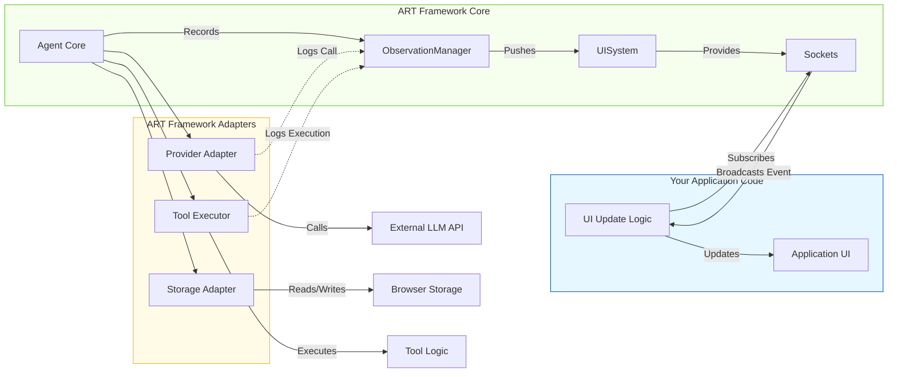

# ART Framework: Streaming & Metadata Implementation Plan

## 1. Introduction & Goal

This document summarizes the investigation and planning process undertaken to understand the ART framework's current capabilities and design a solution for implementing advanced LLM response streaming. The primary goals of the new features are:

*   Stream LLM responses token-by-token to the UI in real-time.
*   Differentiate between "thinking" tokens (intermediate reasoning steps from the LLM) and final "response" tokens within the stream.
*   Capture and deliver detailed LLM metadata (token counts, timing, etc.) to the UI.
*   Ensure the implementation aligns with ART's existing architecture (especially the Observation and UI systems) and provides a consistent developer experience.
*   Learn from established frameworks like LangChain/LangGraph.

## 2. Initial Question: Adapter Integration with Observation/UI Systems

**User Intent:** Understand if developers using existing ART Adapters (like `OpenAIAdapter`, `IndexedDBStorageAdapter`) need to write explicit code to integrate with the Observation and UI systems for real-time UI updates, or if these systems handle it automatically. Clarify how developers can access the necessary outputs (observations, events) to update their UI.

**Initial Analysis (Based on `ART-Comprehensive-Guide.md`):**

*   **Adapters (Node 3):** Primarily bridge ART's core to external services (LLMs, Storage). Not directly involved in driving UI updates, though they *might* log observations.
*   **ObservationManager (Node 2):** Records discrete internal events (`Observation` objects) triggered mainly by the Agent Core.
*   **UISystem (Node 2):** Broadcasts observations recorded by `ObservationManager` via subscription sockets (`ObservationSocket`, `ConversationSocket`).
*   **Developer Interaction:** Application code subscribes directly to `UISystem` sockets to receive events and update the UI.

**Initial Hypothesis:** Adapters don't directly drive the UI. The Agent Core logs events via `ObservationManager`, `UISystem` broadcasts them, and the application code subscribes to `UISystem` sockets.

## 3. Investigation Process & Findings

To verify the hypothesis and understand the exact flow, the following steps were taken using ART's available tools:

1.  **Directory Structure:**
    *   `list_files` on `src/adapters` confirmed `reasoning/` and `storage/` subdirectories.
    *   `list_files` on `src/core/managers` found no files, indicating managers were located elsewhere.
    *   `list_files` on `src/core` revealed `agent-factory.ts`, `interfaces.ts`, `agents/`.
    *   `list_files` on `src/systems` revealed subdirectories: `context/`, `observation/`, `reasoning/`, `tool/`, `ui/`.
    *   `list_files` on `src/systems/observation` confirmed `observation-manager.ts`.
    *   `list_files` on `src/systems/ui` confirmed `ui-system.ts` and socket implementations.

2.  **Core Interfaces (`src/core/interfaces.ts`):**
    *   `read_file` showed that `ProviderAdapter` and `StorageAdapter` interfaces define contracts for external communication and persistence, respectively. **Neither interface mandates interaction with `ObservationManager` or `UISystem`.**

3.  **Concrete Adapter Implementation (`src/adapters/reasoning/openai.ts`):**
    *   `read_file` showed the `OpenAIAdapter` uses a separate `Logger` utility, **not** `ObservationManager`, for internal logging. It does not interact with the observation system.

4.  **ObservationManager (`src/systems/observation/observation-manager.ts`):**
    *   `read_file` confirmed it receives observation data via `record()`, adds ID/timestamp, persists via an injected repository, and **notifies subscribers via an injected `ObservationSocket`**.

5.  **UISystem (`src/systems/ui/ui-system.ts`):**
    *   `read_file` confirmed it instantiates and provides access to singleton `ObservationSocket` and `ConversationSocket` instances.

**Conclusion on Initial Question:**

The investigation confirmed the initial hypothesis. Adapters focus on their specific external tasks. The Agent Core logs events via `ObservationManager`. `ObservationManager` pushes these events to the relevant socket provided by `UISystem`. Application code subscribes to these sockets (primarily `ObservationSocket` and `ConversationSocket`) to receive updates for the UI. Developers using existing adapters do not need to modify them for basic observation/UI integration.

**Diagram of Current Flow:**



## 4. Follow-up Question: Advanced Streaming Requirements

The user then inquired about more advanced capabilities currently lacking:

*   **Real-time Token Streaming:** Displaying LLM responses token-by-token as they are generated.
*   **Thinking vs. Response Tokens:** Differentiating tokens generated during intermediate LLM reasoning ("thinking") from tokens forming the final user-facing response.
*   **Detailed Metadata:** Capturing and displaying LLM metadata (input/output/thinking token counts, time-to-first-token, total generation time, stop reason).
*   **Integration:** How these features could be implemented within ART's architecture.

## 5. Investigation: Current ART Capabilities vs. Streaming Requirements

Further investigation assessed ART's readiness for these features:

1.  **`onThought` Callback:**
    *   **Definition (`src/types/index.ts`):** `CallOptions` includes `onThought?: (thought: string) => void;`, intended for intermediate reasoning steps.
    *   **Usage (`src/core/agents/pes-agent.ts`):** `PESAgent` *provides* an `onThought` callback to the `ReasoningEngine`, aiming to record the thought via `ObservationManager`.
    *   **Implementation Gap (`src/adapters/reasoning/*.ts`):** All reviewed adapters (`OpenAI`, `Anthropic`, `Gemini`, etc.) **do not implement** the logic to call `onThought`. Its functionality is currently linked to unimplemented streaming support.
    *   **Conclusion:** The *intent* for `onThought` matches capturing agent-level thoughts, but it's non-functional end-to-end due to the adapter implementation gap.

2.  **Streaming Support:**
    *   **Adapters:** Explicitly state streaming is not implemented. They use standard, non-streaming API calls.
    *   **`ReasoningEngine` Interface:** Returns `Promise<string>`, implying a complete response.
    *   **`ModelCapability` Enum:** Includes `STREAMING`, showing awareness of the concept.
    *   **Conclusion:** No built-in support for consuming LLM streams.

3.  **Metadata Handling:**
    *   **Types (`AgentFinalResponse`, `ExecutionMetadata`):** Lack fields for detailed LLM metadata (token counts, timing). Basic metadata (duration, call counts) exists.
    *   **Adapters:** Do not extract or return detailed metadata, even if the provider API response includes it (e.g., Anthropic's `usage` field).
    *   **Conclusion:** No mechanism to capture or deliver detailed LLM metadata.

4.  **Thinking/Response Differentiation:**
    *   No types, interfaces, or adapter logic exist to handle this distinction.

**Overall Assessment:** ART currently lacks the necessary infrastructure across its types, interfaces, adapters, and core logic to support the requested advanced streaming and metadata features.

## 6. Design Rationale & Influences

Before detailing the proposed solution, it's important to outline the reasoning behind key architectural decisions, influenced by user requirements, ART's existing patterns, and insights from frameworks like LangChain/LangGraph:

*   **Async Iterables (`ReasoningEngine.call` return type):**
    *   **Non-Developer Explanation:** Instead of waiting for the LLM's entire answer, we want a way to get pieces (like words or tokens) as soon as they are ready. Using an "async iterable" is like setting up a conveyor belt from the LLM. We can pick items off the belt one by one as they arrive, without waiting for the end. Each item on the belt will also have a label (`StreamEvent`) saying what it is (a word, metadata, an error, or the end signal).
    *   **Developer Notes:** This pattern, common in modern JavaScript and heavily used by LangChain (`astream`), provides a flexible and efficient way to handle streams of data. It allows yielding different types of structured events (`StreamEvent`) over a single asynchronous channel, making it suitable for delivering tokens, metadata, errors, and lifecycle signals. It's generally preferred over complex callback management for stream consumption.
*   **Dedicated `LLMStreamSocket` (`UISystem`):**
    *   **Non-Developer Explanation:** ART already uses an announcement system (sockets) for the UI to listen for updates (like new messages or observations). Instead of creating a completely separate way for the UI to get the streamed LLM words, we'll add a new, dedicated channel (`LLMStreamSocket`) to this existing system. The internal ART components put the words onto this channel, and the UI listens to it, just like it listens to the other channels.
    *   **Developer Notes:** While the `ReasoningEngine` produces an async iterable, directly exposing this to potentially multiple UI components adds complexity and couples the UI tightly to the engine's implementation. Introducing `LLMStreamSocket` maintains ART's architectural pattern of using sockets for UI communication. The Agent Core consumes the iterator internally and pushes events to the socket, which handles broadcasting to any number of UI subscribers. This decouples the UI from the stream source and provides a consistent subscription mechanism for developers (`uiSystem.getLLMStreamSocket().subscribe(...)`). The minor overhead is acceptable for the architectural consistency and decoupling benefits.
*   **Event Handling Split (`LLMStreamSocket` vs. `ObservationManager`):**
    *   **Non-Developer Explanation:** We want two things: see the words appear live on screen, and also keep a log of important stream events (like metadata received or errors). The live words (`TOKEN` events) and the signals for when the stream ends or breaks (`END`, `ERROR`) will go through the new `LLMStreamSocket` so the UI can react immediately. The important log entries (`METADATA`, `END`, `ERROR`) will *also* be sent to the existing `ObservationManager` (the logbook) so they can be stored and reviewed later for monitoring or debugging.
    *   **Developer Notes:** This split optimizes for different needs. The `LLMStreamSocket` handles the high-frequency `TOKEN` events and the essential `END`/`ERROR` lifecycle events needed for immediate UI state management. The `ObservationManager` handles the lower-frequency, discrete events (`METADATA`, `END`, `ERROR`) that are valuable for persistent logging, monitoring, and auditing, using new specific `ObservationType`s. This avoids flooding the `ObservationManager` and its potential persistence layer with every token while still capturing key milestones. The Agent Core orchestrates this split, pushing to the socket and calling `observationManager.record` as appropriate based on the `StreamEvent` type received from the iterator.
## 7. Proposed Solution for Streaming & Metadata (Final Version)

Based on the investigation, requirements, and design rationale, the following comprehensive solution is proposed:

**7.1. Core Interface Changes (`src/core/interfaces.ts`)**

*   **`ReasoningEngine.call`:** Modify the method signature:
    ```typescript
    // Non-Developer: Changes how the core "brain" asks for and receives info from the LLM, enabling piece-by-piece delivery.
    // Developer Notes: Returns a Promise resolving to an AsyncIterable yielding StreamEvent objects.
    call(prompt: FormattedPrompt, options: CallOptions): Promise<AsyncIterable<StreamEvent>>;
    ```

**7.2. Type System Changes (`src/types/index.ts`)**

*   **`StreamEvent` Interface:** Define the structure for items on the stream "conveyor belt":
    ```typescript
    // Non-Developer: Defines the "label" attached to each piece coming from the LLM stream, saying what it is.
    // Developer Notes: Represents a single event from the LLM stream iterator. Should be defined in src/types/index.ts.
    interface StreamEvent {
      type: 'TOKEN' | 'METADATA' | 'ERROR' | 'END'; // Kind of event
      data: any; // The actual content (string for TOKEN, LLMMetadata for METADATA, Error for ERROR)
      tokenType?: 'LLM_THINKING' | 'LLM_RESPONSE' | 'AGENT_THOUGHT_LLM_THINKING' | 'AGENT_THOUGHT_LLM_RESPONSE' | 'FINAL_SYNTHESIS_LLM_THINKING' | 'FINAL_SYNTHESIS_LLM_RESPONSE'; // Specific kind of token
      threadId: string; // Links event to the conversation thread. Essential for routing and context.
      traceId: string; // Links event to the specific agent.process() call. Essential for debugging and correlation.
      sessionId?: string; // Links event to a specific UI tab/window. Recommended for multi-session scenarios.
    }
    ```
*   **`LLMMetadata` Interface:** Define the structure for detailed LLM statistics:
    ```typescript
    // Non-Developer: Defines what kind of statistics we want to capture about the LLM's work (like token counts).
    // Developer Notes: Structure for holding parsed metadata from LLM responses/streams. Should be defined in src/types/index.ts.
    interface LLMMetadata {
      inputTokens?: number;
      outputTokens?: number;
      thinkingTokens?: number; // If available from provider
      timeToFirstTokenMs?: number;
      totalGenerationTimeMs?: number;
      stopReason?: string; // e.g., 'stop_sequence', 'max_tokens', 'end_turn'
      providerRawUsage?: any; // Optional raw usage data from provider for extensibility
      // Developer Note: Include traceId if this object might be stored or passed independently.
      traceId?: string;
    }
    ```
*   **`CallOptions` Interface:** Add options to control streaming and provide context:
    ```typescript
    // Non-Developer: Adds switches to turn streaming on/off and tells the LLM call whether it's for an internal "thought" or the final answer.
    // Developer Notes: Extends options passed to ReasoningEngine.call. Defined in src/types/index.ts.
    interface CallOptions {
      // ... existing fields (threadId, traceId, userId, sessionId, onThought, etc.)
      stream?: boolean; // Request streaming response. Adapters MUST check this.
      callContext?: 'AGENT_THOUGHT' | 'FINAL_SYNTHESIS' | string; // Provides context for tokenType determination by the adapter. Agent Core MUST provide this.
    }
    ```
*   **`ExecutionMetadata` Interface:** Add field to store final metadata:
    ```typescript
    // Non-Developer: Adds a place to store the final LLM statistics associated with the agent's overall response.
    // Developer Notes: Extends the metadata returned by agent.process(). Defined in src/types/index.ts.
    interface ExecutionMetadata {
      // ... existing fields
      llmMetadata?: LLMMetadata; // Aggregated metadata from LLM calls in the execution. Agent Core MUST populate this.
    }
    ```
*   **`ObservationType` Enum:** Add types for logging discrete stream events:
    ```typescript
    // Non-Developer: Adds new categories to the agent's logbook specifically for important streaming events.
    // Developer Notes: New enum values for ObservationManager.record(). Defined in src/types/index.ts.
    enum ObservationType {
      // ... existing types
      LLM_STREAM_START = 'LLM_STREAM_START', // Optional: Logged by Agent Core when iterator consumption begins.
      LLM_STREAM_METADATA = 'LLM_STREAM_METADATA', // Logged by Agent Core upon receiving METADATA event. Content should be LLMMetadata.
      LLM_STREAM_END = 'LLM_STREAM_END', // Logged by Agent Core upon receiving END event.
      LLM_STREAM_ERROR = 'LLM_STREAM_ERROR', // Logged by Agent Core upon receiving ERROR event. Content should be Error object or message.
    }
    ```

**7.3. Adapter Responsibilities (`src/adapters/reasoning/`)**

*   **Non-Developer Summary:** The specific adapter (like the OpenAI or Anthropic one) needs to be updated to handle the new streaming approach. It will talk to the LLM provider using their streaming method, figure out if the LLM is "thinking" or "responding" based on special markers (which differ between providers), and put the correctly labeled pieces (`StreamEvent`s) onto the internal conveyor belt (`AsyncIterable`).
*   **Developer Notes:**
    *   Implement `call` to return `Promise<AsyncIterable<StreamEvent>>`.
    *   Check `options.stream`. If true, connect to provider's streaming endpoint (e.g., using SSE, WebSockets). If false, perform a regular non-streaming call and yield a minimal sequence of events (e.g., `TOKEN` with full response, `METADATA` if available, `END`).
    *   Inside the streaming logic (if `options.stream` is true):
        *   Parse provider-specific stream chunks (SSE, etc.).
        *   **Crucially:** Implement provider-specific logic to detect thinking tokens (e.g., parsing `<think>` tags, checking JSON fields, handling control tokens). This requires understanding each provider's streaming format.
        *   Yield `StreamEvent` objects with correct `type`, `data`, `threadId`, `traceId`, `sessionId`.
        *   Set `tokenType` by combining provider marker detection (`LLM_THINKING`/`LLM_RESPONSE`) and `options.callContext` (`AGENT_THOUGHT`/`FINAL_SYNTHESIS`) to produce specific types (e.g., `AGENT_THOUGHT_LLM_THINKING`). Default to `LLM_RESPONSE` or `FINAL_SYNTHESIS_LLM_RESPONSE` if no thinking markers are detected.
        *   Extract metadata (token counts, timing, stop reason) from stream events or final messages and yield `METADATA` `StreamEvent`s (can be multiple if metadata arrives incrementally, or one at the end). Package into the `LLMMetadata` structure.
        *   Yield `ERROR` `StreamEvent` if the provider signals an error or parsing fails.
        *   Yield `END` `StreamEvent` when the provider indicates the stream is complete.
    *   **(Optional) Legacy `onThought`:** Consider if calling `options.onThought()` when yielding an `AGENT_THOUGHT_...` token provides useful transitional compatibility.

**7.4. Agent Core Responsibilities (`src/core/agents/`)**

*   **Non-Developer Summary:** The main coordinator (Agent Core) will now watch the conveyor belt (`AsyncIterable`). As pieces arrive, it sends the words, end signals, and errors to the new `LLMStreamSocket` for the UI. It also tells the logbook (`ObservationManager`) about important events like metadata, errors, and the end signal. When the stream finishes, it gathers all the final response words and saves them as a complete message.
*   **Developer Notes:**
    *   Requires access to `UISystem` and `ObservationManager` (via constructor dependency injection).
    *   Modify `process` method:
        *   When calling `reasoningEngine.call`, pass `stream: true` (if applicable for the step) and the correct `callContext`.
        *   Use `async for await (const event of stream)` to consume the iterator.
        *   Initialize buffer for final response string and potentially aggregated metadata.
        *   Inside the loop:
            *   `switch (event.type)`:
                *   `case 'TOKEN'`: Push event to `uiSystem.getLLMStreamSocket().notify(event)`. If `tokenType` indicates final response (e.g., `FINAL_SYNTHESIS_LLM_RESPONSE`), append `event.data` to the response buffer.
                *   `case 'METADATA'`: Push event to `uiSystem.getLLMStreamSocket().notify(event)`. Call `observationManager.record({ type: ObservationType.LLM_STREAM_METADATA, content: event.data, threadId: event.threadId, traceId: event.traceId, sessionId: event.sessionId })`. Aggregate `event.data` into the final metadata object.
                *   `case 'ERROR'`: Push event to `uiSystem.getLLMStreamSocket().notify(event)`. Call `observationManager.record({ type: ObservationType.LLM_STREAM_ERROR, content: event.data, threadId: event.threadId, traceId: event.traceId, sessionId: event.sessionId })`. Handle error appropriately (e.g., stop processing, prepare error response).
                *   `case 'END'`: Push event to `uiSystem.getLLMStreamSocket().notify(event)`. Call `observationManager.record({ type: ObservationType.LLM_STREAM_END, threadId: event.threadId, traceId: event.traceId, sessionId: event.sessionId })`. Break the loop or proceed to finalization.
        *   After the loop (if successful):
            *   Construct final `ConversationMessage` using the buffered response string.
            *   Call `conversationManager.addMessages()`.
            *   Construct `AgentFinalResponse` including the final `ConversationMessage` and `ExecutionMetadata` (with aggregated `llmMetadata`).

**7.5. UI System Changes (`src/systems/ui/`)**

*   **Non-Developer Summary:** Create the new announcement channel (`LLMStreamSocket`) specifically for the live LLM stream.
*   **Developer Notes:**
    *   Implement `LLMStreamSocket extends TypedSocket<StreamEvent>` in `src/systems/ui/llm-stream-socket.ts`. It likely doesn't need repository dependencies itself, as it's just broadcasting events pushed to it.
    *   Modify `UISystem` (`src/systems/ui/ui-system.ts`): Instantiate `LLMStreamSocket` in the constructor. Add `getLLMStreamSocket(): LLMStreamSocket` method.
    *   Update dependency injection (`AgentFactory` or manual setup) to provide `UISystem` to `AgentCore`.

**7.6. Observation System Role (`src/systems/observation/`)**

*   **Non-Developer Summary:** The main logbook (`ObservationManager`) doesn't need major changes, but it will now receive and store the new types of log entries related to streaming (metadata, stream end, stream errors) when told to by the Agent Core.
*   **Developer Notes:** `ObservationManager` implementation remains largely the same. It simply needs to be able to handle the new `ObservationType` values passed to its `record` method by the Agent Core. The persistence layer (`IObservationRepository`) must also support storing these new types.

**7.7. Handling Streamed vs. Final Messages (UI Logic)**

*   **Non-Developer Summary:** The chat UI needs to be smart. When it gets live words from the `LLMStreamSocket`, it adds them to the *current* chat bubble. When it gets the *final, saved* message later from the regular `ConversationSocket`, it replaces the temporary streamed bubble with the final, official one. This avoids showing the message twice.
*   **Developer Notes:**
    *   UI subscribes to `LLMStreamSocket` and `ConversationSocket`.
    *   Use `traceId` from `StreamEvent` and `ConversationMessage.metadata.traceId` to correlate events to the same agent request.
    *   Maintain temporary UI state (e.g., in React state) for the in-progress streamed message, keyed by `traceId`.
    *   On `TOKEN` event, append `event.data` to the temporary message corresponding to `event.traceId`. Handle different `tokenType`s for display variations (e.g., different styling for thinking vs. response).
    *   On `END`/`ERROR` event from `LLMStreamSocket`, update the temporary message state (e.g., remove cursor, show error icon) for the corresponding `traceId`.
    *   On receiving final `ConversationMessage` from `ConversationSocket`, use `traceId` (or potentially the message's `metadata` if the Agent Core adds correlation info) to find and replace the temporary UI element with the final, persisted message data.

**7.8. Metadata Delivery**

*   **Non-Developer Summary:** Statistics about the LLM's work (metadata) are sent through the new `LLMStreamSocket` for the UI to display live (if desired) and are also logged by the `ObservationManager`. The final statistics are included in the overall summary of the agent's work.
*   **Developer Notes:** Metadata follows the path: Adapter -> Iterator (`METADATA` event) -> Agent Core -> `LLMStreamSocket` -> UI AND Agent Core -> `ObservationManager` -> Log AND Agent Core -> Aggregated in `AgentFinalResponse.metadata.llmMetadata`. UI subscribes to `LLMStreamSocket` and filters for `event.type === 'METADATA'` to display it.
## 8. Conclusion

This proposal outlines a comprehensive approach to adding advanced streaming and metadata capabilities to ART. It leverages asynchronous iterables for efficient data handling internally, integrates with the existing socket architecture for UI consistency, provides clear mechanisms for differentiating token types based on both LLM markers and agent context, and ensures metadata is delivered effectively for both real-time display and persistent logging. This design requires coordinated changes across multiple framework layers but provides a robust and flexible foundation for real-time LLM interactions, aligning with modern practices seen in frameworks like LangChain while respecting ART's specific architectural patterns.