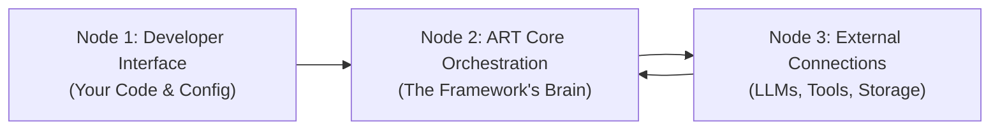

# ART Framework: Comprehensive Developer Guide

## 1. Introduction: What is ART?

ART (Agent Reasoning & Tooling) is a JavaScript/TypeScript framework designed specifically for building intelligent, AI-powered agents that run **directly in the user's web browser**. Think of it as a toolkit that helps you create applications like sophisticated chatbots, research assistants, or automated helpers without needing a separate server for the core AI logic.

**Core Goals:**

*   **Client-Side First:** Runs entirely in the browser, making web-native AI apps possible.
*   **Modular:** Built like LEGO bricks – different parts (like memory, reasoning engine, tools) can be swapped or added.
*   **Flexible:** Adaptable to different AI models, tools, and agent behaviors.
*   **Decoupled:** Components work together through defined contracts (interfaces), not direct dependencies, making the system easier to manage and extend.

**Who is this guide for?**

This guide is for web developers who want to build applications using Large Language Models (LLMs) directly in the browser. We'll cover everything from basic setup to advanced customization, using both technical terms and simpler explanations.

## 2. Understanding ART's Architecture: The 3 Nodes

Imagine ART as having three main layers or "nodes" that work together:



*   **Node 1: Developer Interface (Your Code & Config)**
    *   **What it is:** This is where you, the developer, interact with ART. You write the code to set up, configure, and control the agent.
    *   **What you do here:** Choose which AI model to use (like GPT-4 or Gemini), decide how the agent should remember things (in memory or browser storage), select which tools it can use, pick the agent's thinking style (its "pattern"), and tell the agent when to start processing a user's request.
    *   **Key ART parts involved:** `createArtInstance` (the function to start ART), configuration objects, `ArtInstance` (the main object you interact with), `art.process()` (the command to make the agent think).

*   **Node 2: ART Core Orchestration (The Framework's Brain)**
    *   **What it is:** This is the internal engine of ART, set up based on your configuration in Node 1. It manages the entire process of understanding a request, using tools, and generating a response.
    *   **What it does:** Follows the chosen agent pattern (like "Plan-Execute-Synthesize"), manages conversation history, keeps track of the agent's state, prepares instructions (prompts) for the AI model, understands the AI's responses, coordinates tool usage, and logs important events happening inside.
    *   **Key ART parts involved:** The specific Agent Core implementation (`PESAgent`, `ReActAgent`), Managers (`StateManager`, `ConversationManager`, `ObservationManager`), Systems (`ToolSystem`, `UISystem`), Reasoning Components (`ReasoningEngine`, `PromptManager`, `OutputParser`). You usually don't interact with these directly after setup unless you're doing advanced customization.

*   **Node 3: External Connections (LLMs, Tools, Storage)**
    *   **What it is:** This layer handles ART's communication with the outside world – the specific services and capabilities you plugged in via Node 1's configuration.
    *   **What it does:** Makes the actual calls to the AI model's API (like OpenAI), runs the code for any tools the agent decides to use (which might involve calling other web services or using browser features), and saves/loads data from the chosen storage (like the browser's IndexedDB).
    *   **Key ART parts involved:** Adapters (`ProviderAdapter` for LLMs, `StorageAdapter` for memory/storage), Tool Implementations (`IToolExecutor`).

## 3. Scenario 1: Building a Feature-Rich React Chatbot (Simple Usage)

Let's build a chatbot component for a React website using only ART's built-in features. We'll aim to showcase several core ART capabilities.

**Goal:** A chat interface where users can talk to an AI powered by OpenAI, with conversation history saved in the browser, and some real-time feedback using ART's observation system.

**3.1. Necessary Imports & Explanations**

```typescript
// src/components/ArtChatbot.tsx
import React, { useState, useEffect, useRef, useCallback } from 'react';

// --- ART Core Imports ---
import {
  // The main factory function to initialize ART
  createArtInstance,
  // Type definition for the initialized ART object
  ArtInstance,
  // Type for the properties needed to call the agent's process method
  AgentProps,
  // Type for the final response object from the agent
  AgentFinalResponse,
  // Type representing a single message in the conversation
  ConversationMessage,
  // Enum defining message roles (USER, ASSISTANT, SYSTEM, TOOL)
  MessageRole,
  // Type representing an internal event/observation within ART
  Observation,
  // Enum defining different types of observations (PROCESS_START, LLM_REQUEST, etc.)
  ObservationType,
  // The default Plan-Execute-Synthesize agent pattern implementation
  PESAgent,
  // Interfaces for core components (needed for type hints, less for direct use here)
  StorageAdapter, ProviderAdapter, ReasoningEngine, IToolExecutor, IAgentCore,
  StateManager, ConversationManager, ToolRegistry, ObservationManager, UISystem
} from 'art-framework'; // Assuming 'art-framework' is the installed package name

// --- ART Adapter Imports (Developer Choices) ---
import {
  // Storage adapter that uses the browser's IndexedDB for persistence
  IndexedDBStorageAdapter,
  // Storage adapter that uses temporary browser memory (data lost on refresh)
  // InMemoryStorageAdapter, // Alternative, uncomment if preferred
} from 'art-framework'; // Adapters are usually exported from the main package too

import {
  // Reasoning provider adapter for OpenAI models (GPT-3.5, GPT-4, etc.)
  OpenAIAdapter,
  // Reasoning provider adapter for Google Gemini models
  // GeminiAdapter, // Alternative, uncomment if preferred
  // Reasoning provider adapter for Anthropic Claude models
  // AnthropicAdapter,
} from 'art-framework';

// --- ART Built-in Tool Imports (Optional) ---
import {
  // A simple tool that can evaluate mathematical expressions
  CalculatorTool
} from 'art-framework';
```

**Explanation of Imports:**

*   **`createArtInstance`**
    This is the main function you use to start the ART framework. Think of it as the "ignition key" – you give it instructions (configuration), and it builds and starts the ART engine for you.
    *   **Developer Notes:** An asynchronous factory function (`async function createArtInstance(config: AgentFactoryConfig): Promise<ArtInstance>`). Takes `config` (object conforming to the `AgentFactoryConfig` interface: `{ storage: StorageConfig, reasoning: ReasoningConfig, tools?: IToolExecutor[], agentCore?: new (deps: any) => IAgentCore, logger?: { level?: LogLevel } }`). Uses `AgentFactory` internally to instantiate and inject dependencies for all core components (Managers, Systems, Repositories, Adapters). Returns a `Promise` resolving to the fully initialized `ArtInstance` object. Typically called once at application setup.

*   **`ArtInstance`**
    This describes the main control panel you get after starting ART. It's the object that lets you interact with the initialized framework, primarily by telling it to process user messages.
    *   **Developer Notes:** A TypeScript interface defining the public API returned by `createArtInstance`. Key properties:
        *   `process(props: AgentProps): Promise<AgentFinalResponse>`: The core method to run the agent's reasoning cycle.
        *   `conversationManager: ConversationManager`: Access methods like `getMessages`, `addMessages`.
        *   `stateManager: StateManager`: Access methods like `loadThreadContext`, `setThreadConfig`, `getAgentState`, `setAgentState`, `isToolEnabled`.
        *   `toolRegistry: ToolRegistry`: Access methods like `registerTool`, `getToolExecutor`, `getAvailableTools`.
        *   `observationManager: ObservationManager`: Access methods like `record`, `getObservations`.
        *   `uiSystem: UISystem`: Access methods like `getObservationSocket`, `getConversationSocket` to get subscription interfaces.

*   **`AgentProps`**
    Describes the information you need to give the agent each time you want it to respond (your message and which chat it belongs to).
    *   **Developer Notes:** Interface for the input object to `ArtInstance.process()`.
        *   Required: `query: string` (user input), `threadId: string` (conversation ID).
        *   Optional: `configOverrides?: Partial<ThreadConfig>` (temporarily override settings like model or enabled tools for this call), `executionContext?: Record<string, any>` (pass arbitrary data into the execution context, accessible by tools), `userId?: string` (associate the request with a user).

*   **`AgentFinalResponse`**
    Describes the information the agent gives back after processing your request (its reply and some tracking info).
    *   **Developer Notes:** Interface for the output object from `ArtInstance.process()`.
        *   Core Properties: `responseText: string`, `responseId: string`, `threadId: string`, `traceId: string`.
        *   Optional/Contextual: `llmResponse?: any` (raw output from the final LLM call), `toolResults?: ToolResult[]` (results if tools were used), `plan?: string`, `intent?: string`, `metadata?: Record<string, any>`.

*   **`ConversationMessage`**
    How each chat bubble's information (who sent it, what it says, when) is organized.
    *   **Developer Notes:** Interface representing a message. Properties: `id: string`, `role: MessageRole`, `content: string`, `timestamp: number`, `threadId: string`, `metadata?: Record<string, any>`. Used by `ConversationManager` (via `StorageAdapter`) and often directly in UI rendering logic.

*   **`MessageRole`**
    Labels to know if a message is from the User, the AI Assistant, the System (e.g., errors, info), or a Tool (results).
    *   **Developer Notes:** TypeScript enum: `USER`, `ASSISTANT`, `SYSTEM`, `TOOL`. Crucial for structuring prompts for the LLM (differentiating user input from previous AI responses) and for UI display logic.

*   **`Observation`**
    A notification about something happening inside the agent's brain while it's working (like "Thinking..." or "Using calculator...").
    *   **Developer Notes:** Interface for internal events. Properties: `id: string`, `timestamp: number`, `threadId: string`, `traceId?: string`, `type: ObservationType`, `content: any`, `metadata?: Record<string, any>`. Emitted by `ObservationManager` and broadcast via `UISystem`'s `ObservationSocket`. Useful for real-time UI updates (status indicators) and debugging.

*   **`ObservationType`**
    Labels for the different types of internal notifications (like "Started thinking", "Asking the AI", "Finished using a tool").
    *   **Developer Notes:** TypeScript enum listing event types (e.g., `PROCESS_START`, `LLM_REQUEST`, `LLM_RESPONSE`, `TOOL_START`, `TOOL_END`, `PLANNING_OUTPUT`, `SYNTHESIS_OUTPUT`, `PROCESS_END`, `REACT_STEP`, `thought`, `action`, `observation`). Used to categorize `Observation` events and filter subscriptions on the `ObservationSocket`.

*   **`PESAgent`**
    The specific "thinking style" the agent will use by default (Plan -> Use Tools -> Answer).
    *   **Developer Notes:** Concrete class implementing `IAgentCore`. Instantiated by `AgentFactory` if specified in `config.agentCore` or if `agentCore` is omitted. Receives dependencies (`StateManager`, `ReasoningEngine`, `ToolSystem`, etc.) in its constructor. Its `process` method orchestrates the Plan-Execute-Synthesize flow, interacting with the injected dependencies.

*   **`IndexedDBStorageAdapter` / `InMemoryStorageAdapter`**
    How the agent remembers the conversation. `IndexedDB` is like saving to a file (remembers after closing), `InMemory` is like writing on a whiteboard (erased when closed).
    *   **Developer Notes:** Concrete classes implementing `StorageAdapter` (`get`, `set`, `delete`, `query`). Selected via `config.storage.type`. `IndexedDBStorageAdapter` takes `{ dbName: string, version?: number, objectStores?: string[] }` in its constructor (usually via `config.storage`). `InMemoryStorageAdapter` takes no arguments. Used by internal Repositories. `IndexedDB` provides persistence across browser sessions; `InMemory` does not.

*   **`OpenAIAdapter` / `GeminiAdapter` / `AnthropicAdapter`**
    The specific translator the agent uses to talk to a particular AI brain (like OpenAI's GPT, Google's Gemini, or Anthropic's Claude).
    *   **Developer Notes:** Concrete classes implementing `ProviderAdapter` (extends `ReasoningEngine`). Selected via `config.reasoning.provider`. Constructor takes an options object (e.g., `{ apiKey: string, model?: string, baseURL?: string, defaultParams?: object }`) derived from `config.reasoning`. Implements the `call(prompt, options)` method to handle provider-specific API requests, authentication, and response handling. Used by the core `ReasoningEngine` component.

*   **`CalculatorTool`**
    A specific skill the agent can use, like a pocket calculator.
    *   **Developer Notes:** Concrete class implementing `IToolExecutor`. Provides `schema` (`name`, `description`, `inputSchema`) and `execute(input, context)`. Instances are passed in `config.tools`. Registered with `ToolRegistry` and executed by `ToolSystem` when planned by the `IAgentCore`.

**3.2. React Component Implementation**

```typescript jsx
// src/components/ArtChatbot.tsx
import React, { useState, useEffect, useRef, useCallback } from 'react';
import {
  createArtInstance, ArtInstance, AgentProps, AgentFinalResponse,
  ConversationMessage, MessageRole, Observation, ObservationType, PESAgent
} from 'art-framework';
import { IndexedDBStorageAdapter } from 'art-framework'; // Or InMemoryStorageAdapter
import { OpenAIAdapter } from 'art-framework'; // Or GeminiAdapter, etc.
import { CalculatorTool } from 'art-framework';

// Basic CSS (add this to a corresponding CSS file or use styled-components/tailwind)
/*
.chatbot-container { max-width: 600px; margin: auto; border: 1px solid #ccc; border-radius: 8px; display: flex; flex-direction: column; height: 70vh; }
.message-list { flex-grow: 1; overflow-y: auto; padding: 10px; display: flex; flex-direction: column; }
.message { margin-bottom: 10px; padding: 8px 12px; border-radius: 15px; max-width: 80%; word-wrap: break-word; }
.message.USER { background-color: #dcf8c6; align-self: flex-end; border-bottom-right-radius: 0; }
.message.ASSISTANT { background-color: #f1f0f0; align-self: flex-start; border-bottom-left-radius: 0; }
.message.SYSTEM, .message.TOOL { background-color: #e0e0e0; font-style: italic; font-size: 0.9em; align-self: center; text-align: center; }
.input-area { display: flex; padding: 10px; border-top: 1px solid #ccc; }
.input-area input { flex-grow: 1; padding: 10px; border: 1px solid #ccc; border-radius: 20px; margin-right: 10px; }
.input-area button { padding: 10px 15px; border: none; background-color: #007bff; color: white; border-radius: 20px; cursor: pointer; }
.input-area button:disabled { background-color: #aaa; cursor: not-allowed; }
.status-indicator { padding: 5px 10px; font-size: 0.8em; color: #666; text-align: center; height: 20px; }
*/

const ArtChatbot: React.FC = () => {
  const [messages, setMessages] = useState<ConversationMessage[]>([]);
  const [input, setInput] = useState('');
  const [isLoading, setIsLoading] = useState(false);
  const [status, setStatus] = useState<string>('Initializing...'); // For observation feedback
  const artInstanceRef = useRef<ArtInstance | null>(null);
  const messageListRef = useRef<HTMLDivElement>(null); // For auto-scrolling
  const threadId = 'web-chatbot-thread-1'; // Consistent ID for this chat instance

  // --- Auto-scrolling ---
  useEffect(() => {
    if (messageListRef.current) {
      messageListRef.current.scrollTop = messageListRef.current.scrollHeight;
    }
  }, [messages]);

  // --- ART Initialization ---
  useEffect(() => {
    let isMounted = true; // Prevent state updates on unmounted component
    let unsubObservation: (() => void) | null = null;
    let unsubConversation: (() => void) | null = null;

    const initializeArt = async () => {
      if (!artInstanceRef.current) {
        try {
          setStatus('Initializing ART Engine...');
          const config = {
            storage: {
              type: 'indexedDB',
              dbName: 'artWebChatHistory'
            },
            reasoning: {
              provider: 'openai',
              apiKey: import.meta.env.VITE_OPENAI_API_KEY || 'YOUR_OPENAI_API_KEY', // Use env var
              model: 'gpt-4o'
            },
            agentCore: PESAgent, // Explicitly using the default
            tools: [new CalculatorTool()] // Include the calculator
          };

          const instance = await createArtInstance(config);
          if (!isMounted) return; // Check if component unmounted during async init

          artInstanceRef.current = instance;
          setStatus('Loading history...');
          await loadMessages(); // Load history after successful init

          // --- Subscribe to Observations (UI Feedback) ---
          setStatus('Connecting observers...');
          const observationSocket = instance.uiSystem.getObservationSocket();
          unsubObservation = observationSocket.subscribe(
            (observation: Observation) => {
              if (observation.threadId === threadId) {
                // Simple status updates based on observations
                let newStatus = status;
                switch (observation.type) {
                  case ObservationType.LLM_REQUEST: newStatus = 'Asking AI...'; break;
                  case ObservationType.LLM_RESPONSE: newStatus = 'AI replied.'; break;
                  case ObservationType.TOOL_START: newStatus = `Using ${observation.metadata?.toolName}...`; break;
                  case ObservationType.TOOL_END: newStatus = 'Tool finished.'; break;
                  case ObservationType.PROCESS_START: newStatus = 'Processing request...'; break;
                  case ObservationType.PROCESS_END: newStatus = 'Ready.'; break;
                }
                if (isMounted) setStatus(newStatus);
              }
            },
            // Subscribe to multiple types
            [
              ObservationType.PROCESS_START, ObservationType.LLM_REQUEST, ObservationType.LLM_RESPONSE,
              ObservationType.TOOL_START, ObservationType.TOOL_END, ObservationType.PROCESS_END
            ],
            { threadId: threadId } // Filter for this specific chat thread
          );

          // --- Subscribe to Conversation (Optional: for real-time multi-user or streaming) ---
          // In this simple example, we add messages manually after process() resolves,
          // but this shows how you *could* listen for messages pushed via sockets.
          const conversationSocket = instance.uiSystem.getConversationSocket();
          unsubConversation = conversationSocket.subscribe(
            (message: ConversationMessage) => {
              // Example: If another source added a message to this thread, update UI
              if (message.threadId === threadId && !messages.some(m => m.id === message.id)) {
                 console.log("Received message via socket:", message);
                 // if (isMounted) setMessages(prev => [...prev, message]); // Be careful with duplicates if also adding manually
              }
            },
            undefined, // No role filter
            { threadId: threadId }
          );

          if (isMounted) setStatus('Ready.');

        } catch (error) {
          console.error("Failed to initialize ART:", error);
          if (isMounted) setStatus(`Initialization Error: ${error instanceof Error ? error.message : 'Unknown error'}`);
        }
      }
    };

    initializeArt();

    // Cleanup function
    return () => {
      isMounted = false;
      console.log("Cleaning up ART subscriptions...");
      if (unsubObservation) unsubObservation();
      if (unsubConversation) unsubConversation();
      // Note: ART instance itself might not need explicit cleanup unless specified by the framework
    };
  }, [threadId]); // Rerun if threadId changes (it doesn't in this example)

  // --- Load Messages ---
  const loadMessages = useCallback(async () => {
    if (!artInstanceRef.current) return;
    try {
      setIsLoading(true);
      const history = await artInstanceRef.current.conversationManager.getMessages(threadId, { limit: 100 });
      setMessages(history.sort((a, b) => a.timestamp - b.timestamp)); // Sort oldest to newest
    } catch (error) {
      console.error("Failed to load messages:", error);
      setStatus('Error loading history.');
    } finally {
      setIsLoading(false);
    }
  }, [threadId]);

  // --- Handle Sending ---
  const handleSend = useCallback(async () => {
    if (!input.trim() || !artInstanceRef.current || isLoading) return;

    const userMessage: ConversationMessage = {
      id: `user-${Date.now()}`,
      role: MessageRole.USER,
      content: input,
      timestamp: Date.now(),
      threadId: threadId,
    };

    setMessages(prev => [...prev, userMessage]);
    const currentInput = input; // Capture input before clearing
    setInput('');
    setIsLoading(true);
    setStatus('Sending to ART...');

    try {
      const props: AgentProps = {
        query: currentInput,
        threadId: threadId,
      };
      const response: AgentFinalResponse = await artInstanceRef.current.process(props);

      const aiMessage: ConversationMessage = {
        id: response.responseId || `ai-${Date.now()}`,
        role: MessageRole.ASSISTANT,
        content: response.responseText,
        timestamp: Date.now(), // Consider using a server timestamp if available/needed
        threadId: threadId,
        metadata: { traceId: response.traceId } // Store trace ID if needed
      };
      setMessages(prev => [...prev, aiMessage]);
      setStatus('Ready.');

    } catch (error) {
      console.error("Error processing message:", error);
      const errorMessage: ConversationMessage = {
        id: `error-${Date.now()}`,
        role: MessageRole.SYSTEM,
        content: `Error: ${error instanceof Error ? error.message : 'Failed to get response'}`,
        timestamp: Date.now(),
        threadId: threadId,
      };
      setMessages(prev => [...prev, errorMessage]);
      setStatus('Error occurred.');
    } finally {
      setIsLoading(false);
    }
  }, [input, isLoading, threadId]);

  // --- Render Component ---
  return (
    <div className="chatbot-container">
      <div className="message-list" ref={messageListRef}>
        {messages.map((msg) => (
          <div key={msg.id} className={`message ${msg.role}`}>
            {/* Simple rendering, consider markdown parsing for content */}
            <pre style={{ whiteSpace: 'pre-wrap', margin: 0, fontFamily: 'inherit' }}>{msg.content}</pre>
          </div>
        ))}
      </div>
      <div className="status-indicator">{status}</div>
      <div className="input-area">
        <input
          type="text"
          value={input}
          onChange={(e) => setInput(e.target.value)}
          onKeyPress={(e) => e.key === 'Enter' && !isLoading && handleSend()}
          disabled={isLoading || !artInstanceRef.current}
          placeholder={artInstanceRef.current ? "Ask something..." : "Initializing..."}
        />
        <button onClick={handleSend} disabled={isLoading || !artInstanceRef.current || !input.trim()}>
          {isLoading ? '...' : 'Send'}
        </button>
      </div>
    </div>
  );
};

export default ArtChatbot;
```

**Explanation of Features Used:**

1.  **Initialization (`createArtInstance`):** Sets up ART with chosen adapters (`IndexedDBStorageAdapter`, `OpenAIAdapter`), the default `PESAgent`, and a built-in `CalculatorTool`.
2.  **Conversation Management (`conversationManager.getMessages`):** Loads previous messages from storage when the component mounts, providing history. Messages are saved implicitly by the `PESAgent` after `process` completes.
3.  **State Management (`StateManager`):** Used internally by ART to load thread configuration (like the OpenAI model specified) and potentially save agent state between turns (though this simple example doesn't explicitly manipulate `AgentState`).
4.  **Reasoning (`OpenAIAdapter`, `PESAgent`):** Handles the core logic of understanding the query, planning (potentially deciding to use the calculator), and synthesizing the response via calls to the OpenAI API.
5.  **Tools (`CalculatorTool`, `ToolSystem`):** The calculator is available. If the user asks "What is 5*5?", the `PESAgent` should plan to use it, the `ToolSystem` will execute it, and the result will inform the final answer.
6.  **Storage (`IndexedDBStorageAdapter`):** Ensures conversation history persists even if the user closes and reopens the browser tab.
7.  **Observations & UI Sockets (`uiSystem.getObservationSocket`):** Subscribes to internal ART events to provide simple real-time feedback to the user in the `status-indicator` div (e.g., "Asking AI...", "Using calculator...").

This component provides a solid foundation, demonstrating the core ART features working together in a practical application.

## 4. Scenario 2: Adding a Custom Tool (Intermediate Usage)

Now, let's extend our chatbot by adding a custom tool that provides current information like date, time, and approximate location/locale.

**Goal:** Create a `CurrentInfoTool` and integrate it into the ART configuration.

**4.1. Necessary Imports & Explanations**

In addition to the imports from Scenario 1, you'll need these specifically for creating a tool:

```typescript
// --- ART Tool Creation Imports ---
import {
  // The interface that every tool must implement
  IToolExecutor,
  // The type defining the tool's description, name, and input/output schemas
  ToolSchema,
  // The type defining the structure of the result returned by a tool's execute method
  ToolResult,
  // The type providing context (like threadId, traceId) to the tool's execute method
  ExecutionContext
} from 'art-framework';
```

**Explanation of Tool Imports:**

*   **`IToolExecutor`**
    The blueprint or set of rules your custom skill needs to follow so ART knows how to use it.
    *   **Developer Notes:** The core interface for creating custom tools. Your tool class must implement this. Key requirements:
        *   Implement a readonly `schema` property of type `ToolSchema`.
        *   Implement an `async execute(input: any, context: ExecutionContext): Promise<ToolResult>` method. This method receives validated `input` (based on `schema.inputSchema`) and the `context` object. It should perform the tool's action and return a `Promise` resolving to a `ToolResult`.

*   **`ToolSchema`**
    The tool's "instruction manual" for the AI – its name, what it does, and what information it needs to run.
    *   **Developer Notes:** Interface defining the tool's metadata, used by both the LLM (via prompts) and the `ToolSystem`. Properties:
        *   `name: string`: The unique function name the LLM will use to call the tool (e.g., "get_current_weather"). Use snake_case.
        *   `description: string`: Detailed explanation for the LLM about the tool's purpose, capabilities, and when it should be used. Crucial for effective tool selection by the LLM.
        *   `inputSchema: object`: A standard JSON Schema object describing the expected structure, types (string, number, boolean, object, array), required fields, and descriptions for the `input` argument of the `execute` method. Used by `ToolSystem` to validate arguments before execution.

*   **`ToolResult`**
    The format for the tool's answer – whether it worked, and either the result or an error message.
    *   **Developer Notes:** Interface defining the object returned by `IToolExecutor.execute`. Properties:
        *   `status: 'success' | 'error'`: Must indicate the outcome.
        *   `output?: any`: Required if `status` is 'success'. Contains the result data. Aim for JSON-serializable data (strings, numbers, booleans, arrays, plain objects) so the LLM can easily understand and incorporate it into its response.
        *   `error?: string`: Required if `status` is 'error'. Provides a descriptive error message for logging and potentially for the LLM to understand the failure.

*   **`ExecutionContext`**
    Extra information passed to your tool when it runs, like which chat it's running for, useful for tracking or context-specific logic.
    *   **Developer Notes:** Interface for the context object passed as the second argument to `IToolExecutor.execute`. Provides runtime context. Properties:
        *   `threadId: string`: The ID of the conversation thread this execution belongs to.
        *   `traceId?: string`: The ID tracing the entire `ArtInstance.process` call, useful for correlating logs across multiple steps and tool calls within a single user request.
        *   May contain other properties passed down from the `AgentProps` or added by the `IAgentCore` implementation.

**4.2. Implementing the `CurrentInfoTool`**

```typescript
// src/tools/CurrentInfoTool.ts (or define within the component file for simplicity)

import { IToolExecutor, ToolSchema, ToolResult, ExecutionContext } from 'art-framework';

export class CurrentInfoTool implements IToolExecutor {
  readonly schema: ToolSchema = {
    name: "get_current_info",
    description: "Provides the current date, time, approximate user location (requires permission), and browser language/locale.",
    inputSchema: { // No specific input needed for this tool
      type: "object",
      properties: {},
    }
  };

  async execute(input: any, context: ExecutionContext): Promise<ToolResult> {
    console.log(`Executing CurrentInfoTool, Trace ID: ${context.traceId}`);
    try {
      const now = new Date();
      const dateTimeInfo = {
        date: now.toLocaleDateString(),
        time: now.toLocaleTimeString(),
        timezoneOffset: now.getTimezoneOffset(), // In minutes from UTC
        isoString: now.toISOString(),
      };

      let locationInfo: any = { status: 'permission_denied_or_unavailable' };
      try {
        // Use browser Geolocation API - Requires HTTPS and user permission
        if ('geolocation' in navigator) {
          locationInfo = await new Promise((resolve, reject) => {
            navigator.geolocation.getCurrentPosition(
              (position) => {
                resolve({
                  status: 'success',
                  latitude: position.coords.latitude,
                  longitude: position.coords.longitude,
                  accuracy: position.coords.accuracy, // In meters
                });
              },
              (error) => {
                // Handle errors (PERMISSION_DENIED, POSITION_UNAVAILABLE, TIMEOUT)
                resolve({ status: 'error', code: error.code, message: error.message });
              },
              { timeout: 5000 } // Set a timeout
            );
          });
        }
      } catch (geoError) {
         console.warn("Geolocation API error:", geoError);
         // Error already captured in the promise resolution
      }


      const localeInfo = {
        language: navigator.language, // e.g., "en-US"
        languages: navigator.languages, // Array of preferred languages
      };

      // Note: Getting local currency reliably client-side is complex.
      // We'll just include the locale as a hint.

      return {
        status: "success",
        output: {
          dateTime: dateTimeInfo,
          location: locationInfo,
          locale: localeInfo,
        }
      };
    } catch (error) {
      console.error("CurrentInfoTool Error:", error);
      return { status: "error", error: error instanceof Error ? error.message : "Unknown error fetching current info" };
    }
  }
}
```

**Explanation:**

1.  **Implement `IToolExecutor`:** The class declares it follows the tool contract.
2.  **Define `schema`:** Provides the name (`get_current_info`), description, and specifies no required input.
3.  **Implement `execute`:**
    *   Gets the current date/time using the `Date` object.
    *   Attempts to get the location using the browser's `navigator.geolocation` API. This is asynchronous and requires user permission (and usually HTTPS). It handles success and error cases gracefully.
    *   Gets browser language/locale using `navigator.language(s)`.
    *   Bundles all collected information into the `output` field of a successful `ToolResult`.
    *   Includes error handling for unexpected issues.

**4.3. Integrating the Tool into the Chatbot**

Modify the ART configuration within the `ArtChatbot` component's `useEffect` hook:

```typescript jsx
// Inside the useEffect hook in ArtChatbot.tsx

import { CurrentInfoTool } from './tools/CurrentInfoTool'; // Adjust path if needed

// ... inside initializeArt function ...
          const config = {
            storage: { /* ... */ },
            reasoning: { /* ... */ },
            agentCore: PESAgent,
            tools: [
                new CalculatorTool(),
                new CurrentInfoTool() // Add an instance of the new tool
            ]
          };

          const instance = await createArtInstance(config);
// ... rest of the initialization ...
```

**How it Works Now:**

*   **Node 1 (Developer Interface):** You've defined the `CurrentInfoTool` and told ART about it by adding `new CurrentInfoTool()` to the `tools` array in the configuration.
*   **Node 2 (Core Orchestration):** When the user asks something like "What time is it?" or "Where am I?", the `PESAgent` asks the LLM to plan. The LLM, seeing `get_current_info` in its list of available tools (because you registered it), should plan to call it. The `OutputParser` extracts this call. The `ToolSystem` finds your `CurrentInfoTool` in the `ToolRegistry` and calls its `execute` method. The results (date, time, location status, locale) are passed back. The `PESAgent` then uses the `PromptManager` to create the synthesis prompt including this information, asking the LLM to formulate the final answer.
*   **Node 3 (External Connections):** The `CurrentInfoTool` interacts with browser APIs (`Date`, `navigator.geolocation`, `navigator.language`). If geolocation permission is granted, it interacts with the device's location services.

## 5. Scenario 3: Adding a Custom Provider Adapter (Anthropic Example)

Sometimes, you might want to connect ART to an LLM provider that isn't supported out-of-the-box, like Anthropic's Claude models, or perhaps use a proxy or a self-hosted model with a unique API. This requires creating a custom Provider Adapter.

**Goal:** Implement a functional `AnthropicAdapter` using the Anthropic Messages API.

**5.1. Necessary Imports & Explanations**

```typescript
// --- ART Provider Adapter Creation Imports ---
import {
  // The base interface for LLM provider adapters
  ProviderAdapter,
  // The core interface for making LLM calls (ProviderAdapter extends this)
  ReasoningEngine,
  // Type for formatted prompts (might be string or provider-specific object)
  FormattedPrompt,
  // Type for options passed to the LLM call (model params, callbacks, etc.)
  CallOptions,
  // Type for conversation messages, needed for formatting prompts
  ConversationMessage,
  // Enum for message roles
  MessageRole,
  // Type for observations, needed for logging
  ObservationType,
  // Interface for ObservationManager, needed for logging
  ObservationManager // Assuming this gets injected or is accessible
} from 'art-framework';

// --- Potentially types from Anthropic SDK if used, or define manually ---
// Example manual types for Anthropic Messages API
interface AnthropicMessage {
  role: 'user' | 'assistant';
  content: string;
}
interface AnthropicRequestBody {
  model: string;
  messages: AnthropicMessage[];
  system?: string;
  max_tokens: number;
  temperature?: number;
  stop_sequences?: string[];
  // ... other Anthropic params
}
interface AnthropicResponse {
  content: { type: string, text: string }[];
  // ... other response fields
}
```

**Explanation of Provider Adapter Imports:**

*   **`ProviderAdapter`**
    The blueprint for creating a translator between ART's general way of thinking about AI models and the specific way a particular AI provider's API works (like Anthropic).
    *   **Developer Notes:** The interface your custom LLM adapter class must implement. It extends `ReasoningEngine`, meaning it must primarily implement the `call` method. It also requires a `readonly providerName: string` property to identify the adapter (e.g., 'anthropic').

*   **`ReasoningEngine`**
    Defines the basic capability of making a call to an AI model with a prompt. `ProviderAdapter` builds upon this.
    *   **Developer Notes:** The base interface defining the core `async call(prompt: FormattedPrompt, options: CallOptions): Promise<string>` method signature. Your `ProviderAdapter` implementation provides the concrete logic for this method.

*   **`FormattedPrompt`**
    Represents the instructions prepared for the AI model, which might be a simple string or a more complex structure depending on the AI provider.
    *   **Developer Notes:** A type alias. Your adapter needs to know how to handle the format provided by the `PromptManager` (which should ideally format it suitably, e.g., as `ConversationMessage[]`) and convert it to the specific format the target API requires (e.g., `AnthropicMessage[]`).

*   **`CallOptions`**
    Additional settings and information passed along when making the AI call, like which specific model version to use (e.g., 'claude-3-opus-20240229'), creativity settings (temperature), max response length (`maxTokens`), or stop sequences.
    *   **Developer Notes:** Interface for the options object passed to `ReasoningEngine.call`. Includes properties like `threadId`, `traceId`, `model` (optional override), `temperature`, `maxTokens`, `stopSequences`, `systemPrompt` (important for Anthropic), `onThought` (callback), etc. Your adapter's `call` method must map these relevant options to the parameters supported by the Anthropic API.

*   **`ConversationMessage`, `MessageRole`**
    Needed to correctly interpret the `FormattedPrompt` if it's an array of messages and map the roles (`USER`, `ASSISTANT`) to the provider's expected roles (`user`, `assistant`).
    *   **Developer Notes:** Used within the adapter's `call` method during the prompt formatting step before sending the request to the Anthropic API. System messages might need special handling (passed via the `system` parameter in Anthropic's API).

*   **`ObservationType`, `ObservationManager`**
    Used for logging the request and response interactions with the LLM provider, aiding debugging and observability.
    *   **Developer Notes:** Although `ObservationManager` isn't explicitly part of the `ProviderAdapter` interface, a well-behaved adapter should ideally log `LLM_REQUEST` and `LLM_RESPONSE` observations. This implies the `ObservationManager` instance needs to be accessible, likely via dependency injection in the adapter's constructor (requiring potential modification to `AgentFactory` or manual instantiation).

**5.2. Implementing `AnthropicAdapter`**

```typescript
// src/adapters/AnthropicAdapter.ts

import {
  ProviderAdapter, FormattedPrompt, CallOptions, ConversationMessage, MessageRole,
  ObservationType, ObservationManager // Assuming ObservationManager is injected
} from 'art-framework';

// Example types matching Anthropic Messages API structure
interface AnthropicMessage {
  role: 'user' | 'assistant';
  content: string;
}
interface AnthropicRequestBody {
  model: string;
  messages: AnthropicMessage[];
  system?: string;
  max_tokens: number;
  temperature?: number;
  stop_sequences?: string[];
}
interface AnthropicResponse {
  content: { type: string, text: string }[];
  // ... other fields like usage, stop_reason
}

interface AnthropicAdapterOptions {
  apiKey: string;
  model?: string; // e.g., 'claude-3-opus-20240229'
  defaultMaxTokens?: number;
  defaultTemperature?: number;
  // Add other necessary options like API version header
}

export class AnthropicAdapter implements ProviderAdapter {
  readonly providerName = 'anthropic';
  private options: AnthropicAdapterOptions;
  private observationManager?: ObservationManager; // Optional, for logging

  // Modified constructor to accept ObservationManager
  constructor(options: AnthropicAdapterOptions, observationManager?: ObservationManager) {
    if (!options.apiKey) {
      throw new Error(`Anthropic adapter requires an apiKey.`);
    }
    this.options = options;
    this.observationManager = observationManager;
    this.options.defaultMaxTokens = options.defaultMaxTokens ?? 1024; // Set a reasonable default
    this.options.defaultTemperature = options.defaultTemperature ?? 0.7;
  }

  // Helper to format ART messages to Anthropic format
  private formatMessages(prompt: FormattedPrompt): { messages: AnthropicMessage[], system?: string } {
    if (!Array.isArray(prompt)) {
      // Handle simple string prompts if necessary, though chat format is preferred
      return { messages: [{ role: 'user', content: String(prompt) }] };
    }

    const history = prompt as ConversationMessage[];
    let systemPrompt: string | undefined = undefined;
    const anthropicMessages: AnthropicMessage[] = [];

    // Extract system prompt and filter messages
    // Anthropic API expects alternating user/assistant roles
    let lastRole: MessageRole | null = null;
    for (const message of history) {
      if (message.role === MessageRole.SYSTEM) {
        systemPrompt = message.content; // Use the last system message
        continue;
      }
      if (message.role === MessageRole.USER) {
         if (lastRole === MessageRole.USER) {
             // Handle consecutive user messages if needed (e.g., merge or error)
             console.warn("AnthropicAdapter: Consecutive user messages detected, merging content.");
             const lastMsg = anthropicMessages.pop();
             anthropicMessages.push({ role: 'user', content: `${lastMsg?.content ?? ''}\n${message.content}` });
         } else {
            anthropicMessages.push({ role: 'user', content: message.content });
            lastRole = MessageRole.USER;
         }
      } else if (message.role === MessageRole.ASSISTANT) {
         if (lastRole === MessageRole.ASSISTANT) {
             // Handle consecutive assistant messages if needed
             console.warn("AnthropicAdapter: Consecutive assistant messages detected, merging content.");
             const lastMsg = anthropicMessages.pop();
             anthropicMessages.push({ role: 'assistant', content: `${lastMsg?.content ?? ''}\n${message.content}` });
         } else {
            anthropicMessages.push({ role: 'assistant', content: message.content });
            lastRole = MessageRole.ASSISTANT;
         }
      }
      // Ignore TOOL messages for Anthropic's main message list for now
    }

     // Ensure the conversation starts with a user message if possible
     if (anthropicMessages.length > 0 && anthropicMessages[0].role === 'assistant') {
         console.warn("AnthropicAdapter: Conversation starts with assistant message, prepending empty user message.");
         anthropicMessages.unshift({ role: 'user', content: "(Previous turn)" });
     }


    return { messages: anthropicMessages, system: systemPrompt };
  }

  async call(prompt: FormattedPrompt, options: CallOptions): Promise<string> {
    const traceId = options.traceId ?? `anthropic-trace-${Date.now()}`;
    const threadId = options.threadId;

    this.observationManager?.record({ type: ObservationType.LLM_REQUEST, threadId, traceId, content: { provider: this.providerName, prompt } });

    const { messages, system } = this.formatMessages(prompt);
    const modelToUse = options.model || this.options.model || 'claude-3-sonnet-20240229'; // Default if none provided
    const maxTokens = options.maxTokens ?? this.options.defaultMaxTokens!;
    const temperature = options.temperature ?? this.options.defaultTemperature!;

    const requestBody: AnthropicRequestBody = {
      model: modelToUse,
      messages: messages,
      max_tokens: maxTokens,
      temperature: temperature,
    };

    if (system) {
      requestBody.system = system;
    }
    if (options.stopSequences) {
      requestBody.stop_sequences = options.stopSequences;
    }

    const apiUrl = 'https://api.anthropic.com/v1/messages'; // Standard Anthropic API endpoint

    try {
      const response = await fetch(apiUrl, {
        method: 'POST',
        headers: {
          'Content-Type': 'application/json',
          'x-api-key': this.options.apiKey,
          'anthropic-version': '2023-06-01', // Required header
        },
        body: JSON.stringify(requestBody),
      });

      if (!response.ok) {
        const errorBody = await response.text();
        throw new Error(`Anthropic API Error (${response.status}): ${errorBody}`);
      }

      const responseData: AnthropicResponse = await response.json();

      // Extract text from the response content block(s)
      const responseText = responseData.content
        .filter(block => block.type === 'text')
        .map(block => block.text)
        .join('');

      this.observationManager?.record({ type: ObservationType.LLM_RESPONSE, threadId, traceId, content: { provider: this.providerName, response: responseText, raw: responseData } });
      return responseText;

    } catch (error) {
      console.error(`${this.providerName} adapter error:`, error);
      this.observationManager?.record({ type: ObservationType.LLM_RESPONSE, threadId, traceId, content: { provider: this.providerName, error: error instanceof Error ? error.message : String(error) } });
      throw new Error(`Failed to call ${this.providerName}: ${error instanceof Error ? error.message : String(error)}`);
    }
  }
}
```

**Explanation:**

1.  **Implement `ProviderAdapter`:** The class adheres to the contract.
2.  **`providerName`:** Set to 'anthropic'.
3.  **Constructor:** Takes API key and other options. Includes optional `ObservationManager` for logging.
4.  **`formatMessages` Helper:** Converts the `FormattedPrompt` (expected to be `ConversationMessage[]`) into the `AnthropicMessage[]` format, handling role mapping and extracting the system prompt. Includes basic handling for consecutive messages of the same role.
5.  **`call` Method:**
    *   Logs the request using `ObservationManager`.
    *   Calls `formatMessages`.
    *   Determines model, max tokens, temperature from `options` or defaults.
    *   Constructs the `requestBody` for the Anthropic Messages API.
    *   Uses `fetch` to make the POST request to the Anthropic API endpoint.
    *   Includes necessary headers (`x-api-key`, `anthropic-version`).
    *   Handles potential API errors.
    *   Parses the JSON response and extracts the text content.
    *   Logs the response using `ObservationManager`.
    *   Returns the extracted text.

**5.3. Integrating the `AnthropicAdapter`**

As noted before, the default `AgentFactory` doesn't directly support custom provider classes. You would likely need to:

1.  **Manually Instantiate:** Create instances of `AnthropicAdapter`, `StorageAdapter`, Repositories, Managers, Systems, and your chosen `IAgentCore` implementation, injecting dependencies manually.
2.  **Extend/Modify `AgentFactory`:** If you control the framework code, modify the factory to recognize a custom provider option (e.g., `providerInstance` or `providerClass` in the config) and use it instead of the built-in ones.

**Example Manual Instantiation Snippet (Conceptual):**

```typescript
// --- Manual Instantiation Example ---
import { AnthropicAdapter } from './adapters/AnthropicAdapter';
import { IndexedDBStorageAdapter } from 'art-framework';
import { ConversationRepository, StateRepository, ObservationRepository } from 'art-framework'; // Assuming concrete repo exports
import { ConversationManagerImpl, StateManagerImpl, ObservationManagerImpl } from 'art-framework'; // Assuming concrete manager exports
import { ToolRegistryImpl, ToolSystemImpl } from 'art-framework'; // Assuming concrete system exports
import { PromptManagerImpl, OutputParserImpl, ReasoningEngineImpl } from 'art-framework'; // Assuming concrete reasoning exports
import { PESAgent } from 'art-framework';
import { CalculatorTool } from 'art-framework';
// ... other necessary imports

async function setupManually(): Promise<ArtInstance> {
    // 1. Init Adapters
    const storageAdapter = new IndexedDBStorageAdapter({ dbName: 'manualArtDb', objectStores: ['conversations', 'state', 'observations'] });
    await storageAdapter.init?.(); // If adapter has init

    const observationManager = new ObservationManagerImpl(/* Need repo, socket - complex setup */); // UISystem setup needed first
    const providerAdapter = new AnthropicAdapter({ apiKey: 'YOUR_ANTHROPIC_KEY' }, observationManager); // Inject logger/observer if needed

    // 2. Init Repositories
    const conversationRepository = new ConversationRepository(storageAdapter);
    const stateRepository = new StateRepository(storageAdapter);
    // const observationRepository = new ObservationRepository(storageAdapter); // Used by ObservationManager

    // 3. Init Managers (Need UI System/Sockets first - simplified here)
    // const uiSystem = new UISystemImpl(...)
    const conversationManager = new ConversationManagerImpl(conversationRepository, /* uiSystem.getConversationSocket() */);
    const stateManager = new StateManagerImpl(stateRepository);
    // observationManager initialized above

    // 4. Init Tooling
    const toolRegistry = new ToolRegistryImpl();
    await toolRegistry.registerTool(new CalculatorTool());
    const toolSystem = new ToolSystemImpl(toolRegistry, stateManager, observationManager);

    // 5. Init Reasoning Components
    const reasoningEngine = new ReasoningEngineImpl(providerAdapter); // Use the custom adapter instance
    const promptManager = new PromptManagerImpl();
    const outputParser = new OutputParserImpl();

    // 6. Init Agent Core
    const agentCore = new PESAgent({
        stateManager, conversationManager, toolRegistry, promptManager,
        reasoningEngine, outputParser, observationManager, toolSystem
    });

    // 7. Construct ArtInstance object
    const artInstance: ArtInstance = {
        process: agentCore.process.bind(agentCore),
        conversationManager,
        stateManager,
        toolRegistry,
        observationManager,
        uiSystem: /* Need actual UISystem instance */
    };

    return artInstance;
}
```
*Note: The manual setup is complex, especially around the `UISystem` and `ObservationManager` which have interdependencies. Using the factory is highly recommended if possible.*

## 6. Scenario 4: Adding a Custom Storage Adapter (DuckDB WASM Example)

Let's explore using DuckDB WASM as a storage backend. DuckDB is an in-process analytical data management system, and its WASM version allows running it directly in the browser. This could enable more powerful local data storage and querying, including potential vector similarity search for RAG-like capabilities, compared to basic `localStorage` or `IndexedDB`.

**Goal:** Implement a skeleton `DuckDBWasmAdapter` demonstrating basic CRUD and conceptual vector storage/search.

**Disclaimer:** Integrating DuckDB WASM is significantly more complex than `localStorage` or `IndexedDB`. It involves asynchronous initialization, managing WASM bundles, understanding SQL, and potentially handling vector embeddings and similarity calculations. This example provides a conceptual structure.

**6.1. Necessary Imports & Explanations**

```typescript
// --- ART Storage Adapter Creation Imports ---
import {
  // The interface that a custom storage adapter must implement
  StorageAdapter,
  // Type defining options for querying data (filtering, sorting, limits)
  FilterOptions
} from 'art-framework';

// --- DuckDB WASM Imports ---
// You would typically install @duckdb/duckdb-wasm
import * as duckdb from '@duckdb/duckdb-wasm';
// Import specific types if needed, e.g., from duckdb-wasm
// import { AsyncDuckDB, AsyncDuckDBConnection } from '@duckdb/duckdb-wasm';

// --- Vector Embedding Imports (Conceptual) ---
// You would need a library or function to generate embeddings
// e.g., using Transformers.js or calling an embedding API
// import { pipeline } from '@xenova/transformers'; // Example
// const extractor = await pipeline('feature-extraction', 'Xenova/all-MiniLM-L6-v2');
// async function getEmbedding(text: string): Promise<number[]> {
//   const output = await extractor(text, { pooling: 'mean', normalize: true });
//   return Array.from(output.data as Float32Array);
// }
```

**Explanation of Storage Adapter Imports:**

*   **`StorageAdapter`**
    The blueprint for creating a custom way for ART to save and load its data (like chat history or agent memory) using DuckDB WASM.
    *   **Developer Notes:** The interface your custom storage class must implement. Requires implementing methods for basic CRUD operations:
        *   `async get<T>(collection: string, id: string): Promise<T | null>`: Retrieve a single item by ID.
        *   `async set<T>(collection: string, id: string, data: T): Promise<void>`: Save (create or update) an item.
        *   `async delete(collection: string, id: string): Promise<void>`: Delete an item by ID.
        *   `async query<T>(collection: string, filterOptions: FilterOptions): Promise<T[]>`: Retrieve multiple items based on filter criteria.
        *   Optional: `async init?(config?: any): Promise<void>` (for async setup), `async clearCollection?(collection: string): Promise<void>`, `async clearAll?(): Promise<void>`. The implementation will translate these generic operations into DuckDB SQL commands executed via the WASM instance.

*   **`FilterOptions`**
    Describes how to filter, sort, or limit the data when asking the storage adapter for multiple items. Mapping this to SQL, especially for vector similarity, is the main challenge.
    *   **Developer Notes:** Interface used as input for the `StorageAdapter.query` method. May include properties like:
        *   `filters?: Array<{ field: string; operator: string; value: any }>`: Criteria to match items (e.g., `{ field: 'role', operator: '==', value: 'USER' }`).
        *   `sortBy?: string`: Field name to sort by.
        *   `sortDirection?: 'asc' | 'desc'`: Sorting order.
        *   `limit?: number`: Maximum number of items to return.
        *   `offset?: number`: Number of items to skip (for pagination).
        *   The `query` implementation in the DuckDB adapter will need to parse these options and construct appropriate `WHERE`, `ORDER BY`, and `LIMIT`/`OFFSET` clauses in SQL. Supporting complex filters or vector similarity searches (e.g., using a custom operator like `<=>` if using an extension, or calculating distance manually) requires specific logic.

*   **`@duckdb/duckdb-wasm`**
    The library providing the DuckDB WASM engine and browser integration.
    *   **Developer Notes:** Used for initializing the database (`duckdb.selectBundle`, `db.instantiate`, `db.open`), establishing connections (`db.connect()`), and executing SQL queries (`connection.query()`, `connection.send()`, `connection.prepare()`, etc.). Requires careful handling of asynchronous initialization and potentially large WASM bundles. Consider using specific backends like OPFS (`db.registerFileURL`) for better persistence.

*   **Vector Embedding Library (Conceptual)**
    A library or function to convert text data (like conversation messages or state content) into numerical vectors (embeddings) for similarity search.
    *   **Developer Notes:** Needed if implementing vector search capabilities. This is separate from DuckDB itself but crucial for the RAG use case. Embeddings would be generated before `set`ting data and used during `query` for similarity calculations. Libraries like `Transformers.js` can run embedding models client-side.

**6.2. Implementing `DuckDBWasmAdapter` (Skeleton)**

```typescript
// src/adapters/DuckDBWasmAdapter.ts
import { StorageAdapter, FilterOptions } from 'art-framework';
import * as duckdb from '@duckdb/duckdb-wasm';

// --- Vector Embedding Placeholder ---
async function getEmbedding(text: string): Promise<number[]> {
  // Placeholder: Replace with actual embedding generation
  console.warn("Using placeholder embedding function!");
  // Simple hash-based placeholder vector (NOT suitable for real use)
  let hash = 0;
  for (let i = 0; i < text.length; i++) {
    hash = (hash << 5) - hash + text.charCodeAt(i);
    hash |= 0; // Convert to 32bit integer
  }
  // Create a dummy vector based on the hash
  const vec = Array(16).fill(0); // Small dimension for example
  for(let i=0; i<vec.length; i++) {
      vec[i] = (hash >> (i*2)) & 3; // Simple mapping
  }
  return vec;
}
// --- End Placeholder ---


// Define table schemas conceptually
const TABLE_SCHEMAS: Record<string, string> = {
  conversations: `(id VARCHAR PRIMARY KEY, threadId VARCHAR, role VARCHAR, content TEXT, timestamp BIGINT, embedding FLOAT[16])`, // Added embedding
  state: `(id VARCHAR PRIMARY KEY, threadId VARCHAR, config JSON, agentState JSON)`, // Store JSON directly
  observations: `(id VARCHAR PRIMARY KEY, threadId VARCHAR, traceId VARCHAR, type VARCHAR, timestamp BIGINT, content JSON, metadata JSON)`,
  // Add other collections as needed
};
const EMBEDDING_DIMENSION = 16; // Match the schema

export class DuckDBWasmAdapter implements StorageAdapter {
  private db: duckdb.AsyncDuckDB | null = null;
  private connection: duckdb.AsyncDuckDBConnection | null = null;
  private dbPath: string; // Path for storing DB file if using specific backend
  private initPromise: Promise<void> | null = null; // Prevent race conditions

  constructor(options: { dbPath?: string } = {}) {
      // dbPath might be used with specific backends like OPFS
      this.dbPath = options.dbPath || 'art_duckdb.db';
  }

  // Modified init to handle concurrent calls
  async init(): Promise<void> {
    if (!this.initPromise) {
        this.initPromise = this._initialize();
    }
    return this.initPromise;
  }

  private async _initialize(): Promise<void> {
    if (this.db) return; // Already initialized

    console.log("Initializing DuckDB WASM...");
    try {
      const JSDELIVR_BUNDLES = duckdb.getJsDelivrBundles();
      const bundle = await duckdb.selectBundle(JSDELIVR_BUNDLES);
      const worker_url = URL.createObjectURL(
        new Blob([`importScripts("${bundle.mainWorker!}");`], { type: 'text/javascript' })
      );
      const worker = new Worker(worker_url);
      const logger = new duckdb.ConsoleLogger(); // Or implement custom logger
      this.db = new duckdb.AsyncDuckDB(logger, worker);
      await this.db.instantiate(bundle.mainModule, bundle.pthreadWorker);
      URL.revokeObjectURL(worker_url);

      // Optional: Register a specific file persistence backend if needed (e.g., OPFS)
      // Requires specific browser support and setup
      // await this.db.registerFileURL(this.dbPath, `/${this.dbPath}`, duckdb.DuckDBDataProtocol.BROWSER_FSACCESS, false);

      await this.db.open({
          // path: this.dbPath, // Use if registered above
          query: {
              // Configure WASM specifics if needed, e.g., memory limits
              // initialMemory: '...',
          }
      });
      this.connection = await this.db.connect();
      console.log("DuckDB WASM Initialized and Connected.");

      // Ensure tables exist
      await this.ensureTables();

    } catch (error) {
      console.error("DuckDB WASM Initialization failed:", error);
      this.initPromise = null; // Reset promise on failure
      throw error;
    }
  }

  private async ensureTables(): Promise<void> {
      if (!this.connection) throw new Error("DuckDB connection not available.");
      console.log("Ensuring tables exist...");
      // Consider installing extensions like 'json' if not bundled
      // await this.connection.query(`INSTALL json; LOAD json;`);
      for (const [tableName, schema] of Object.entries(TABLE_SCHEMAS)) {
          try {
              await this.connection.query(`CREATE TABLE IF NOT EXISTS ${tableName} ${schema};`);
              console.log(`Table ${tableName} ensured.`);
          } catch(e) {
              console.error(`Failed to ensure table ${tableName}:`, e);
              throw e;
          }
      }
  }

  private async ensureConnection(): Promise<duckdb.AsyncDuckDBConnection> {
      await this.init(); // Ensure initialization is complete
      if (!this.connection) {
          throw new Error("Failed to establish DuckDB connection after init.");
      }
      return this.connection;
  }

  async get<T>(collection: string, id: string): Promise<T | null> {
    const conn = await this.ensureConnection();
    try {
      // Use prepared statements for safety
      const stmt = await conn.prepare(`SELECT * FROM ${collection} WHERE id = $1`);
      // Use arrow format for potentially better type handling with JSON
      const results = await stmt.query(id);
      await stmt.close(); // Close statement
      if (results.numRows > 0) {
        const row = results.get(0)?.toJSON();
        // DuckDB might return JSON columns as strings, parse them
        return this.parseJsonColumns(collection, row) as T;
      }
      return null;
    } catch (error) {
      console.error(`DuckDB get error in ${collection}:`, error);
      return null; // Or throw? Depends on desired error handling
    }
  }

  async set<T extends { id: string, content?: string }>(collection: string, id: string, data: T): Promise<void> {
    const conn = await this.ensureConnection();
    const schema = TABLE_SCHEMAS[collection];
    if (!schema) throw new Error(`Unknown collection: ${collection}`);

    // Prepare data for insertion (handle JSON, generate embedding)
    const values: any[] = [];
    const placeholders: string[] = [];
    const columns: string[] = [];

    let embedding: number[] | null = null;
    if (collection === 'conversations' && data.content && schema.includes('embedding')) {
        embedding = await getEmbedding(data.content); // Generate embedding
    }

    // Dynamically build based on schema and data properties
    // This is simplified; a real implementation needs robust mapping & type handling
    const columnDefs = schema.substring(1, schema.length - 1).split(',').map(s => s.trim().split(' ')[0]);

    for (const col of columnDefs) {
        if (col === 'embedding') {
            if (embedding) {
                columns.push(col);
                values.push(embedding); // DuckDB WASM might handle array types directly or need list_value syntax
                placeholders.push(`$${values.length}`);
            }
        } else if (col in data) {
            columns.push(col);
            let value = (data as any)[col];
            // Stringify JSON fields
            if (schema.includes(`${col} JSON`) && typeof value === 'object') {
                value = JSON.stringify(value);
            }
            values.push(value);
            placeholders.push(`$${values.length}`);
        } else if (col === 'id') { // Ensure ID is always included if not in data explicitly
             columns.push('id');
             values.push(id);
             placeholders.push(`$${values.length}`);
        }
    }


    const sql = `INSERT OR REPLACE INTO ${collection} (${columns.join(', ')}) VALUES (${placeholders.join(', ')})`;

    try {
      // Use prepared statements for insertion/replacement
      const stmt = await conn.prepare(sql);
      await stmt.send(...values); // Use send for operations not returning rows
      await stmt.close();
    } catch (error) {
      console.error(`DuckDB set error in ${collection}:`, error);
      throw error; // Re-throw to signal failure
    }
  }

  async delete(collection: string, id: string): Promise<void> {
    const conn = await this.ensureConnection();
    try {
      const stmt = await conn.prepare(`DELETE FROM ${collection} WHERE id = $1`);
      await stmt.send(id);
      await stmt.close();
    } catch (error) {
      console.error(`DuckDB delete error in ${collection}:`, error);
      throw error;
    }
  }

  async query<T>(collection: string, filterOptions: FilterOptions): Promise<T[]> {
    const conn = await this.ensureConnection();
    let sql = `SELECT * FROM ${collection}`;
    const params: any[] = [];
    let paramIndex = 1;

    // --- Basic Filtering ---
    if (filterOptions.filters && filterOptions.filters.length > 0) {
      const whereClauses = filterOptions.filters
        .map((filter) => {
            // Basic equality check - needs expansion for other operators
            if (filter.operator === '==') {
                params.push(filter.value);
                return `${filter.field} = $${paramIndex++}`;
            }
            // TODO: Add support for other operators like '!=', '>', '<', 'in', etc.
            console.warn(`Unsupported filter operator: ${filter.operator}`);
            return null; // Ignore unsupported filters
        })
        .filter(clause => clause !== null); // Remove nulls from ignored filters

      if (whereClauses.length > 0) {
          sql += ` WHERE ${whereClauses.join(' AND ')}`;
      }
    }

    // --- Vector Similarity Search (Conceptual) ---
    // This requires a specific setup in DuckDB (e.g., vss extension)
    // or manual calculation. Let's assume a filter operator 'vector_similarity'.
    const vectorFilter = filterOptions.filters?.find(f => f.operator === 'vector_similarity');
    if (vectorFilter && collection === 'conversations' && TABLE_SCHEMAS[collection].includes('embedding')) {
        // Assuming vectorFilter.value is the query embedding (number[])
        // Assuming vectorFilter.field is 'embedding'
        const queryEmbedding = vectorFilter.value as number[];
        // Example using hypothetical list_dot_product (needs extension or UDF)
        // Or calculate distance manually if needed.
        // This SQL is conceptual and depends heavily on DuckDB setup.
        // sql = `SELECT *, list_dot_product(embedding, list_value(${queryEmbedding.join(',')})) AS similarity FROM ${collection}`;
        // sql += ` ORDER BY similarity DESC`; // Order by similarity
        console.warn("Vector similarity search requested but not fully implemented in this skeleton.");
        // Add placeholder WHERE clause if needed based on filtering logic
    } else {
        // --- Basic Sorting ---
        if (filterOptions.sortBy) {
            sql += ` ORDER BY ${filterOptions.sortBy} ${filterOptions.sortDirection === 'desc' ? 'DESC' : 'ASC'}`;
        }
    }


    // --- Pagination ---
    if (filterOptions.limit !== undefined) {
      sql += ` LIMIT $${paramIndex++}`;
      params.push(filterOptions.limit);
    }
    if (filterOptions.offset !== undefined) {
      sql += ` OFFSET $${paramIndex++}`;
      params.push(filterOptions.offset);
    }

    try {
      console.log("Executing DuckDB Query:", sql, params);
      const stmt = await conn.prepare(sql);
      const results = await stmt.query(...params);
      await stmt.close();
      // Parse JSON columns for all results
      return results.toArray().map(arrowRecord => this.parseJsonColumns(collection, arrowRecord.toJSON()) as T);
    } catch (error) {
      console.error(`DuckDB query error in ${collection}:`, error);
      return []; // Return empty on error, or re-throw
    }
  }

   async clearCollection(collection: string): Promise<void> {
       const conn = await this.ensureConnection();
       try {
           const stmt = await conn.prepare(`DELETE FROM ${collection}`);
           await stmt.send();
           await stmt.close();
       } catch (error) {
           console.error(`DuckDB clearCollection error for ${collection}:`, error);
           throw error;
       }
   }

   async clearAll(): Promise<void> {
       const conn = await this.ensureConnection();
       try {
           for (const tableName of Object.keys(TABLE_SCHEMAS)) {
               const stmt = await conn.prepare(`DELETE FROM ${tableName}`);
               await stmt.send();
               await stmt.close();
           }
       } catch (error) {
           console.error(`DuckDB clearAll error:`, error);
           throw error;
       }
   }

   // Helper to parse columns that should be JSON
   private parseJsonColumns(collection: string, row: any): any {
       if (!row) return null;
       const schema = TABLE_SCHEMAS[collection];
       if (!schema) return row;

       const jsonFields = ['config', 'agentState', 'content', 'metadata']; // Fields potentially stored as JSON strings
       for (const field of jsonFields) {
           // Check if schema defines field as JSON and if current value is string
           if (schema.includes(`${field} JSON`) && typeof row[field] === 'string') {
               try {
                   row[field] = JSON.parse(row[field]);
               } catch (e) {
                   console.warn(`Failed to parse JSON field ${field} in collection ${collection}`, e);
                   // Keep as string if parsing fails
               }
           }
       }
       return row;
   }

   async close(): Promise<void> {
       if (this.initPromise) {
           await this.initPromise; // Ensure init is done before closing
       }
       if (this.connection) {
           console.log("Closing DuckDB connection...");
           await this.connection.close();
           this.connection = null;
       }
       if (this.db) {
           console.log("Terminating DuckDB instance...");
           await this.db.terminate();
           this.db = null;
       }
       this.initPromise = null; // Reset init promise
       console.log("DuckDB terminated.");
   }
}
```

**Explanation:**

1.  **Implement `StorageAdapter`:** Fulfills the contract.
2.  **DuckDB WASM Setup:**
    *   Imports `@duckdb/duckdb-wasm`.
    *   The `init` method handles the complex asynchronous loading of the WASM bundle, worker instantiation, database opening, and connection establishment. Uses `initPromise` to prevent race conditions on concurrent calls.
    *   `ensureTables` creates the necessary tables (including conceptual `embedding` column) if they don't exist.
    *   `ensureConnection` is a helper to guarantee initialization.
3.  **CRUD Methods:**
    *   Translate operations into SQL using **prepared statements** (`prepare`, `query`, `send`) for security and efficiency.
    *   Handles JSON stringification/parsing for relevant columns.
    *   Includes conceptual embedding generation during `set` for the `conversations` table.
4.  **`query` Method:**
    *   Constructs SQL `SELECT` query.
    *   Maps simple equality filters from `FilterOptions` to `WHERE` clauses using parameterized queries.
    *   Includes a *conceptual placeholder* for vector similarity search, noting its complexity and dependency on potential DuckDB extensions (like `vss`) or manual calculations.
    *   Adds basic `ORDER BY`, `LIMIT`, and `OFFSET`.
    *   **Limitation:** Explicitly notes that complex filtering and efficient vector search are advanced topics.
5.  **Cleanup:** Includes an async `close` method to properly terminate the DB connection and worker, ensuring it waits for initialization if pending.

**6.3. Integrating the `DuckDBWasmAdapter`**

Again, the default `AgentFactory` doesn't directly support custom storage classes. Integration requires manual instantiation or a custom factory.

**Example Manual Instantiation Snippet (Conceptual):**

```typescript
// --- Manual Instantiation Example ---
import { DuckDBWasmAdapter } from './adapters/DuckDBWasmAdapter';
import { OpenAIAdapter } from 'art-framework'; // Or your custom provider
// ... import Repositories, Managers, Systems, AgentCore, Tools ...

async function setupDuckDbArt(): Promise<ArtInstance> {
    // 1. Init Adapters
    const storageAdapter = new DuckDBWasmAdapter(/* options */);
    await storageAdapter.init(); // IMPORTANT: Must initialize DuckDB

    const providerAdapter = new OpenAIAdapter({ apiKey: 'YOUR_OPENAI_KEY' });
    // ... potentially inject ObservationManager if needed ...

    // 2. Init Repositories (pass the initialized DuckDB adapter)
    const conversationRepository = new ConversationRepository(storageAdapter);
    const stateRepository = new StateRepository(storageAdapter);
    const observationRepository = new ObservationRepository(storageAdapter);

    // 3. Init Managers & Systems (Inject Repositories, setup UI System)
    // ... complex setup ...
    const observationManager = new ObservationManagerImpl(observationRepository, /* uiSystem.getObservationSocket() */);
    const conversationManager = new ConversationManagerImpl(conversationRepository, /* uiSystem.getConversationSocket() */);
    const stateManager = new StateManagerImpl(stateRepository);
    const toolRegistry = new ToolRegistryImpl();
    // await toolRegistry.registerTool(...)
    const toolSystem = new ToolSystemImpl(toolRegistry, stateManager, observationManager);
    const reasoningEngine = new ReasoningEngineImpl(providerAdapter);
    const promptManager = new PromptManagerImpl();
    const outputParser = new OutputParserImpl();

    // 4. Init Agent Core
    const agentCore = new PESAgent({
        stateManager, conversationManager, toolRegistry, promptManager,
        reasoningEngine, outputParser, observationManager, toolSystem
    });

    // 5. Construct ArtInstance
    const artInstance: ArtInstance = {
        process: agentCore.process.bind(agentCore),
        conversationManager,
        stateManager,
        toolRegistry,
        observationManager,
        uiSystem: /* Need actual UISystem instance */
    };

    // Add cleanup hook for DuckDB if your app lifecycle allows
    // window.addEventListener('beforeunload', () => storageAdapter.close());

    return artInstance;
}
```

**How it Works Now:**

*   **Node 1 (Developer Interface):** You define `DuckDBWasmAdapter` and manually instantiate it (or use a custom factory), ensuring its `init()` method is called. You pass this instance during the manual setup of Repositories.
*   **Node 2 (Core Orchestration):** The internal Repositories now use your `DuckDBWasmAdapter` for all data operations. Calls like `ConversationManager.getMessages` trigger the adapter's `query` method, executing SQL against the WASM database.
*   **Node 3 (External Connections):** Your adapter interacts with the DuckDB WASM engine, executing SQL commands to manage data stored potentially in the browser's file system (e.g., OPFS) or memory. If vector search is implemented, it also handles embedding generation and similarity calculations.

## 7. Scenario 5: Adding a Custom Agent Pattern (Advanced Usage)

*(This section was previously Section 5, now renumbered)*

Let's implement the ReAct (Reason -> Act -> Observe) agent pattern and allow the user to switch between PES and ReAct in the chatbot UI.

**Goal:** Create a `ReActAgent` class, integrate it, and add UI controls for switching.

**7.1. Necessary Imports & Explanations**

*(Content remains the same as previous Section 5.1, just renumbered)*

In addition to imports from previous scenarios, you need these for creating a custom agent core:

```typescript
// --- ART Agent Core Creation Imports ---
import {
  // The interface that a custom agent core must implement
  IAgentCore,
  // (Already imported) Input properties for the process method
  // AgentProps,
  // (Already imported) Output type for the process method
  // AgentFinalResponse,

  // --- Interfaces for Dependencies Injected into the Agent Core ---
  // These define the components your custom agent will use internally
  StateManager,
  ConversationManager,
  ToolRegistry,
  PromptManager, // You'll likely need custom prompt logic for ReAct
  ReasoningEngine,
  OutputParser, // You'll likely need custom parsing logic for ReAct
  ObservationManager,
  ToolSystem,
  // (Already imported) Needed types like ToolSchema, ParsedToolCall, ToolResult etc.
} from 'art-framework';
```

**Explanation of Agent Core Imports:**

*   **`IAgentCore`**
    The main blueprint for creating a new "thinking style" or reasoning process for the agent. If you want the agent to think differently than the default "Plan -> Use Tools -> Answer" style, you implement this.
    *   **Developer Notes:** The core interface for custom agent logic. Your class must implement `IAgentCore`. Key requirements:
        *   Implement `async process(props: AgentProps): Promise<AgentFinalResponse>`: This method *is* your agent's brain. It receives the `AgentProps` (query, threadId, etc.) and must orchestrate all steps (loading data, calling LLMs, calling tools, saving data) according to your custom logic (e.g., a ReAct loop, or something else entirely) and return the final response.
        *   Define a `constructor` that accepts a single argument: an object containing instances of the necessary ART subsystems (dependencies) defined by the interfaces below (e.g., `constructor(private deps: { stateManager: StateManager, reasoningEngine: ReasoningEngine, ... })`). The `AgentFactory` will automatically provide (inject) these dependencies when it instantiates your custom agent core based on the `config.agentCore` setting.

*   **Dependency Interfaces (`StateManager`, `ConversationManager`, `ToolRegistry`, `PromptManager`, `ReasoningEngine`, `OutputParser`, `ObservationManager`, `ToolSystem`)**
    These are the built-in helpers and managers that ART gives to your custom agent brain so it doesn't have to reinvent everything (like how to talk to the LLM, use tools, remember history, or log events). Your custom `process` method will use these helpers.
    *   **Developer Notes:** These interfaces define the contracts for the core ART subsystems injected into your `IAgentCore` constructor. You'll use their methods within your `process` implementation:
        *   `StateManager`: Use `.loadThreadContext(threadId)` to get `ThreadConfig` and `AgentState`. Use `.saveStateIfModified(threadId)` to persist state changes. Use `.isToolEnabled(threadId, toolName)` for checks.
        *   `ConversationManager`: Use `.getMessages(threadId, options)` to retrieve history. Use `.addMessages(threadId, messages)` to save new user/assistant messages.
        *   `ToolRegistry`: Use `.getAvailableTools({ enabledForThreadId })` to get `ToolSchema[]` for prompting the LLM. Use `.getToolExecutor(toolName)` if needed (though `ToolSystem` is usually preferred).
        *   `PromptManager`: Use `.createPlanningPrompt(...)`, `.createSynthesisPrompt(...)` (for PES-like flows) or potentially define/use custom methods if your agent needs different prompt structures (like ReAct).
        *   `ReasoningEngine`: Use `.call(prompt, options)` to send a formatted prompt to the configured LLM (via the underlying `ProviderAdapter`) and get the raw response string.
        *   `OutputParser`: Use `.parsePlanningOutput(...)`, `.parseSynthesisOutput(...)` (for PES-like flows) or potentially define/use custom methods to extract structured data (like thoughts, actions, final answers) from the LLM's raw response string.
        *   `ObservationManager`: Use `.record(observationData)` frequently within your `process` logic to log key steps (start/end, LLM calls, tool calls, custom steps like 'thought' or 'action') for debugging and UI feedback via sockets.
        *   `ToolSystem`: Use `.executeTools(parsedToolCalls, threadId, traceId)` to run one or more tools identified by your agent's logic. It handles retrieving the executor, validating input against the schema, calling `execute`, and returning `ToolResult[]`.

**7.2. Implementing the `ReActAgent` (Skeleton)**

*(Content remains the same as previous Section 5.2, just renumbered)*

This requires defining the ReAct loop logic within the `process` method.

```typescript
// src/agents/ReActAgent.ts (or define within the component file)

import {
  IAgentCore, AgentProps, AgentFinalResponse, StateManager, ConversationManager, ToolRegistry,
  PromptManager, ReasoningEngine, OutputParser, ObservationManager, ToolSystem,
  ObservationType, ConversationMessage, MessageRole, ToolSchema, ParsedToolCall, ToolResult
} from 'art-framework';

// Define a structure for the parsed ReAct step output
interface ReActStepOutput {
  thought: string;
  action?: string; // Tool name
  actionInput?: any; // Arguments for the tool
  finalAnswer?: string; // Final answer if found
  rawLLMOutput: string;
}

export class ReActAgent implements IAgentCore {
  // Store injected dependencies
  constructor(private deps: {
    stateManager: StateManager;
    conversationManager: ConversationManager;
    toolRegistry: ToolRegistry;
    promptManager: PromptManager; // Consider if custom ReAct prompts are needed
    reasoningEngine: ReasoningEngine;
    outputParser: OutputParser; // Consider if custom ReAct parsing is needed
    observationManager: ObservationManager;
    toolSystem: ToolSystem;
  }) {}

  // --- Custom Parsing Logic (Example) ---
  // In a real implementation, this might be more robust or part of a custom OutputParser
  private parseReActOutput(llmOutput: string): ReActStepOutput {
    const thoughtMatch = llmOutput.match(/Thought:([\s\S]*?)(Action:|Final Answer:|$)/);
    const actionMatch = llmOutput.match(/Action: (\w+)/);
    const inputMatch = llmOutput.match(/Action Input: ({[\s\S]*?}|[\s\S]*?)(Thought:|Observation:|$)/); // Try JSON first, then raw string
    const finalAnswerMatch = llmOutput.match(/Final Answer: ([\s\S]*)/);

    let actionInput: any = null;
    if (inputMatch) {
        try {
            // Try parsing as JSON first
            actionInput = JSON.parse(inputMatch[1].trim());
        } catch (e) {
            // Fallback to raw string if JSON parsing fails
            actionInput = inputMatch[1].trim();
        }
    }


    return {
      thought: thoughtMatch ? thoughtMatch[1].trim() : "Could not parse thought.",
      action: actionMatch ? actionMatch[1].trim() : undefined,
      actionInput: actionInput,
      finalAnswer: finalAnswerMatch ? finalAnswerMatch[1].trim() : undefined,
      rawLLMOutput: llmOutput
    };
  }

  // --- Custom Prompt Creation Logic (Example) ---
  // In a real implementation, this might be more sophisticated or part of a custom PromptManager
  private createReActPrompt(
    query: string,
    history: ConversationMessage[],
    tools: ToolSchema[],
    previousSteps: { thought: string; action?: string; actionInput?: any; observation: string }[]
  ): string {
    let prompt = `You are a helpful assistant that thinks step-by-step using the ReAct framework.\n`;
    prompt += `Available Tools: ${JSON.stringify(tools.map(t => ({ name: t.name, description: t.description, args: t.inputSchema })))}.\n`;
    prompt += `Conversation History:\n${history.map(m => `${m.role}: ${m.content}`).join('\n')}\n`;
    prompt += `User Query: ${query}\n\n`;
    prompt += `ReAct Scratchpad:\n`;
    previousSteps.forEach((step, index) => {
      prompt += `Thought ${index + 1}: ${step.thought}\n`;
      if (step.action) {
        prompt += `Action ${index + 1}: ${step.action}\nAction Input ${index + 1}: ${JSON.stringify(step.actionInput)}\nObservation ${index + 1}: ${step.observation}\n`;
      }
    });
    prompt += `Thought: [Your current reasoning step]\nAction: [tool_name or Final Answer:]\nAction Input: [Arguments as JSON object if using a tool, otherwise the final answer content]\n`;
    return prompt;
  }


  async process(props: AgentProps): Promise<AgentFinalResponse> {
    const { query, threadId, traceId = `react-trace-${Date.now()}` } = props;
    await this.deps.observationManager.record({ type: ObservationType.PROCESS_START, threadId, traceId, content: { agentType: 'ReAct', query } });

    // 1. Load context, history, tools
    const context = await this.deps.stateManager.loadThreadContext(threadId);
    const initialHistory = await this.deps.conversationManager.getMessages(threadId);
    const tools = await this.deps.toolRegistry.getAvailableTools({ enabledForThreadId: threadId });

    const reactSteps: { thought: string; action?: string; actionInput?: any; observation: string }[] = [];
    let step = 0;
    const maxSteps = 7; // Limit loops

    while (step < maxSteps) {
      step++;
      await this.deps.observationManager.record({ type: 'REACT_STEP' as ObservationType, threadId, traceId, content: { step } });

      // 2. Create ReAct Prompt using custom logic
      const currentPrompt = this.createReActPrompt(query, initialHistory, tools, reactSteps);

      // 3. Call LLM
      await this.deps.observationManager.record({ type: ObservationType.LLM_REQUEST, threadId, traceId, content: { phase: `react_step_${step}` } });
      const llmResponse = await this.deps.reasoningEngine.call(currentPrompt, { threadId, traceId });
      await this.deps.observationManager.record({ type: ObservationType.LLM_RESPONSE, threadId, traceId, content: { phase: `react_step_${step}`, response: llmResponse } });

      // 4. Parse ReAct Output using custom logic
      const parsedOutput = this.parseReActOutput(llmResponse);
      await this.deps.observationManager.record({ type: 'thought' as ObservationType, threadId, traceId, content: parsedOutput.thought });

      // 5. Check for Final Answer
      if (parsedOutput.finalAnswer) {
        await this.deps.observationManager.record({ type: ObservationType.PROCESS_END, threadId, traceId, content: { status: 'success', finalAnswer: parsedOutput.finalAnswer } });
        // TODO: Save history (user query + final answer)
        // await this.deps.conversationManager.addMessages(...)
        await this.deps.stateManager.saveStateIfModified(threadId);
        return { responseId: `react-final-${Date.now()}`, responseText: parsedOutput.finalAnswer, traceId };
      }

      // 6. Execute Action (if any)
      let observationResult = "No action taken in this step.";
      if (parsedOutput.action && parsedOutput.actionInput !== undefined) {
         await this.deps.observationManager.record({ type: ObservationType.TOOL_START, threadId, traceId, metadata: { toolName: parsedOutput.action } });
         const toolCall: ParsedToolCall = { toolName: parsedOutput.action, args: parsedOutput.actionInput };
         const toolResults = await this.deps.toolSystem.executeTools([toolCall], threadId, traceId);
         const result = toolResults[0];
         observationResult = JSON.stringify(result.status === 'success' ? result.output : { error: result.error });
         await this.deps.observationManager.record({ type: ObservationType.TOOL_END, threadId, traceId, metadata: { toolName: parsedOutput.action, resultStatus: result.status } });
      } else {
         // Handle cases where LLM didn't output a valid action
         observationResult = "LLM did not specify a valid action or input.";
      }

      // 7. Store step for next iteration
      reactSteps.push({
        thought: parsedOutput.thought,
        action: parsedOutput.action,
        actionInput: parsedOutput.actionInput,
        observation: observationResult
      });
       await this.deps.observationManager.record({ type: 'observation' as ObservationType, threadId, traceId, content: observationResult });


    } // End while loop

    // Reached max steps
    const finalResponseText = "Reached maximum thinking steps without a final answer.";
    await this.deps.observationManager.record({ type: ObservationType.PROCESS_END, threadId, traceId, content: { status: 'max_steps_reached' } });
    // TODO: Save history
    await this.deps.stateManager.saveStateIfModified(threadId);
    return { responseId: `react-maxstep-${Date.now()}`, responseText: finalResponseText, traceId };
  }
}
```

**Explanation:**

*(Content remains the same as previous Section 5.2, just renumbered)*

1.  **Implement `IAgentCore`:** The class implements the required `process` method.
2.  **Constructor Dependencies:** It declares constructor parameters for all the ART systems it needs to interact with (StateManager, ReasoningEngine, ToolSystem, etc.). The `AgentFactory` will provide these.
3.  **`process` Method:** Contains the core ReAct loop:
    *   Loads context/history/tools.
    *   **Loop:**
        *   Creates a prompt including previous thoughts, actions, and observations (requires custom `createReActPrompt` logic).
        *   Calls the LLM (`ReasoningEngine`).
        *   Parses the LLM response for "Thought:", "Action:", "Action Input:", or "Final Answer:" (requires custom `parseReActOutput` logic).
        *   If "Final Answer:", records it and returns.
        *   If "Action:", executes the specified tool using `ToolSystem`.
        *   Records the tool's output as the "Observation".
        *   Repeats the loop with the new observation.
    *   Handles reaching max steps.
    *   Saves history/state.
    *   Returns the final response.
4.  **Custom Logic:** Note the placeholders/examples for `createReActPrompt` and `parseReActOutput`. A robust implementation would likely involve more sophisticated prompt engineering and parsing, potentially within custom `PromptManager` and `OutputParser` classes if the framework allows injecting those (or handled internally within the agent).

**7.3. Integrating ReAct and Agent Switching into the Chatbot**

*(Content remains the same as previous Section 5.3, just renumbered)*

Modify the `ArtChatbot` component:

```typescript jsx
// src/components/ArtChatbot.tsx
import React, { useState, useEffect, useRef, useCallback } from 'react';
// ... other imports ...
import { PESAgent } from 'art-framework'; // Default agent
import { ReActAgent } from '../agents/ReActAgent'; // Import custom agent (adjust path)
import { CurrentInfoTool } from '../tools/CurrentInfoTool'; // Import custom tool

// --- Add Agent Type State ---
type AgentType = 'pes' | 'react';

const ArtChatbot: React.FC = () => {
  // ... existing state (messages, input, isLoading, status) ...
  const [selectedAgent, setSelectedAgent] = useState<AgentType>('pes'); // State for agent choice
  const artInstanceRef = useRef<ArtInstance | null>(null);
  const messageListRef = useRef<HTMLDivElement>(null);
  const threadId = 'web-chatbot-thread-1';
  const [isInitializing, setIsInitializing] = useState(true); // Track initialization state

  // --- ART Initialization (Modified for Agent Switching) ---
  // We need to re-initialize if the agent type changes
  useEffect(() => {
    let isMounted = true;
    let unsubObservation: (() => void) | null = null;
    let unsubConversation: (() => void) | null = null;

    const initializeArt = async () => {
      // Clear previous instance if any (optional, depends on ART cleanup needs)
      artInstanceRef.current = null;
      if (!isMounted) return;
      setIsInitializing(true);
      setStatus(`Initializing ${selectedAgent.toUpperCase()} Agent...`);

      try {
        const AgentCoreClass = selectedAgent === 'react' ? ReActAgent : PESAgent;

        const config = {
          storage: { type: 'indexedDB', dbName: `artWebChatHistory-${selectedAgent}` }, // Separate DB per agent? Or shared?
          reasoning: {
            provider: 'openai',
            apiKey: import.meta.env.VITE_OPENAI_API_KEY || 'YOUR_OPENAI_API_KEY',
            model: 'gpt-4o' // Ensure model is suitable for the chosen agent pattern
          },
          agentCore: AgentCoreClass, // Dynamically set the agent core
          tools: [
              new CalculatorTool(),
              new CurrentInfoTool() // Include custom tool for both agents
          ]
        };

        const instance = await createArtInstance(config);
        if (!isMounted) return;

        artInstanceRef.current = instance;
        setStatus('Loading history...');
        await loadMessages(); // Reload messages for the new instance/config

        // --- Re-subscribe to Observations ---
        setStatus('Connecting observers...');
        // (Subscription logic remains the same as in Scenario 1, just re-run)
        const observationSocket = instance.uiSystem.getObservationSocket();
        unsubObservation = observationSocket.subscribe(/* ... observer callback ... */);
        const conversationSocket = instance.uiSystem.getConversationSocket();
        unsubConversation = conversationSocket.subscribe(/* ... conversation callback ... */);


        if (isMounted) setStatus('Ready.');

      } catch (error) {
        console.error(`Failed to initialize ${selectedAgent.toUpperCase()} ART:`, error);
        if (isMounted) setStatus(`Initialization Error: ${error instanceof Error ? error.message : 'Unknown error'}`);
      } finally {
         if (isMounted) setIsInitializing(false);
      }
    };

    initializeArt(); // Initialize on mount and when selectedAgent changes

    // Cleanup function
    return () => {
      isMounted = false;
      console.log("Cleaning up ART subscriptions...");
      if (unsubObservation) unsubObservation();
      if (unsubConversation) unsubConversation();
    };
  }, [selectedAgent, threadId]); // Re-run useEffect when selectedAgent changes!

  // --- Load Messages (Modified slightly for re-init) ---
  const loadMessages = useCallback(async () => {
    // Clear messages before loading new history if agent switched
    setMessages([]);
    if (!artInstanceRef.current) return;
    // ... (rest of loadMessages logic is the same) ...
  }, [threadId]); // Depends only on threadId now, called by useEffect

  // --- Handle Sending (No changes needed) ---
  const handleSend = useCallback(async () => {
    // ... (handleSend logic is the same) ...
  }, [input, isLoading, threadId]);

  // --- Render Component (Add Agent Switcher) ---
  return (
    <div className="chatbot-container">
      {/* Agent Switcher UI */}
      <div style={{ padding: '5px 10px', borderBottom: '1px solid #eee', textAlign: 'center' }}>
        <label>Agent Mode: </label>
        <select value={selectedAgent} onChange={(e) => setSelectedAgent(e.target.value as AgentType)} disabled={isInitializing}>
          <option value="pes">Plan-Execute-Synthesize</option>
          <option value="react">ReAct</option>
        </select>
        {isInitializing && <span style={{ marginLeft: '10px', fontSize: '0.8em' }}>Initializing...</span>}
      </div>

      <div className="message-list" ref={messageListRef}>
        {/* ... message rendering ... */}
      </div>
      <div className="status-indicator">{status}</div>
      <div className="input-area">
        <input
          type="text"
          // ... input props ...
          disabled={isLoading || isInitializing || !artInstanceRef.current}
          placeholder={isInitializing ? 'Initializing...' : (artInstanceRef.current ? "Ask something..." : "Error")}
        />
        <button
          onClick={handleSend}
          disabled={isLoading || isInitializing || !artInstanceRef.current || !input.trim()}
        >
          {isLoading ? '...' : 'Send'}
        </button>
      </div>
    </div>
  );
};

export default ArtChatbot;
```

**Explanation of Changes:**

*(Content remains the same as previous Section 5.3, just renumbered)*

1.  **State for Agent Type:** Added `selectedAgent` state (`'pes'` or `'react'`).
2.  **Agent Switcher UI:** Added a `<select>` dropdown to allow the user to change the `selectedAgent` state.
3.  **Dynamic Initialization:** The main `useEffect` hook now has `selectedAgent` in its dependency array. This means whenever `selectedAgent` changes, the effect re-runs:
    *   It determines the correct `AgentCoreClass` (`PESAgent` or `ReActAgent`) based on the state.
    *   It calls `createArtInstance` with the chosen `agentCore`.
    *   It reloads messages (potentially from a different DB if configured, or clears the list for the new agent context).
    *   It re-subscribes to the sockets for the new instance.
4.  **Loading/Disabled States:** Added `isInitializing` state and updated `disabled` conditions on input/button to prevent interaction while ART is re-initializing after an agent switch.

**How it Works Now:**

*(Content remains the same as previous Section 5.3, just renumbered)*

*   **Node 1 (Developer Interface):** You've defined the `ReActAgent` and provided UI controls (`<select>`) to change the `selectedAgent` state. The `useEffect` hook dynamically sets the `agentCore` in the `config` based on this state before calling `createArtInstance`.
*   **Node 2 (Core Orchestration):** When the user selects an agent type, `createArtInstance` builds the internal engine using the *specified* `IAgentCore` implementation (`PESAgent` or `ReActAgent`). When `art.process()` is called, the framework routes the call to the currently active agent core's `process` method, executing either the PES or ReAct logic.
*   **Node 3 (External Connections):** The same configured adapters and tools are available to *both* agent patterns, but they will be invoked differently based on the logic within the active `IAgentCore` implementation.

## 8. Conclusion

*(This section was previously Section 6, now renumbered)*

ART offers a layered approach to building browser-based AI agents. Developers can start simply by configuring built-in components, progress to extending capabilities with custom tools and adapters, and finally achieve deep customization by implementing entirely new agent reasoning patterns. By understanding the 3-node architecture and the different usage levels, you can effectively leverage ART to create powerful and flexible client-side AI applications.
