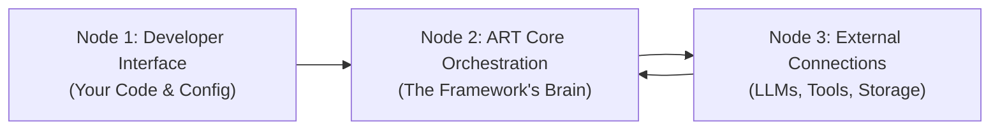

## 2. Understanding ART's Architecture: The 3 Nodes

Imagine ART as having three main layers or "nodes" that work together:

*   **Node 1: Developer Interface (Your Code & Config)**
    *   **What it is:** This is where you, the developer, interact with ART. You write the code to set up, configure, and control the agent.
    *   **What you do here:** Choose which AI model to use (like GPT-4 or Gemini), decide how the agent should remember things (in memory or browser storage), select which tools it can use, pick the agent's thinking style (its "pattern"), and tell the agent when to start processing a user's request.
    *   **Key ART parts involved:** `createArtInstance` (the function to start ART), configuration objects, `ArtInstance` (the main object you interact with), `art.process()` (the command to make the agent think).

*   **Node 2: ART Core Orchestration (The Framework's Brain)**
    *   **What it is:** This is the internal engine of ART, set up based on your configuration in Node 1. It manages the entire process of understanding a request, using tools, and generating a response.
    *   **What it does:** Follows the chosen agent pattern (like "Plan-Execute-Synthesize"), manages conversation history, keeps track of the agent's state, prepares instructions (prompts) for the AI model, understands the AI's responses, coordinates tool usage, and logs important events happening inside.
    *   **Key ART parts involved:** The specific Agent Core implementation (`PESAgent`, `ReActAgent`), Managers (`StateManager`, `ConversationManager`, `ObservationManager`), Systems (`ToolSystem`, `UISystem`), Reasoning Components (`ReasoningEngine`, `PromptManager`, `OutputParser`). You usually don't interact with these directly after setup unless you're doing advanced customization.

*   **Node 3: External Connections (LLMs, Tools, Storage)**
    *   **What it is:** This layer handles ART's communication with the outside world – the specific services and capabilities you plugged in via Node 1's configuration.
    *   **What it does:** Makes the actual calls to the AI model's API (like OpenAI), runs the code for any tools the agent decides to use (which might involve calling other web services or using browser features), and saves/loads data from the chosen storage (like the browser's IndexedDB).
    *   **Key ART parts involved:** Adapters (`ProviderAdapter` for LLMs, `StorageAdapter` for memory/storage), Tool Implementations (`IToolExecutor`).