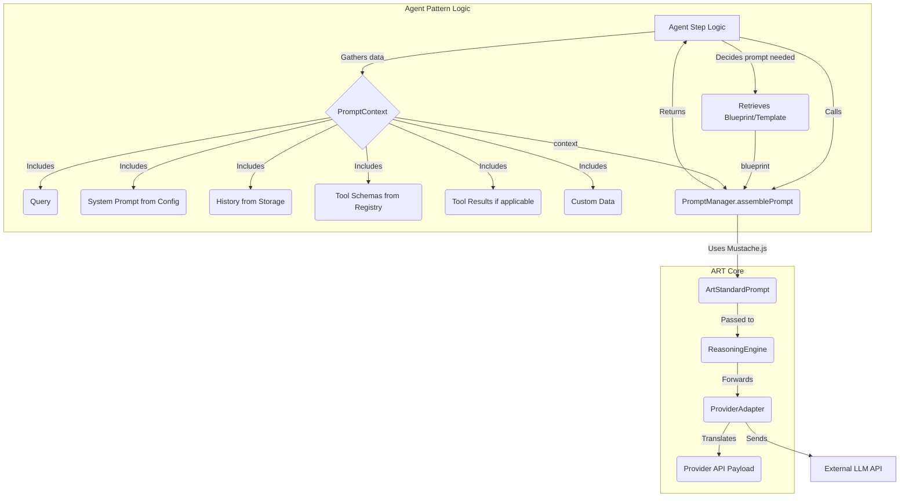

## 2.2. Core Concept: Prompt Management Architecture

ART's prompt management system has been refactored to provide greater flexibility, decouple agent patterns from the core framework, and give developers more control over prompt content.

**Rationale:**

*   **Support Custom Agent Patterns:** Decouple core prompt assembly from specific agent patterns (like PES) to allow developers to create and integrate arbitrary agent flows without modifying the ART framework.
*   **Developer Control over Content:** Enable developers to define and control key prompt content elements, such as system prompts (via `ThreadConfig` or dynamic context), tool presentation (via descriptions/schemas in their tool definitions, interpreted by agent blueprints), and custom data relevant to their specific agent logic (via `PromptContext`).
*   **Provider Agnosticism:** Achieve true decoupling between agent logic/prompt structure and provider-specific API requirements by introducing a standardized intermediate format (`ArtStandardPrompt`).
*   **Clear Responsibilities:** Establish clear boundaries: Agent Patterns define structure (blueprints) and provide context; `PromptManager` assembles into the standard format; Adapters translate the standard format to the provider API.
*   **Alignment:** Align with established framework best practices that favor configuration, standardization, and template-driven customization over hardcoded, monolithic logic.

**Proposed Architecture Overview:**

**Key Concepts:**

*   **`ArtStandardPrompt` Format:** A canonical, provider-agnostic message array format (e.g., `[{ role: 'system' | 'user' | 'assistant' | 'tool_request' | 'tool_result', content: string | object }]`). This replaces the previous `FormattedPrompt` type alias.
*   **Agent Pattern Responsibility:** Defines prompt "blueprints" (templates targeting `ArtStandardPrompt`) and gathers all necessary `PromptContext` data (query, system prompt string, history, tool schemas, tool results, custom data). Blueprints are considered intrinsic to the agent pattern's logic and are not selected or modified via `ThreadConfig`. Built-in agents define default system prompt strings, which can be overridden by `ThreadConfig`.
*   **Core `PromptManager`:** A stateless assembler with an `assemblePrompt(blueprint: string | object, context: PromptContext): Promise<ArtStandardPrompt>` method. It uses an internal templating engine (like Mustache.js) to produce the `ArtStandardPrompt` object based on the agent-provided blueprint and context.
*   **Core `ReasoningEngine`:** Receives the `ArtStandardPrompt` from `PromptManager` and passes it directly to the selected `ProviderAdapter`.
*   **Provider Adapters:** Each adapter is responsible for **translating** the received `ArtStandardPrompt` object into the specific API format required by the target LLM provider (e.g., mapping roles, structuring content, handling tool calls/results according to that API's specification).

This architecture ensures that developers can customize prompt behavior significantly by controlling the inputs (blueprints, configuration, context) without needing to modify the core `PromptManager` assembly logic or the provider-specific `Adapter` translation logic.

**Example Data Flow (`PromptContext` -> `ArtStandardPrompt`):**

1.  *Agent Logic (e.g., PES Planning):* Gathers `query`, `history`, `availableTools`, `systemPrompt` (from `ThreadConfig` or agent default) into a `PromptContext` object. Retrieves its specific `planningBlueprint` (Mustache template string).
2.  *Agent Logic Calls:* `promptManager.assemblePrompt(planningBlueprint, planningContext)`.
3.  *`PromptManager` Execution:* Uses Mustache.js to render the `planningBlueprint` using data from `planningContext`. This involves iterating over history, tools, etc., as defined in the blueprint. The output is a JSON string representing the `ArtStandardPrompt` array structure defined in the blueprint. `PromptManager` parses this JSON string into the final `ArtStandardPrompt` object.
4.  *`PromptManager` Output:* Returns the assembled `ArtStandardPrompt` (an array of `ArtStandardMessage` objects), e.g., `[{ role: 'system', content: '...', ... }, { role: 'user', content: '...', ... }, ...]`.
5.  *Agent Logic:* Passes the resulting `ArtStandardPrompt` to `ReasoningEngine`.