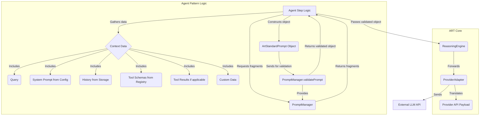

## 2.2. Core Concept: Prompt Management Architecture

ART's prompt management system has been refactored to provide greater flexibility, decouple agent patterns from the core framework, and give developers more control over prompt content.

**Rationale:**

*   **Support Custom Agent Patterns:** Decouple core prompt assembly from specific agent patterns (like PES) to allow developers to create and integrate arbitrary agent flows without modifying the ART framework.
*   **Developer Control over Content:** Enable developers to define and control key prompt content elements, such as system prompts (via `ThreadConfig` or dynamic context), tool presentation (via descriptions/schemas in their tool definitions, interpreted by agent blueprints), and custom data relevant to their specific agent logic (via `PromptContext`).
*   **Provider Agnosticism:** Achieve true decoupling between agent logic/prompt structure and provider-specific API requirements by introducing a standardized intermediate format (`ArtStandardPrompt`).
*   **Clear Responsibilities:** Establish clear boundaries: Agent Patterns construct the prompt object and provide context; `PromptManager` provides reusable fragments and validates the final object; Adapters translate the standard format to the provider API.
*   **Reliability & Maintainability:** Avoid fragile string-based template rendering for complex JSON structures, while still allowing prompt instructions to be managed separately as fragments.

**Hybrid Architecture Overview:**

**Key Concepts:**

*   **`ArtStandardPrompt` Format:** A canonical, provider-agnostic message array format (e.g., `[{ role: 'system' | 'user' | 'assistant' | 'tool_request' | 'tool_result', content: string | object }]`). This replaces the previous `FormattedPrompt` type alias.
*   **Agent Pattern Responsibility:** Gathers all necessary context data (query, system prompt string, history, tool schemas, tool results, custom data). Constructs the final `ArtStandardPrompt` *JavaScript object* directly. May retrieve reusable instruction text blocks (`fragments`) from the `PromptManager` to incorporate into the prompt object's content strings. Built-in agents define default system prompt strings, which can be overridden by `ThreadConfig`.
*   **Core `PromptManager`:** Provides reusable prompt text fragments via `getFragment(name: string, context?: Record<string, any>): string`. Validates the final `ArtStandardPrompt` object constructed by the agent logic using `validatePrompt(prompt: ArtStandardPrompt): ArtStandardPrompt`. It no longer uses templates or assembles the prompt structure itself.
*   **Core `ReasoningEngine`:** Receives the *validated* `ArtStandardPrompt` object from the Agent Logic (after it calls `promptManager.validatePrompt`) and passes it directly to the selected `ProviderAdapter`.
*   **Provider Adapters:** Each adapter is responsible for **translating** the received `ArtStandardPrompt` object into the specific API format required by the target LLM provider (e.g., mapping roles, structuring content, handling tool calls/results according to that API's specification).

This architecture ensures reliability by avoiding complex string templating for JSON, while maintaining separation of concerns. Developers customize prompt behavior by modifying agent logic (how it constructs the object and uses fragments) and managing the fragments themselves, without needing to modify the core `PromptManager` validation or the provider-specific `Adapter` translation logic.

**Example Data Flow (Hybrid Approach):**

1.  *Agent Logic (e.g., PES Planning):* Gathers context data: `query`, `history`, `availableTools`, `systemPrompt` (retrieved via `stateManager.getThreadConfigValue` or agent default).
2.  *Agent Logic Calls:* `promptManager.getFragment('pes_planning_instructions')`, `promptManager.getFragment('pes_tool_format_instructions')` etc. to retrieve necessary instruction texts.
3.  *Agent Logic Constructs Prompt:* Creates the `planningPromptObject` (an `ArtStandardPrompt` array) directly in code, embedding the context data (query, formatted history, tool details) and the retrieved fragments into the appropriate `content` strings of the message objects.
4.  *Agent Logic Calls:* `promptManager.validatePrompt(planningPromptObject)`.
5.  *`PromptManager` Execution:* Validates the structure and types of `planningPromptObject` against the `ArtStandardPromptSchema`. Returns the validated object (or throws a `ZodError` wrapped in `ARTError` if invalid).
6.  *Agent Logic:* Determines the `RuntimeProviderConfig` (e.g., from `ThreadConfig`). Creates `CallOptions` including the `providerConfig`. Calls `reasoningEngine.call(validatedPlanningPromptObject, callOptions)`.
7.  *`ReasoningEngine` Execution:* Calls `providerManager.getAdapter(callOptions.providerConfig)` to get a `ManagedAdapterAccessor`.
8.  *`ReasoningEngine` Execution:* Calls `accessor.adapter.call(validatedPlanningPromptObject, callOptions)` which translates the prompt object and interacts with the LLM API.
9.  *`ReasoningEngine` Execution (Post-Call/Stream):* Calls `accessor.release()` to return the adapter instance slot to the `ProviderManager`.