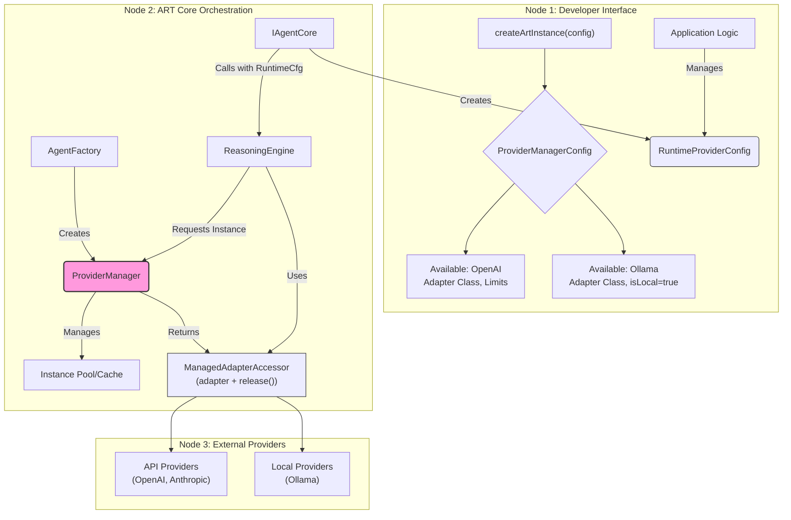

## 2.4. Core Concept: Provider Manager Architecture

ART's provider manager system enables flexible runtime selection and management of multiple LLM providers within a single ART instance. This architecture allows applications to seamlessly switch between different providers (like OpenAI, Anthropic, or local models) based on user choice, task requirements, or other runtime conditions.

**Core Goals:**

* **Dynamic Provider Selection:** Configure multiple potential LLM providers at initialization, but select specific providers and models at runtime.
* **Resource Management:** Control concurrent API usage, manage instance lifecycles, and enforce provider-specific constraints.
* **Separation of Concerns:** Clearly separate provider configuration (available providers) from runtime selection (which provider to use for a specific call).

**Key Components:**



**1. Provider Registration (Initialization Time):**

* **`ProviderManagerConfig`:** Defines available provider adapters and global management rules:
```typescript
interface ProviderManagerConfig {
    availableProviders: {
        name: string;          // e.g., 'openai', 'anthropic', 'ollama_local'
        adapter: new (...args) => ProviderAdapter; // The adapter class
        isLocal?: boolean;     // Determines singleton vs pooling behavior
    }[];
    maxParallelApiInstancesPerProvider?: number; // Default: 5
    apiInstanceIdleTimeoutSeconds?: number;      // Default: 300
}
```

* **Example Configuration:**
```typescript
const config = {
    providers: {
        availableProviders: [
            {
                name: 'openai',
                adapter: OpenAIAdapter,
                // Default API provider behavior
            },
            {
                name: 'ollama_local',
                adapter: OllamaAdapter,
                isLocal: true  // Enforces singleton behavior
            }
        ],
        maxParallelApiInstancesPerProvider: 3
    }
    // ... other ART config
};
```

**2. Runtime Provider Selection:**

* **`RuntimeProviderConfig`:** Specifies the desired provider and settings for a specific LLM call:
```typescript
interface RuntimeProviderConfig {
    providerName: string;    // Must match a registered name
    modelId: string;         // e.g., 'gpt-4o', 'llama3:latest'
    adapterOptions: {        // Provider-specific options
        apiKey?: string;
        baseUrl?: string;
        temperature?: number;
        // ... other options
    };
    // Note: The combination of providerName, modelId, and sorted adapterOptions
    // forms a unique 'configSignature' used by the ProviderManager to identify
    // and cache distinct provider instances.
}
```

* The application typically stores this configuration in `ThreadConfig` via `StateManager`:
```typescript
await stateManager.setThreadConfigValue(threadId, 'runtimeProviderConfig', {
    providerName: 'openai',
    modelId: 'gpt-4o',
    adapterOptions: {
        apiKey: process.env.OPENAI_API_KEY
    }
});
```

**3. Instance Management Rules:**

* **API Providers (isLocal: false):**
    * Multiple instances allowed up to `maxParallelApiInstancesPerProvider` per provider.
    * Instances are pooled and reused when configurations match.
    * Idle instances are evicted after `apiInstanceIdleTimeoutSeconds`.
    * Requests queue when provider limit is reached.

* **Local Providers (isLocal: true):**
    *   **Unique Instance Definition:** A local provider "instance" is uniquely identified by its `configSignature`, which is derived from the `providerName`, `modelId`, and `adapterOptions` specified in the `RuntimeProviderConfig`. Requesting the same `providerName` with a different `modelId` or `adapterOptions` is considered a request for a new, distinct instance.
    *   **Active State:** An instance becomes 'active' when it's acquired via `ProviderManager.getAdapter()`. It remains 'active' until `release()` is called on its `ManagedAdapterAccessor`.
    *   **Idle State & `release()`:**
        *   The `ReasoningEngine` is responsible for calling `release()` on the adapter's accessor. This happens automatically after the LLM call stream is fully consumed or if an error occurs during the call/stream, effectively making the instance 'idle' in the `ProviderManager` after every token generation cycle.
        *   Once 'idle', a local provider instance is available for immediate reuse if the *exact same* `RuntimeProviderConfig` is requested again.
    *   **No Idle Timeouts:** Local provider instances do not have automatic idle timeouts. They persist in an 'idle' state indefinitely.
    *   **Replacement and Eviction:**
        *   An *idle* local provider instance **is replaced** (evicted) if a request for a *different* local provider configuration (i.e., different `configSignature`) is made.
        *   During eviction, the `ProviderManager` will call the `shutdown()` method on the adapter, if the adapter implements it. This `shutdown()` method is crucial for the adapter to perform actual resource cleanup, such as unloading an LLM model from memory/VRAM. If the adapter doesn't implement `shutdown()` or it's a no-op, the underlying model might remain in memory based on the local LLM server's own logic, even if the adapter instance is "evicted" by ART.
    *   **Strict Singleton Behavior for Active Instances:**
        *   Only **one** local provider instance (as defined by its unique `configSignature`) can be **active** at any given time across all local providers.
        *   If a local provider instance is currently 'active':
            *   Attempting to acquire a *different* local provider instance (different `providerName`, or same `providerName` but different `modelId` or `adapterOptions`) will result in a `LocalProviderConflictError`.
            *   Attempting to acquire the *exact same* local provider instance (same `configSignature`) again while it's still active will result in a `LocalInstanceBusyError`.
    *   **Switching Models/Configurations:** To "switch" from one local model/configuration to another, the currently active instance (if any) must first be released (become idle). Requesting the new configuration will then cause the previously idle instance to be evicted and the new one to be created.

**4. Workflow Example:**

1. **Application Prepares:**
```typescript
// In your React component or application logic
const runtimeConfig: RuntimeProviderConfig = {
    providerName: 'openai',
    modelId: 'gpt-4o',
    adapterOptions: {
        apiKey: apiKey,
        temperature: 0.7
    }
};
await art.stateManager.setThreadConfigValue(threadId, 'runtimeProviderConfig', runtimeConfig);
```

2. **Agent Core Acts:**
```typescript
// Inside PESAgent or custom IAgentCore implementation
async process(props: AgentProps) {
    const context = await this.deps.stateManager.loadThreadContext(threadId);
    const runtimeConfig = context.config.runtimeProviderConfig;
    
    // Create CallOptions with the runtime config
    const callOptions: CallOptions = {
        providerConfig: runtimeConfig,
        threadId: props.threadId,
        stream: true,
        // ... other options
    };
    
    // ReasoningEngine will use this config to get the right adapter
    const responseStream = await this.deps.reasoningEngine.call(prompt, callOptions);
    // ... continue processing
}
```

3. **Provider Manager Handles Request:**
```typescript
// Inside ProviderManagerImpl
async getAdapter(config: RuntimeProviderConfig): Promise<ManagedAdapterAccessor> {
    // Check if config is for a local provider
    if (this.isLocalProvider(config.providerName)) {
        // Enforce local provider singleton rules
        await this.enforceLocalProviderConstraints(config);
    } else {
        // Check API provider limits & queue if needed
        await this.enforceApiProviderLimits(config);
    }
    
    // Get or create adapter instance
    const instance = await this.getOrCreateInstance(config);
    
    // Return accessor with release function
    return {
        adapter: instance.adapter,
        release: () => this.releaseInstance(instance)
    };
}
```

4. **ReasoningEngine Uses Adapter:**
```typescript
// Inside ReasoningEngineImpl
async call(prompt: ArtStandardPrompt, options: CallOptions): Promise<AsyncIterable<StreamEvent>> {
    // Get managed adapter
    const accessor = await this.providerManager.getAdapter(options.providerConfig);
    
    try {
        // Create releasing generator that ensures adapter is released
        return {
            [Symbol.asyncIterator]: async function*() {
                try {
                    const stream = accessor.adapter.call(prompt, options);
                    for await (const event of stream) {
                        yield event;
                    }
                } finally {
                    // Always release the adapter back to the ProviderManager.
                    // This transitions the instance to 'idle' or allows another queued request to proceed.
                    accessor.release();
                }
            }
        };
    } catch (error) {
        // Release on error if the accessor was obtained before the error.
        // This ensures the instance doesn't get stuck in an 'active' state in the ProviderManager.
        accessor.release();
        throw error;
    }
}
```

**5. Error Scenarios:**

* **Local Provider Conflict:**
```typescript
// Trying to use Ollama while another local provider is active
throw new LocalProviderConflictError(
    `Cannot use Ollama while LMStudio is active. Only one local provider can be active at a time.`
);
```

* **API Limit Reached:**
```typescript
// All OpenAI slots in use (hitting maxParallelApiInstancesPerProvider)
// Request will be queued, or throw error if queueing disabled
throw new ProviderLimitError(
    `Maximum parallel instances (3) reached for OpenAI. Try again later.`
);
```

This architecture enables applications to provide flexible LLM provider selection while maintaining control over resource usage and enforcing necessary constraints. The separation between initialization-time configuration (`ProviderManagerConfig`) and runtime selection (`RuntimeProviderConfig`) allows for dynamic provider switching without sacrificing stability or control.