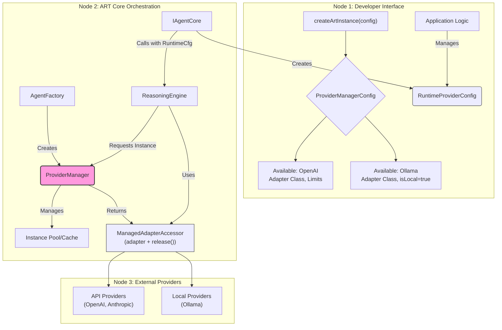

## 2.4. Core Concept: Provider Manager Architecture

ART's provider manager system enables flexible runtime selection and management of multiple LLM providers within a single ART instance. This architecture allows applications to seamlessly switch between different providers (like OpenAI, Anthropic, or local models) based on user choice, task requirements, or other runtime conditions.

**Core Goals:**

* **Dynamic Provider Selection:** Configure multiple potential LLM providers at initialization, but select specific providers and models at runtime.
* **Resource Management:** Control concurrent API usage, manage instance lifecycles, and enforce provider-specific constraints.
* **Separation of Concerns:** Clearly separate provider configuration (available providers) from runtime selection (which provider to use for a specific call).

**Key Components:**



**1. Provider Registration (Initialization Time):**

* **`ProviderManagerConfig`:** Defines available provider adapters and global management rules:
```typescript
interface ProviderManagerConfig {
    availableProviders: {
        name: string;          // e.g., 'openai', 'anthropic', 'ollama_local'
        adapter: new (...args) => ProviderAdapter; // The adapter class
        isLocal?: boolean;     // Determines singleton vs pooling behavior
    }[];
    maxParallelApiInstancesPerProvider?: number; // Default: 5
    apiInstanceIdleTimeoutSeconds?: number;      // Default: 300
}
```

* **Example Configuration:**
```typescript
const config = {
    providers: {
        availableProviders: [
            {
                name: 'openai',
                adapter: OpenAIAdapter,
                // Default API provider behavior
            },
            {
                name: 'ollama_local',
                adapter: OllamaAdapter,
                isLocal: true  // Enforces singleton behavior
            }
        ],
        maxParallelApiInstancesPerProvider: 3
    }
    // ... other ART config
};
```

**2. Runtime Provider Selection:**

* **`RuntimeProviderConfig`:** Specifies the desired provider and settings for a specific LLM call:
```typescript
interface RuntimeProviderConfig {
    providerName: string;    // Must match a registered name
    modelId: string;         // e.g., 'gpt-4o', 'llama3:latest'
    adapterOptions: {        // Provider-specific options
        apiKey?: string;
        baseUrl?: string;
        temperature?: number;
        // ... other options
    };
}
```

* The application typically stores this configuration in `ThreadConfig` via `StateManager`:
```typescript
await stateManager.setThreadConfigValue(threadId, 'runtimeProviderConfig', {
    providerName: 'openai',
    modelId: 'gpt-4o',
    adapterOptions: {
        apiKey: process.env.OPENAI_API_KEY
    }
});
```

**3. Instance Management Rules:**

* **API Providers (isLocal: false):**
    * Multiple instances allowed up to `maxParallelApiInstancesPerProvider` per provider.
    * Instances are pooled and reused when configurations match.
    * Idle instances are evicted after `apiInstanceIdleTimeoutSeconds`.
    * Requests queue when provider limit is reached.

* **Local Providers (isLocal: true):**
    * Only ONE local provider instance can be active across all providers.
    * No idle timeouts - instances persist until replaced.
    * Requesting a different local provider while one is active throws an error.

**4. Workflow Example:**

1. **Application Prepares:**
```typescript
// In your React component or application logic
const runtimeConfig: RuntimeProviderConfig = {
    providerName: 'openai',
    modelId: 'gpt-4o',
    adapterOptions: {
        apiKey: apiKey,
        temperature: 0.7
    }
};
await art.stateManager.setThreadConfigValue(threadId, 'runtimeProviderConfig', runtimeConfig);
```

2. **Agent Core Acts:**
```typescript
// Inside PESAgent or custom IAgentCore implementation
async process(props: AgentProps) {
    const context = await this.deps.stateManager.loadThreadContext(threadId);
    const runtimeConfig = context.config.runtimeProviderConfig;
    
    // Create CallOptions with the runtime config
    const callOptions: CallOptions = {
        providerConfig: runtimeConfig,
        threadId: props.threadId,
        stream: true,
        // ... other options
    };
    
    // ReasoningEngine will use this config to get the right adapter
    const responseStream = await this.deps.reasoningEngine.call(prompt, callOptions);
    // ... continue processing
}
```

3. **Provider Manager Handles Request:**
```typescript
// Inside ProviderManagerImpl
async getAdapter(config: RuntimeProviderConfig): Promise<ManagedAdapterAccessor> {
    // Check if config is for a local provider
    if (this.isLocalProvider(config.providerName)) {
        // Enforce local provider singleton rules
        await this.enforceLocalProviderConstraints(config);
    } else {
        // Check API provider limits & queue if needed
        await this.enforceApiProviderLimits(config);
    }
    
    // Get or create adapter instance
    const instance = await this.getOrCreateInstance(config);
    
    // Return accessor with release function
    return {
        adapter: instance.adapter,
        release: () => this.releaseInstance(instance)
    };
}
```

4. **ReasoningEngine Uses Adapter:**
```typescript
// Inside ReasoningEngineImpl
async call(prompt: ArtStandardPrompt, options: CallOptions): Promise<AsyncIterable<StreamEvent>> {
    // Get managed adapter
    const accessor = await this.providerManager.getAdapter(options.providerConfig);
    
    try {
        // Create releasing generator that ensures adapter is released
        return {
            [Symbol.asyncIterator]: async function*() {
                try {
                    const stream = accessor.adapter.call(prompt, options);
                    for await (const event of stream) {
                        yield event;
                    }
                } finally {
                    // Always release the adapter
                    accessor.release();
                }
            }
        };
    } catch (error) {
        // Release on error
        accessor.release();
        throw error;
    }
}
```

**5. Error Scenarios:**

* **Local Provider Conflict:**
```typescript
// Trying to use Ollama while another local provider is active
throw new LocalProviderConflictError(
    `Cannot use Ollama while LMStudio is active. Only one local provider can be active at a time.`
);
```

* **API Limit Reached:**
```typescript
// All OpenAI slots in use (hitting maxParallelApiInstancesPerProvider)
// Request will be queued, or throw error if queueing disabled
throw new ProviderLimitError(
    `Maximum parallel instances (3) reached for OpenAI. Try again later.`
);
```

This architecture enables applications to provide flexible LLM provider selection while maintaining control over resource usage and enforcing necessary constraints. The separation between initialization-time configuration (`ProviderManagerConfig`) and runtime selection (`RuntimeProviderConfig`) allows for dynamic provider switching without sacrificing stability or control.