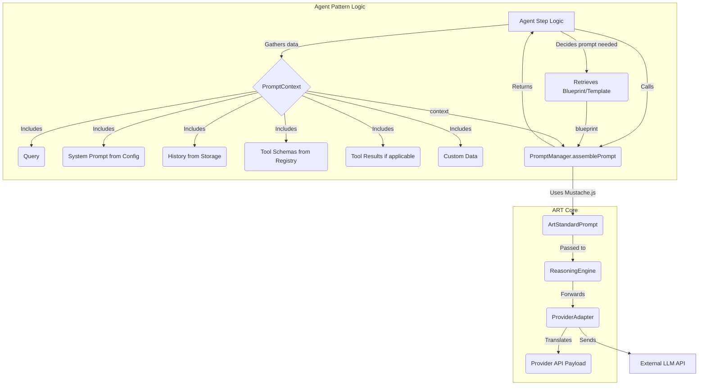

# ART Prompt Management Refactoring - PRD & Checklist

## 1. Introduction & Intent

*   **Goal:** Refactor ART's Prompt Management system to enhance flexibility, decouple agent patterns from the core framework, and give developers more control over prompt content without modifying core code.
*   **Problem Statement:** Current `PromptManager` is tightly coupled to the PES pattern, has hardcoded defaults, and lacks a clear separation between prompt assembly and provider-specific formatting.

## 2. Rationale

*   **Support Custom Agent Patterns:** Explicitly decouple core prompt assembly from the PES agent pattern to allow developers to create and integrate arbitrary agent flows without modifying the ART framework.
*   **Developer Control over Content:** Enable developers to define and control key prompt content elements:
    *   System prompts (via `ThreadConfig` or dynamic context).
    *   Tool presentation (via descriptions/schemas in their tool definitions, interpreted by agent blueprints).
    *   Custom data/instructions relevant to their specific agent logic (via `PromptContext`).
*   **Provider Agnosticism:** Achieve true decoupling between agent logic/prompt structure and provider-specific API requirements by introducing a standardized intermediate format (`ArtStandardPrompt`).
*   **Clear Responsibilities:** Establish clear boundaries: Agent Patterns define structure (blueprints) and provide context; `PromptManager` assembles into the standard format; Adapters translate the standard format to the provider API.
*   **Alignment:** Align with established framework best practices (similar to philosophies in LangChain, LlamaIndex) that favor configuration, standardization, and template-driven customization over hardcoded, monolithic logic.

## 3. Proposed Architecture Overview

*   **`ArtStandardPrompt` Format:** Define a canonical, provider-agnostic message array format (e.g., `[{ role: 'system' | 'user' | 'assistant' | 'tool_request' | 'tool_result', content: string | object }]`). This will replace the current `FormattedPrompt` type alias.
*   **Agent Pattern Responsibility:** Defines prompt "blueprints" (templates targeting `ArtStandardPrompt`) and gathers all necessary `PromptContext` data (query, system prompt string, history, tool schemas, tool results, custom data).
    *   *Blueprint Location & Rationale:* For built-in agents (e.g., PES), blueprints should reside within the agent's source file (e.g., as exported constants in a dedicated section) for maintainability by framework developers. Custom agent developers manage blueprints externally (e.g., separate files, configuration). Blueprints are considered intrinsic to the agent pattern's logic (defining *how* it structures its requests) and are therefore *not* selected or modified via `ThreadConfig`, which is reserved for runtime configuration like the `systemPrompt` string or enabled tools.
    *   *Custom Context Example:* The `PromptContext` allows agents to pass arbitrary key-value data. For instance, a custom "Writing Agent" could pass `{ targetAudience: "Experts", writingStyle: "Formal", persona: "Academic" }` along with the standard context. Its blueprint could then incorporate these values, e.g., within the system message: `System: You are an AI assistant writing for {{targetAudience}} in a {{writingStyle}} style, adopting an {{persona}} persona. {{systemPrompt}}`. This allows for highly specialized prompts using the standard assembly mechanism.
    *   *Default System Prompts:* Built-in agent patterns (like PES) should define their own internal default system prompt strings. The agent logic will first attempt to load a `systemPrompt` from `ThreadConfig`. If none is found, it will use its internal default. This ensures predictable behavior out-of-the-box while allowing per-thread customization via `ThreadConfig`.
*   **Core `PromptManager`:** Becomes a stateless assembler with a method like `assemblePrompt(blueprint: string | object, context: PromptContext): Promise<ArtStandardPrompt>`. It uses an internal templating engine (selected in Dependencies) to produce the `ArtStandardPrompt` object based on the agent-provided blueprint and context.
*   **Core `ReasoningEngine`:** Receives the `ArtStandardPrompt` from `PromptManager` and passes it directly to the selected `ProviderAdapter`.
*   **Provider Adapters:** Each adapter becomes responsible for **translating** the received `ArtStandardPrompt` object into the specific API format required by the target LLM provider (e.g., mapping roles, structuring content, handling tool calls/results according to that API's specification).

*   This architecture ensures that developers can customize prompt behavior significantly by controlling the inputs (blueprints, configuration, context) without needing to modify the core `PromptManager` assembly logic or the provider-specific `Adapter` translation logic.

*   **Example Data Flow (`PromptContext` -> `ArtStandardPrompt`):**
   1.  *Agent Logic (e.g., PES Planning):* Gathers `query`, `history`, `availableTools`, `systemPrompt` (from `ThreadConfig` or agent default) into a `PromptContext` object. Retrieves its specific `planningBlueprint` (Mustache template string).
   2.  *Agent Logic Calls:* `promptManager.assemblePrompt(planningBlueprint, planningContext)`.
   3.  *`PromptManager` Execution:* Uses Mustache.js to render the `planningBlueprint` using data from `planningContext`. This involves iterating over history, tools, etc., as defined in the blueprint. The output is a JSON string representing the `ArtStandardPrompt` array structure defined in the blueprint. `PromptManager` parses this JSON string into the final `ArtStandardPrompt` object.
   4.  *`PromptManager` Output:* Returns the assembled `ArtStandardPrompt` (an array of `ArtStandardMessage` objects), e.g., `[{ role: 'system', content: '...', ... }, { role: 'user', content: '...', ... }, ...]`.
   5.  *Agent Logic:* Passes the resulting `ArtStandardPrompt` to `ReasoningEngine`.

## 3.5 Design Evolution / Alternatives Considered

The proposed architecture evolved through discussion:

1.  **Initial State:** The original `PromptManager` included methods (`createPlanningPrompt`, `createSynthesisPrompt`) tightly coupled to the Plan-Execute-Synthesize (PES) agent pattern. It also contained hardcoded default prompt templates and system messages. *Limitation:* Inflexible, difficult to support custom agents, developer control required framework modification.
2.  **Alternative 1: Externalized Full Templates:** The idea was proposed to move entire prompt templates out of the core code, allowing developers to provide template files. `PromptManager` would load and populate these. *Limitation:* This still potentially burdened the `PromptManager` or the template itself with provider-specific formatting details, failing to achieve full decoupling.
3.  **Alternative 2: Standardized Assembly, Customized Content:** This shifted focus to `PromptManager` having internal assembly logic but using developer-provided *content parts* (system prompt string, tool descriptions, custom context). *Limitation:* Initial discussions incorrectly suggested `PromptManager` might still produce provider-specific formats, placing translation burden incorrectly.
4.  **Final Proposed Architecture:** Refined the previous idea. Agent Patterns own the structural "blueprints" (templates). Agent logic gathers all context. `PromptManager` becomes a stateless assembler using the blueprint and context to create a standardized `ArtStandardPrompt` format. Provider Adapters are solely responsible for translating `ArtStandardPrompt` to the specific target API format. *Benefit:* Achieves the optimal separation of concerns: Agent developers focus on logic and prompt structure (via blueprints targeting the ART standard) without needing provider knowledge. Core `PromptManager` is simple and stateless. Provider Adapters encapsulate all provider-specific translation complexity. This maximizes flexibility, maintainability, and true provider agnosticism for the core framework and agent developers.

## 4. Affected Components Checklist

*   **Phase 1:** [x] **Type Definitions (`src/types/index.ts`):**
    *   [x] Define `ArtStandardMessageRole` enum/type (`'system' | 'user' | 'assistant' | 'tool_request' | 'tool_result'`).
    *   [x] Define `ArtStandardMessage` interface (with `role`, `content: string | object`, potentially `name`, `tool_call_id`, `tool_calls` fields based on role).
    *   [x] Define `ArtStandardPrompt` type alias as `ArtStandardMessage[]`.
    *   [x] Define `PromptContext` interface (including optional standard fields like `query`, `history`, `availableTools`, `toolResults`, `systemPrompt` and allowing `[key: string]: any`).
    *   [x] Rename/deprecate existing `FormattedPrompt` type alias (`export type FormattedPrompt = ArtStandardPrompt;`).
    *   [ ] *Note on `ArtStandardMessageRole` Compatibility:* The roles (`system`, `user`, `assistant`, `tool`) are chosen for broad compatibility across major LLM providers. Adapters will be responsible for translating these standard roles and associated content/structure into the specific API formats:
        *   *OpenAI:* Direct mapping. `assistant` messages contain `tool_calls` array. `tool` messages use `role: 'tool'` and `tool_call_id`.
        *   *Anthropic:* `system` maps to top-level param. `user`/`assistant` map directly. `tool` role messages need translation into Anthropic's `user` role message containing a `tool_result` content block, linked via IDs. `tool_calls` in `assistant` messages map to Anthropic's tool use request structure within an `assistant` message.
        *   *Gemini:* `user`/`model` (assistant) map directly. `system` often handled via initial messages or specific parameters. `tool_calls` in `assistant` messages map to `functionCall` parts. `tool` role messages map to `functionResponse` parts.
    *   [ ] *Note on Compatibility with Existing `ParsedToolCall` and `ToolResult`:*
        *   `ParsedToolCall` (OutputParser -> ToolSystem): The Agent logic will need to transform `ArtToolCallRequest[]` (from an `assistant` `ArtStandardMessage`) into `ParsedToolCall[]` before calling `ToolSystem.executeTools`. This involves parsing the `arguments` string into an object.
        *   `ToolResult` (ToolSystem -> Agent -> PromptContext): The Agent logic will receive `ToolResult[]` from `ToolSystem`. When preparing the `PromptContext` for prompt assembly (e.g., for a synthesis prompt), the Agent logic must ensure that the `output` or `error` from `ToolResult` is appropriately stringified to fit into the `content: string | null` field of the `tool` role `ArtStandardMessage` generated by the blueprint/assembler.
*   **Phase 1:** [x] **`PromptManager` Interface (`src/core/interfaces.ts`):**
    *   [x] Remove `createPlanningPrompt` and `createSynthesisPrompt` methods.
    *   [x] Add `assemblePrompt(blueprint: string | object, context: PromptContext): Promise<ArtStandardPrompt>` method signature.
*   **Phase 1:** [x] **`PromptManager` Implementation (`src/systems/reasoning/PromptManager.ts`):**
    *   [x] Add Mustache.js dependency (`npm install mustache` or equivalent).
    *   [x] Integrate Mustache.js as the templating engine (Dependency: Step 2 in High-Level Plan).
    *   [x] Implement the `assemblePrompt` method:
        *   Accept `blueprint` (string expected for Mustache) and `context`.
        *   Use the templating engine to populate the blueprint with context data.
        *   Ensure the output strictly conforms to the `ArtStandardPrompt` structure (array of `ArtStandardMessage`).
        *   Handle potential errors during templating.
    *   [x] Remove old methods, hardcoded templates, and defaults. Make the class stateless.
*   **Phase 1:** [x] **`GeminiAdapter` Implementation (`src/adapters/reasoning/gemini.ts`):**
    *   [x] Modify the `call` method to accept `ArtStandardPrompt` instead of `FormattedPrompt` (string).
    *   [x] Implement translation logic: Iterate through the `ArtStandardPrompt` array and map `ArtStandardMessage` objects to the Gemini API's `contents` array structure (handling roles, content types, tool calls/results according to Gemini spec).
    *   [x] Remove any previous assumptions about the input prompt format.
*   **Phase 1:** [x] **`PESAgent` Implementation (`src/core/agents/pes-agent.ts`):**
    *   [x] Define default blueprints (Mustache template strings) for its planning and synthesis steps as exported constants within `pes-agent.ts`, targeting the `ArtStandardPrompt` output structure.
    *   [x] In the `execute` method:
        *   [x] Implement logic to retrieve `systemPrompt` from `ThreadConfig` using `stateManager.getThreadConfigValue(threadId, 'systemPrompt')`, falling back to an internal PES default system prompt string if the config value is `undefined` or empty.
        *   **Planning Step:**
            *   [x] Gather context (`query`, `history`, `availableTools`, resolved `systemPrompt`) into a `PromptContext` object.
            *   [x] Retrieve the planning blueprint.
            *   [x] Replace call to `createPlanningPrompt` with `this.props.promptManager.assemblePrompt(planningBlueprint, planningContext)`.
        *   **Synthesis Step:**
            *   [x] Gather context (`query`, `history`, `toolResults`, `intent`, `plan`, resolved `systemPrompt`) into a `PromptContext` object. Ensure `toolResults` content is appropriately stringified if necessary for the blueprint/template.
            *   [x] Retrieve the synthesis blueprint.
            *   [x] Replace call to `createSynthesisPrompt` with `this.props.promptManager.assemblePrompt(synthesisBlueprint, synthesisContext)`.
*   **Phase 1:** [x] **`PromptManager` Tests (`src/systems/reasoning/PromptManager.test.ts`):**
    *   [x] Rewrite tests to focus on `assemblePrompt`.
    *   [x] Test with various blueprints and context data combinations.
    *   [x] Verify correct `ArtStandardPrompt` output structure.
    *   [x] Test error handling.
*   **Phase 1:** [x] **`GeminiAdapter` Tests (`src/adapters/reasoning/gemini.test.ts`):**
    *   [x] Update tests to provide `ArtStandardPrompt` input to the `call` method.
    *   [x] Verify correct translation to the Gemini API format for different message types (system, user, assistant, tool interactions).
*   **Phase 1:** [x] **`PESAgent` Tests (`src/core/agents/pes-agent.test.ts`):**
    *   [x] Update mocks for `promptManager` to mock `assemblePrompt`.
    *   [x] Verify `assemblePrompt` is called with expected blueprints and context data for both planning and synthesis steps.
    *   [x] Ensure tests still cover different execution paths (with/without tools, errors).
*   **Phase 1:** [x] **`AgentFactory` Tests (`src/core/agent-factory.test.ts`):**
    *   [x] Update `PromptManager` mock instantiation/usage if necessary based on interface changes.
*   **Phase 2+:** [ ] **Other `ProviderAdapter` Implementations (`src/adapters/reasoning/*.ts`):** Add translation logic (similar to Gemini).
*   **Phase 2+:** [ ] **Other Agent Implementations (if any):** Refactor similarly to `PESAgent`.
*   **Phase 2+:** [ ] **Documentation (Guides, API):** Update all relevant documentation.

## 5. Dependencies

*   Selection and integration of a suitable templating engine (e.g., Handlebars, Mustache, EJS, or simpler custom solution) capable of handling loops (for history/tools) and basic conditional logic within blueprints.
*   Clear and comprehensive definition of the `ArtStandardPrompt` message structure, including how roles, content types, and tool interactions are represented.
*   **Templating Engine Selection & Integration:**
    *   *Choices Considered:* Handlebars.js (powerful, complex), Mustache.js (logic-less, simple, secure), EJS (uses JS, flexible, potential security risk), Custom Regex (minimal, hard to maintain).
    *   *Requirements:* Variable substitution, loops (history, tools), basic conditionals, security, performance, maintainability.
    *   *Decision:* **Mustache.js** is selected due to its balance of simplicity, security (logic-less), and necessary features (loops, conditionals via sections). Handlebars remains a potential future alternative if significantly more complex template logic becomes essential.
    *   *Task:* Add Mustache.js dependency (`npm install mustache @types/mustache` or equivalent) and integrate it into the `PromptManager` implementation.

## 6. Concerns / Risks & Mitigation Strategies

*   **Adapter Translation Complexity:**
    *   *Risk:* Implementing robust translation logic in each adapter for diverse provider APIs (especially tool use) is complex and requires ongoing maintenance.
    *   *Mitigation:*
        *   Keep `ArtStandardPrompt` as minimal and standard as possible.
        *   Provide clear specifications and examples for `ArtStandardPrompt`, especially tool interactions.
        *   Develop shared utility functions (e.g., in `src/adapters/utils.ts`) for common, reusable translation tasks like mapping standard roles (`system`, `user`, `assistant`, `tool_result`) to provider-specific roles or structuring basic content parts. This reduces code duplication across adapters.
        *   Implement a comprehensive, standard compliance test suite (e.g., `adapter-compliance.test.suite.ts`) that takes any adapter instance and runs it against a predefined set of diverse `ArtStandardPrompt` scenarios (simple chat, multi-turn, tool requests, tool results, system prompts, edge cases). Assert that the translated output matches the expected provider-specific format for each scenario. Every adapter *must* pass this suite to ensure consistency.
        *   Use a phased rollout (Gemini first in Phase 1) to identify and resolve translation challenges early before tackling all adapters.
*   **Templating Engine Choice:**
    *   *Risk:* Balancing features, performance, security, and maintainability.
    *   *Mitigation:* Favor simpler, secure engines like Mustache.js unless complex logic is proven necessary. Carefully vet security if dynamic template loading is ever considered (currently not planned).
*   **`ArtStandardPrompt` Definition:**
    *   *Risk:* Format might be insufficient for future LLM features or overly complex.
    *   *Mitigation:* Design based on common patterns across major providers (OpenAI, Anthropic, Gemini). Allow for future evolution of the standard.
*   **Developer Documentation:**
    *   *Risk:* Insufficient documentation hinders adoption and correct usage.
    *   *Mitigation:* Create clear documentation covering the architecture, `ArtStandardPrompt` format, blueprint creation, context usage, and error handling.
*   **Performance:**
    *   *Risk:* Template processing adds overhead.
    *   *Mitigation:* Choose an efficient engine; benchmark and optimize if necessary.
*   **Migration Effort:**
    *   *Risk:* Refactoring existing components is time-consuming.
    *   *Mitigation:* Use a phased approach (Phase 1 focus). Ensure comprehensive test coverage.
*   **Error Handling Strategy:**
    *   *Goal:* Ensure errors are identifiable, traceable, visible for debugging, and allow for graceful failure handling by the application.
    *   *`PromptManager` Errors (Assembly):* During `assemblePrompt`, catch errors from the templating engine (e.g., Mustache's parse errors, unresolved tags if configured to throw). Wrap these in a specific `ARTError` (code `PROMPT_ASSEMBLY_FAILED`) with a detailed message including the likely source blueprint step and the original error (e.g., "Failed to assemble prompt for 'PES_PLAN': Mustache unresolved tag '{{missing_variable}}'").
    *   *Adapter Errors (Translation):* Within the adapter's `call` method, if the incoming `ArtStandardPrompt` contains a structure or role combination that the adapter cannot translate to the target API, throw a specific `ARTError` (code `PROMPT_TRANSLATION_FAILED`). The message must clearly state the adapter name and the specific incompatibility (e.g., "Adapter 'GeminiAdapter' cannot translate message with role 'tool_request' containing nested arrays").
    *   *Adapter Errors (API Call):* When making the actual API call, catch any provider-specific errors (network issues, authentication failures, rate limits, invalid requests reported by the provider). Wrap these in an `ARTError` (code `LLM_PROVIDER_ERROR`), preserving the original status code, error message, and any other relevant details from the provider's response.
    *   *Agent Core Handling:* The agent's main execution logic (e.g., `PESAgent.execute`) must wrap calls to `promptManager.assemblePrompt` and `reasoningEngine.call` (which internally calls the adapter) within try/catch blocks. Upon catching any `ARTError`:
        *   Record an `Observation` of type `ERROR` via `ObservationManager`, including the error code, message, and potentially the stack trace. This ensures visibility for debugging.
        *   The agent must then decide how to proceed based on the error type or application logic: potentially halt execution, attempt a recovery strategy (e.g., retry, inform the user of a specific failure), or simply propagate the error upwards. This allows application developers using ART to handle failures gracefully.

## 7. High-Level Implementation Plan

1.  **Phase 1:** Define `ArtStandardPrompt` structure and related types (`ArtStandardMessage`, `PromptContext`) in `src/types/index.ts`.
2.  **Phase 1:** Select and integrate the chosen templating engine into `PromptManager`.
3.  **Phase 1:** Refactor `PromptManager` interface (`src/core/interfaces.ts`) and implementation (`src/systems/reasoning/PromptManager.ts`) to use `assemblePrompt` and produce `ArtStandardPrompt`.
4.  **Phase 1:** Refactor `GeminiAdapter` (`src/adapters/reasoning/gemini.ts`) to implement translation logic from `ArtStandardPrompt`.
5.  **Phase 1:** Refactor `PESAgent` (`src/core/agents/pes-agent.ts`) to manage blueprints, gather `PromptContext`, and call `assemblePrompt`.
6.  **Phase 1:** Update tests for `PromptManager`, `GeminiAdapter`, `PESAgent`, and `AgentFactory` mocks.
7.  **Phase 2+:** Refactor remaining `ProviderAdapters` (OpenAI, Anthropic, OpenRouter, DeepSeek).
8.  **Phase 2+:** Update tests for remaining adapters.
9.  **Phase 2+:** Update all documentation (Guides, API Reference).