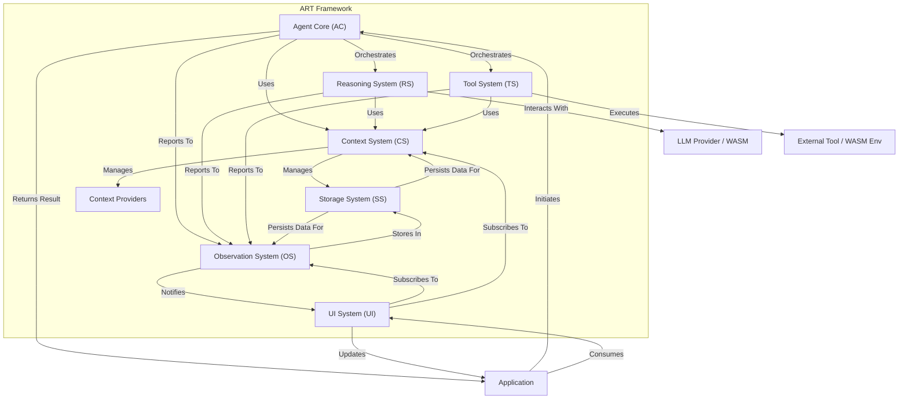

# ART Framework: Architecture Overview

## Introduction

The Agent Reasoning & Tooling (ART) Framework is designed to empower developers to build sophisticated, LLM-powered intelligent agents primarily within the browser environment. Its architecture is centered around modularity, extensibility, and observability.

ART is composed of 7 core, interconnected subsystems that work together to enable complex agent behaviors:

1.  **Agent Core (AC)**
2.  **Reasoning System (RS)**
3.  **Tool System (TS)**
4.  **Context System (CS)**
5.  **Observation System (OS)**
6.  **UI System (UI)**
7.  **Storage System (SS)**

This document provides a high-level overview of these subsystems and the core architectural principles guiding the framework.

## Core Architectural Principles

ART's design is guided by several key principles:

1.  **Decoupled Orchestration Architecture:** ART separates the *logic* of how an agent reasons and acts (the orchestration pattern, e.g., Plan-Execute-Synthesize) from the *mechanics* of interacting with LLMs, tools, and data. This means:
    *   Reasoning patterns (PES, ReAct, CoT, custom) can be implemented and even hot-swapped without changing the underlying subsystems.
    *   All patterns use the same standard interfaces to interact with the Tool System, Context System, etc.
    *   Core functionalities like observation and event handling work consistently across different patterns.

2.  **Registry-Based Approach:** Major components like Models, Tools, and potentially specialized Agents are managed through registries. This provides:
    *   A centralized catalog of available capabilities.
    *   A clean separation between *what* capabilities exist and *how* the agent uses them.
    *   Easy extensibility by registering new components.

3.  **Browser-First Philosophy:** While capable of server integration, ART is designed primarily for the browser. This involves:
    *   Leveraging WebAssembly (WASM) for client-side processing (e.g., local LLM inference, vector stores - planned).
    *   Minimizing reliance on mandatory server components.
    *   Prioritizing privacy and offline capabilities where feasible.

4.  **Modularity and Extensibility:** Each subsystem has well-defined responsibilities and interfaces, allowing developers to:
    *   Replace default implementations (e.g., use a different storage adapter).
    *   Extend the framework with new tools, reasoning patterns, or context providers.

5.  **Observability:** The Observation System provides deep insights into the agent's internal workings, crucial for debugging, monitoring, and building trust.

## System Diagram

The following diagram illustrates the relationships between the core subsystems:

## Subsystem Descriptions

*   **Agent Core (AC):** The central orchestrator. It manages the overall execution flow based on a selected reasoning pattern (e.g., Plan-Execute-Synthesize for v1.0). It coordinates interactions between the other subsystems.
*   **Reasoning System (RS):** Handles all interactions with Language Models (LLMs). This includes constructing prompts, calling LLM APIs (via Provider Adapters) or local WASM models, parsing responses, and managing model selection through the Model Registry.
*   **Tool System (TS):** Manages the definition (using JSON Schema), registration (via Tool Registry), validation, and secure execution of tools (external capabilities like web search, calculators, or custom functions).
*   **Context System (CS):** Responsible for managing the information the agent needs to maintain context. This includes conversation history (`ConversationManager`), thread-specific configuration and state (`StateManager`), and dynamic context retrieved from external sources (`ContextProvider`, e.g., RAG results). It relies on the Storage System for persistence.
*   **Observation System (OS):** Provides transparency into the agent's operations. It creates, manages, and broadcasts structured records (`Observations`) of key events (like planning steps, tool calls, errors, thoughts) for debugging, logging, and UI updates. It uses the Storage System for persistence and notifies the UI System.
*   **UI System (UI):** Facilitates communication between the ART framework and the application's frontend. It provides typed, filterable sockets (`ObservationSocket`, `ConversationSocket`) using a publish/subscribe pattern, allowing the UI to react to specific agent events efficiently.
*   **Storage System (SS):** Offers a unified, adaptable persistence layer. It uses Storage Adapters (`InMemoryStorageAdapter`, `IndexedDBStorageAdapter` in v1.0) to save and retrieve data like conversation history, agent state, and observations, ensuring data is available across sessions when needed.

## High-Level Data Flow (PES Example)

A typical request using the default Plan-Execute-Synthesize (PES) pattern flows through the system as follows:

1.  **Initiation:** The Application sends a query to the Agent Core, providing a `threadId` to identify the conversation context.
2.  **Configuration & Context:** The Agent Core, via the Context System (specifically `StateManager` and `ConversationManager`), loads the relevant configuration (LLM settings, enabled tools) and conversation history for the given `threadId` from the Storage System.
3.  **Planning:** The Reasoning System generates a plan (including potential tool calls) based on the query, history, and available tools. Observations (`INTENT`, `PLAN`, `THOUGHTS`) are generated.
4.  **Execution:** The Tool System executes the planned tool calls, validating inputs and capturing results. `TOOL_EXECUTION` observations are generated.
5.  **Synthesis:** The Reasoning System generates the final response, considering the original query, the plan, and the tool results. More `THOUGHTS` observations may be generated.
6.  **Finalization:** The Agent Core formats the final User and AI messages. The Context System saves the new messages and any state changes to the Storage System. The UI System is notified via sockets, and the final response is returned to the Application.

Throughout this process, the `threadId` is crucial for ensuring that all operations (history retrieval, state loading, tool permissions, message saving) are correctly scoped to the specific conversation. The Observation System records events at each stage, providing a detailed trace of the agent's execution.