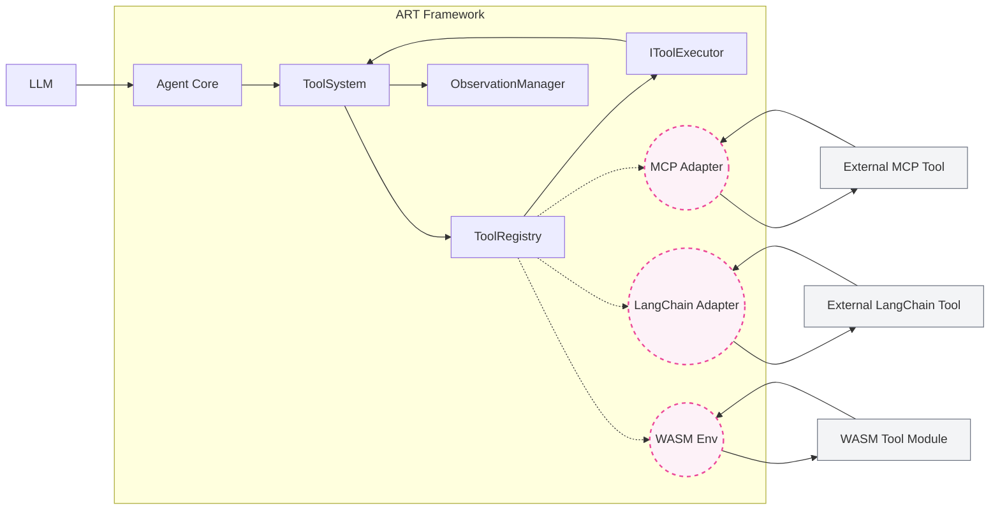

# ART Framework: Tool System Overview

Welcome to the documentation for the Agent Reasoning &amp; Tooling (ART) Framework's Tool System. Tools are fundamental components that empower ART agents to interact with the outside world, perform actions, retrieve information, and execute complex tasks beyond the capabilities of the Language Model (LLM) alone.

## Purpose

The ART Tool System is designed to be robust, flexible, and secure. Its primary responsibilities include:

*   **Definition:** Providing a standardized way to define tool capabilities, inputs, and outputs using `ToolSchema`.
*   **Registration:** Managing a central `ToolRegistry` where available tools are cataloged.
*   **Discovery:** Allowing the agent (via the Reasoning System) to discover available tools and understand how to use them based on their schemas.
*   **Validation:** Ensuring tool inputs conform to the defined schema and that the tool is permitted for use within the current context (`ThreadConfig`).
*   **Execution:** Orchestrating the secure execution of tool logic.
*   **Observation:** Recording the outcome (success or failure) of tool executions for transparency and debugging via the `ObservationManager`.

## Core Components

*   **`IToolExecutor`:** The interface that native ART tools must implement.
*   **`ToolSchema`:** Defines a tool's name, description, input/output structure (using JSON Schema), and examples.
*   **`ToolRegistry`:** The central catalog holding instances of available tools.
*   **`ToolSystem`:** Orchestrates the entire tool lifecycle, including permission checks, validation, execution, and observation recording.

## Vision &amp; Compatibility

ART aims to be a highly versatile framework. While the primary method for adding tools currently involves implementing the native `IToolExecutor` interface directly within the framework, the architectural vision includes broader compatibility:

*   **Native Tools:** Implemented directly using `IToolExecutor`. (Current focus)
*   **MCP Tools:** Planned support for tools exposed via the Machine-readable Capability Protocol (MCP).
*   **LangChain Tools:** Planned adapter layer to allow seamless use of existing LangChain tools.
*   **WASM Tools:** Planned support for executing tools within a secure WebAssembly environment.

The `ToolRegistry` is designed as the central hub to manage all these tool types in the future, providing a unified interface for the agent regardless of the tool's origin.

**Note:** Dashed lines represent future compatibility layers.

## Documentation Guides

To learn more about contributing and using tools in ART, please refer to the following guides:

*   **[Creating Native Tools](./Creating_Native_Tools.md):** Learn how to implement the `IToolExecutor` interface for tools built directly into the framework.
*   **[Tool Lifecycle and Integration](./Tool_Lifecycle_and_Integration.md):** Understand how tools are registered, validated, executed, and observed within the ART ecosystem.
*   **[Security and Best Practices](./Security_and_Best_Practices.md):** Guidelines for writing secure and effective tools.
*   **[Future Directions](./Future_Directions.md):** Information on planned features like MCP support, LangChain adapters, and WASM tools.