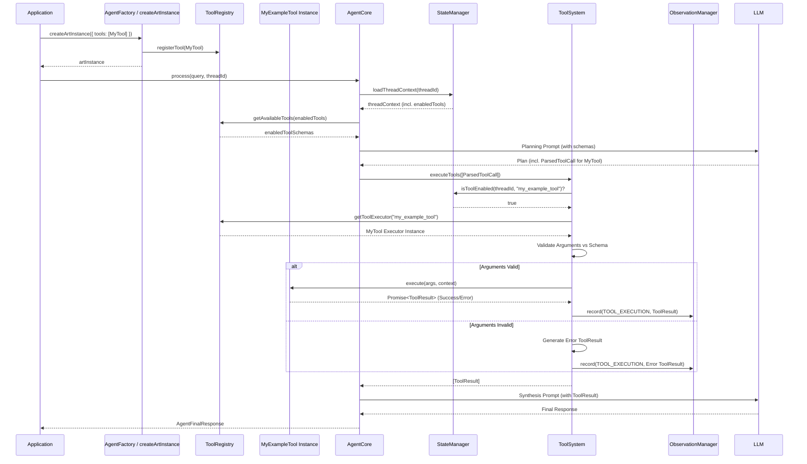

# ART Tool Lifecycle and Integration

This document explains how a native ART tool (implementing `IToolExecutor`) integrates with the framework and the lifecycle it follows during agent execution. Understanding this flow is crucial for debugging and ensuring your tool interacts correctly with other ART systems.

## 1. Registration (Initialization Time)

Native tools become available to the ART framework during the initialization phase, typically when you call `createArtInstance`.

*   **Instantiation:** You first create an instance of your tool class (e.g., `const myTool = new MyExampleTool();`).
*   **Configuration:** You pass this instance within the `tools` array of the `AgentFactoryConfig` object provided to `createArtInstance`.
    ```typescript
    // In your application setup
    import { createArtInstance, AgentFactoryConfig, MyExampleTool } from 'art-framework';

    const myToolInstance = new MyExampleTool();

    const config: AgentFactoryConfig = {
        // ... other config (storage, reasoning)
        tools: [ myToolInstance /*, other tool instances */ ]
    };

    const art = await createArtInstance(config);
    ```
*   **Registry Population:** The `AgentFactory` (used internally by `createArtInstance`) takes these tool instances and registers each one with the central `ToolRegistry` instance, using the tool's static `toolName` as the key.

**Note:** While the `ToolRegistry` is designed to potentially handle other tool types (MCP, LangChain adapters) dynamically in the future, native `IToolExecutor` tools are currently registered only at initialization time via this configuration method.

## 2. Discovery (Planning Phase)

During the agent's planning phase (e.g., in the PES pattern):

*   **Schema Retrieval:** The `AgentCore` (via `StateManager` and `ToolRegistry`) retrieves the `ToolSchema` objects for all tools *enabled* for the current `threadId` (as defined in `ThreadConfig.enabledTools`).
*   **LLM Context:** These schemas (including `name`, `description`, `inputSchema`, `examples`) are provided to the LLM as part of the planning prompt.
*   **Tool Selection:** The LLM uses the descriptions and input schemas to determine if any available tools can help fulfill the user's query and generates `ParsedToolCall` requests if needed.

## 3. Execution Orchestration (Execution Phase)

When the `AgentCore` decides to execute tools based on the LLM's plan:

*   **`ToolSystem.executeTools`:** The `AgentCore` passes the list of `ParsedToolCall` objects to the `ToolSystem`.
*   **Sequential Execution:** The `ToolSystem` currently iterates through the requested tool calls *sequentially*. (Parallel execution is a planned future enhancement).
*   **For each `ParsedToolCall`:**
    1.  **Permission Check:** `ToolSystem` asks the `StateManager` if the requested `toolName` is present in the `enabledTools` list within the `ThreadConfig` for the current `threadId`. If not enabled, an error `ToolResult` is generated immediately.
    2.  **Executor Retrieval:** `ToolSystem` retrieves the corresponding `IToolExecutor` instance from the `ToolRegistry` using the `toolName`. If not found, an error `ToolResult` is generated.
    3.  **Input Validation:** `ToolSystem` validates the `arguments` provided in the `ParsedToolCall` against the tool's declared `inputSchema` using a JSON Schema validator. If validation fails, an error `ToolResult` is generated without calling the tool's logic.
    4.  **Context Creation:** `ToolSystem` creates an `ExecutionContext` object containing `threadId`, `traceId`, and potentially `userId`.
    5.  **`execute` Call:** `ToolSystem` calls the tool's `async execute(validatedArguments, executionContext)` method.
    6.  **Result Handling:** `ToolSystem` receives the `Promise<ToolResult>` from the `execute` method. It ensures the `callId` and `toolName` in the result match the request.
    7.  **Observation Recording:** `ToolSystem` calls `observationManager.record()` to create and persist a `TOOL_EXECUTION` observation containing the complete `ToolResult` (whether success or error). This makes the tool's outcome visible via the `ObservationSocket`.
*   **Return Results:** `ToolSystem` collects all the `ToolResult` objects (one for each call attempt) and returns them as an array to the `AgentCore`.

## 4. Tool Context (`ExecutionContext`)

The `ExecutionContext` object passed to your tool's `execute` method provides limited, essential context:

*   `threadId: string`: Identifies the current conversation thread.
*   `traceId?: string`: A unique identifier for the entire agent processing cycle (useful for correlating logs and observations). Use this as the `callId`.
*   `userId?: string`: Optional identifier for the user associated with the thread.

Tools do **not** typically receive direct access to managers like `StateManager` or `ConversationManager` to maintain isolation and security.

## Summary Flow



This lifecycle ensures that tools are used appropriately based on configuration, their inputs are validated, their execution is observed, and they operate within a defined context.