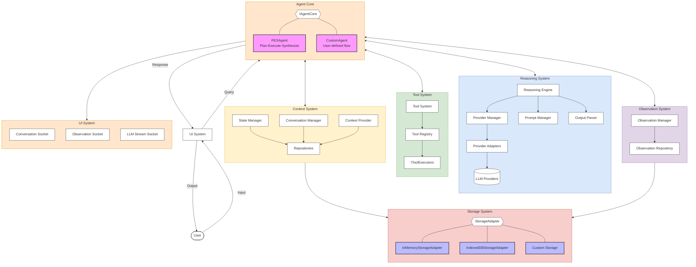

# Welcome to the ART Framework!

The ART (Agent Runtime) Framework is a comprehensive TypeScript library designed to simplify the development of sophisticated AI agents. It provides a modular, extensible, and robust architecture for building agents that can reason, use tools, manage context, and interact with users and external systems.

## Why ART?

ART aims to address common challenges in AI agent development by offering:

*   **Flexible Orchestration:** ART's core design decouples the agent's orchestration logic (the "how" of processing a query) from its core functionalities (reasoning, tools, context). This means developers can use the default `PESAgent` or easily **swap in their own custom agent core implementations** via `ArtInstanceConfig` without altering the underlying systems. This provides unparalleled flexibility in defining agent behavior.
*   **Structured Yet Adaptable:** While offering patterns like Plan-Execute-Synthesize (`PESAgent`), the framework allows for diverse agent architectures.
*   **Modularity:** Decoupled systems for reasoning, context management, tool usage, observation, and UI communication, allowing for easier customization and extension.
*   **Provider Agnosticism:** A flexible `ProviderManager` and adapter system to seamlessly switch between different LLM providers (OpenAI, Anthropic, Gemini, Ollama, etc.) without rewriting core agent logic.
*   **Standardized Primitives:** Core abstractions like `ArtStandardPrompt` for LLM interactions and `StreamEvent` for handling real-time responses simplify development and ensure consistency.
*   **Robust Tool Integration:** A powerful `ToolSystem` and `ToolRegistry` for defining, registering, and executing custom capabilities for your agents.
*   **Configurable State Management:** Built-in support for managing conversation history and agent state, with strategies for both explicit and implicit state saving.
*   **Comprehensive Observability:** A dedicated `ObservationSystem` to track key events and data points throughout the agent's lifecycle, aiding in debugging and analysis.
*   **Developer-Friendly API:** Designed to be intuitive and easy to learn, with a focus on clear interfaces and conventions.

## Core Philosophy & Design Principles

*   **Separation of Concerns:** Each component in ART has a well-defined responsibility.
*   **Extensibility:** Interfaces are designed to be implemented and extended, allowing developers to plug in custom components, including entirely different agent orchestration logics.
*   **Developer Experience:** Focus on providing clear APIs, good documentation, and tools that make agent development faster and more reliable.
*   **Standardization:** Promote common patterns and data structures (like `ArtStandardPrompt`) to reduce boilerplate and improve interoperability.

## Key Features

*   **Swappable Agent Core (`IAgentCore`):** Use the default `PESAgent` (Plan-Execute-Synthesize) or implement your own custom orchestration logic.
*   **Multi-Provider LLM Support:** Easily integrate and switch between various LLM providers via the `ProviderManager` and `ProviderAdapter` system.
*   **Streaming LLM Responses:** Built-in support for handling `StreamEvent`s for real-time token-by-token output from LLMs.
*   **Flexible Tool System:** Define custom tools with JSON Schema for input validation and seamlessly integrate them into your agent's workflow.
*   **Persistent & In-Memory Storage:** Choose between `IndexedDBStorageAdapter` for browser persistence or `InMemoryStorageAdapter` for testing and ephemeral agents, or implement your own.
*   **Configurable State Management:** Manage thread-specific configurations and agent state with strategies for explicit or implicit saving.
*   **Comprehensive Observability:** Log and retrieve detailed observations of agent activity for debugging and analysis.
*   **UI Integration Sockets:** `TypedSocket` implementations for `ConversationMessage`, `Observation`, and `LLMStreamEvent` to easily connect your agent to a user interface.

## Who is ART For?

*   Developers building AI-powered applications that require complex reasoning, tool use, and interaction.
*   Teams looking for a structured and maintainable way to develop AI agents with the ability to define custom operational flows.
*   Developers who want the flexibility to experiment with different LLM providers and agent architectures.
*   Anyone interested in building robust, observable, and adaptable AI systems.

## High-Level Architecture![[welcome.excalidraw]]

**Key Subsystems:**

The ART Framework is composed of several key subsystems that work together:

*   **Agent Core (`IAgentCore`):** The heart of the agent, responsible for the overall orchestration logic (e.g., `PESAgent`'s Plan-Execute-Synthesize flow, or a custom-defined flow). It coordinates interactions between all other systems to process a user's query and generate a response. This component is designed to be **swappable**, allowing developers to implement entirely different agent behaviors.
*   **Reasoning System:** Handles all interactions with LLM providers. It includes the `ReasoningEngine`, `ProviderManager` (for managing multiple LLM `ProviderAdapter`s), the `ProviderAdapter`s themselves (which translate to specific LLM APIs), the `PromptManager` (for prompt fragments and validation), and the `OutputParser` (for interpreting LLM responses).
*   **Tool System:** Enables agents to use external capabilities. It comprises a `ToolRegistry` (to manage available tools) and a `ToolSystem` (to handle the secure execution of tools, including input validation).
*   **Context System:** Manages all stateful information for a conversation. This includes:
    *   `StateManager`: For thread-specific configurations (`ThreadConfig`) and persistent agent operational state (`AgentState`).
    *   `ConversationManager`: For managing the history of `ConversationMessage`s.
    *   `ContextProvider` (currently a placeholder): Intended for future Retrieval-Augmented Generation (RAG) features.
    *   Repositories (`StateRepository`, `ConversationRepository`, `ObservationRepository`): Abstractions over the storage layer for specific data types.
*   **Observation System:** Key to the observability of the agent's activities. The `ObservationManager` records significant events (`Observation`s) throughout the agent's lifecycle, which can be persisted (via `ObservationRepository`) and broadcast for debugging or UI updates.
*   **UI System:** Provides `TypedSocket` instances (`ConversationSocket`, `ObservationSocket`, `LLMStreamSocket`) that allow front-end applications or other services to subscribe to real-time updates from the agent's backend.
*   **Storage System:** An abstraction layer (`StorageAdapter` interface) for data persistence, with concrete implementations like `InMemoryStorageAdapter` and `IndexedDBStorageAdapter`, allowing for flexibility in how and where agent data is stored.

Configuration for these components is primarily managed through `ArtInstanceConfig` when creating an ART instance using `createArtInstance`.

## Quick Links

*   **[Getting Started](./getting-started/quick-start.md):** Build your first "Hello, Agent!"
*   **Core Concepts:**
    *   [Architecture Overview](./core-concepts/architecture-overview.md)
    *   [ArtStandardPrompt](./core-concepts/art-standard-prompt.md) - The common language for LLM prompts.
    *   [Streaming & StreamEvents](./core-concepts/streaming-and-streamevents.md) - Real-time LLM responses.
    *   [Provider Management](./core-concepts/provider-management.md) - Using multiple LLM providers.
*   **Key How-To Guides:**
    *   [Configure an ART Instance](./how-to/configure-art-instance.md)
    *   [Define and Use Tools](./how-to/define-tools.md)
    *   [Handle Streaming in UI](./how-to/handle-streaming-ui.md)
*   **[Examples](./examples/basic-chatbot.md):** See ART in action.