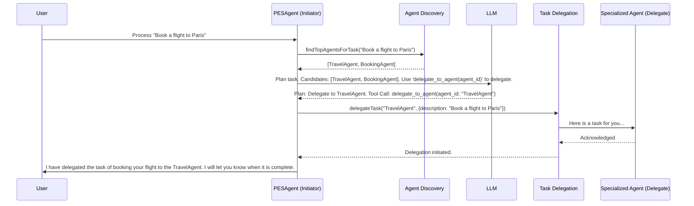

# A2A Task Delegation

## 1. Overview

Agent-to-Agent (A2A) task delegation in the ART framework is a powerful feature that allows one agent to delegate a task to another, more specialized agent. The framework implements a sophisticated **hybrid selection model** that combines programmatic filtering with LLM-driven reasoning to choose the best agent for a given task.

This approach ensures that the LLM is presented with a pre-vetted, high-quality list of candidate agents, improving the reliability and efficiency of the delegation process.

## 2. The Hybrid Selection Model

The selection process involves two main stages:

1.  **Programmatic Filtering & Scoring (`AgentDiscoveryService`):** When a task needs to be delegated, the `AgentDiscoveryService` first finds all available agents and then scores them based on their suitability for the task description. This results in a ranked list of the top N candidate agents.
2.  **LLM-driven Selection (`PESAgent`):** The `PESAgent` takes this ranked list of candidates and injects it directly into the planning prompt. The LLM then uses its reasoning capabilities to make the final selection from this pre-filtered list, considering the nuances of the task and the descriptions of the candidate agents.

This hybrid model gets the best of both worlds: the deterministic efficiency of code-based filtering and the nuanced, contextual understanding of a powerful LLM.

## 3. Core Components

### `AgentDiscoveryService`

-   **Role:** Finds and ranks potential agents for a task.
-   **Method:** `findTopAgentsForTask(taskDescription: string, maxResults: number)`
-   **Process:**
    1.  Fetches a list of all available agents from a discovery endpoint (configurable in `a2aConfig`).
    2.  For each agent, it calculates a relevance score based on how well its `description` and `capabilities` match the `taskDescription`.
    3.  It returns a ranked list of the agents with the highest scores.

### `TaskDelegationService`

-   **Role:** Handles the actual mechanics of delegating the task once an agent has been selected.
-   **Method:** `delegateTask(agentId: string, task: Task)`
-   **Process:**
    1.  Constructs the payload for the delegation request.
    2.  Sends the request to the selected agent's endpoint.
    3.  Manages the communication and status updates for the delegated task.

### `PESAgent` Modifications

The `PESAgent` was significantly enhanced to support this new flow:

1.  **Discovery Step:** Before creating the planning prompt, the `PESAgent` now calls the `AgentDiscoveryService` to get the list of top candidate agents.
2.  **Dynamic Prompt Injection:** The names and descriptions of these candidate agents are formatted and injected into the system prompt that is sent to the LLM for the planning phase.
3.  **Virtual Tool Call:** The prompt instructs the LLM that if it wants to delegate the task, it should use a special tool call: `delegate_to_agent`. The `agent_id` argument for this tool call must be one of the candidate agents provided in the prompt.

## 4. The Delegation Flow

This new architecture makes A2A delegation a core, reliable, and intelligent feature of the ART framework.