# Architecture Overview![[architecture-overview.excalidraw]]

The ART (Agent-Reasoning-Tooling) Framework is designed with a modular architecture to promote separation of concerns, extensibility, and maintainability. Understanding how these components fit together is key to effectively using and customizing ART.

```mermaid
flowchart TD

%% Main Components

User([User Input/External Triggers]) --> ArtInstance["ArtInstance\n(process method)"]

%% Agent Core as the central orchestrator

ArtInstance --> AgentCore["Agent Core (IAgentCore)\n(Swappable Component)\n(e.g., PESAgent)"]

%% Major Subsystems

subgraph ReasoningSystem ["Reasoning System"]

ReasoningEngine["ReasoningEngine"]

ProviderManager["ProviderManager"]

ProviderAdapters["ProviderAdapters\n(OpenAI, Anthropic, Ollama)"]

PromptManager["PromptManager\n(fragments/validation)"]

OutputParser["OutputParser"]

ExternalLLM["External LLM APIs"]

ReasoningEngine --> ProviderManager

ProviderManager --> ProviderAdapters

ProviderAdapters <--> ExternalLLM

PromptManager -.-> ReasoningEngine

ReasoningEngine -.-> OutputParser

end

subgraph ToolSystem ["Tool System"]

ToolSystemMain["ToolSystem"]

ToolRegistry["ToolRegistry"]

ToolExecutor["IToolExecutor\n(specific tools)"]

ToolSystemMain --> ToolRegistry

ToolSystemMain --> ToolExecutor

end

subgraph ContextSystem ["Context System"]

StateManager["StateManager\n(ThreadConfig, AgentState)"]

ConversationManager["ConversationManager\n(message history)"]

ContextProvider["ContextProvider\n(future: RAG)"]

StateRepository["StateRepository"]

ConversationRepository["ConversationRepository"]

StateManager --> StateRepository

ConversationManager --> ConversationRepository

ContextProvider -.-> AgentCore

end

subgraph ObservationSystem ["Observation System"]

ObservationManager["ObservationManager"]

ObservationRepository["ObservationRepository"]

ObservationManager --> ObservationRepository

end

subgraph StorageSystem ["Storage System"]

StorageAdapter["StorageAdapter\n(InMemory, IndexedDB, etc.)"]

StateRepository --> StorageAdapter

ConversationRepository --> StorageAdapter

ObservationRepository --> StorageAdapter

end

subgraph UISystem ["UI System"]

UISystemMain["UISystem"]

LLMStreamSocket["LLMStreamSocket"]

ObservationSocket["ObservationSocket"]

ConversationSocket["ConversationSocket"]

ExternalUI["External UI/Subscribers"]

UISystemMain --> LLMStreamSocket

UISystemMain --> ObservationSocket

UISystemMain --> ConversationSocket

LLMStreamSocket --> ExternalUI

ObservationSocket --> ExternalUI

ConversationSocket --> ExternalUI

end

%% Connections between Agent Core and Subsystems

AgentCore --> ReasoningEngine

AgentCore --> ToolSystemMain

AgentCore --> StateManager

AgentCore --> ConversationManager

%% Cross-system connections

ReasoningEngine --> LLMStreamSocket

ToolSystemMain --> ObservationManager

ToolSystemMain <--> StateManager

ObservationManager --> ObservationSocket

ConversationManager --> ConversationSocket

AgentCore --> ObservationManager

%% A2A Delegation
subgraph "A2A Delegation"
   direction LR
   AgentDiscoveryService["AgentDiscoveryService"]
   TaskDelegationService["TaskDelegationService"]
end
AgentCore --> AgentDiscoveryService
AgentCore --> TaskDelegationService

%% Key Data Flow Items

ArtStandardPrompt["ArtStandardPrompt"] -.-> ReasoningEngine

StreamEvent["StreamEvent"] -.-> LLMStreamSocket

ToolResult["ToolResult"] -.-> AgentCore

Observation["Observation"] -.-> ObservationManager

ConversationMessage["ConversationMessage"] -.-> ConversationManager

%% Configuration

ArtInstanceConfig["ArtInstanceConfig"] -.-> ArtInstance

%% Style

classDef system fill:#f9f9f9,stroke:#999,stroke-width:1px

classDef core fill:#ffebcd,stroke:#ff8c00,stroke-width:2px

classDef component fill:#e6f7ff,stroke:#1890ff,stroke-width:1px

classDef external fill:#f0f0f0,stroke:#d9d9d9,stroke-width:1px

classDef dataitem fill:#f6ffed,stroke:#52c41a,stroke-width:1px,stroke-dasharray: 5 5

class ReasoningSystem,ToolSystem,ContextSystem,ObservationSystem,StorageSystem,UISystem system

class AgentCore core

class ReasoningEngine,ProviderManager,ProviderAdapters,PromptManager,OutputParser,ToolSystemMain,ToolRegistry,ToolExecutor,StateManager,ConversationManager,ContextProvider,ObservationManager,UISystemMain,LLMStreamSocket,ObservationSocket,ConversationSocket,StateRepository,ConversationRepository,ObservationRepository,StorageAdapter component

class User,ExternalLLM,ExternalUI external

class ArtStandardPrompt,StreamEvent,ToolResult,Observation,ConversationMessage,ArtInstanceConfig dataitem
```

<!--
    Placeholder for Detailed Architecture Diagram.
    This diagram should visually represent:
    1.  **User Input/External Triggers** feeding into the system.
    2.  The **`ArtInstance`** as the primary entry point (`process` method).
    3.  The central **Agent Core (`IAgentCore`)** (e.g., `PESAgent` or a custom implementation) as the main orchestrator. Highlight that this component is swappable.
    4.  Arrows showing the Agent Core interacting with the major subsystems:
        *   **Reasoning System:**
            *   Agent Core -> `ReasoningEngine`
            *   `ReasoningEngine` -> `ProviderManager`
            *   `ProviderManager` -> (selects/manages) -> `ProviderAdapter` (multiple, e.g., OpenAI, Anthropic, Ollama)
            *   `ProviderAdapter` <-> External LLM API
            *   Agent Core also uses `PromptManager` (for fragments/validation) and `OutputParser`.
        *   **Tool System:**
            *   Agent Core -> `ToolSystem`
            *   `ToolSystem` -> `ToolRegistry`
            *   `ToolSystem` -> `IToolExecutor` (specific tool)
            *   `ToolSystem` also interacts with `StateManager` (for tool enablement) and `ObservationManager` (to record tool execution).
        *   **Context System:**
            *   Agent Core -> `StateManager` (for `ThreadConfig`, `AgentState`)
            *   Agent Core -> `ConversationManager` (for message history)
            *   Managers -> Respective Repositories (`StateRepository`, `ConversationRepository`)
            *   (Future: Agent Core -> `ContextProvider` for RAG)
        *   **Observation System:**
            *   Various components (Agent Core, `ToolSystem`, etc.) -> `ObservationManager`
            *   `ObservationManager` -> `ObservationRepository`
        *   **Storage System:**
            *   All Repositories (`StateRepository`, `ConversationRepository`, `ObservationRepository`) -> `StorageAdapter` (e.g., `InMemoryStorageAdapter`, `IndexedDBStorageAdapter`)
        *   **UI System:**
            *   `ReasoningEngine` (via Agent Core), `ObservationManager`, `ConversationManager` -> `UISystem` (which provides specific sockets like `LLMStreamSocket`, `ObservationSocket`, `ConversationSocket`)
            *   Sockets -> External UI/Subscribers
    5.  Show data flow for key items like `ArtStandardPrompt`, `StreamEvent`, `ToolResult`, `Observation`, `ConversationMessage`.
-->

## Core Subsystems and Their Roles

The ART framework is organized into several distinct subsystems, each with a clear responsibility:

1.  **Agent Core (`IAgentCore`):**
    *   **Role:** The central brain and orchestrator of the agent. It defines the high-level logic for processing user queries and coordinating other systems.
    *   **Key Feature:** This component is **swappable**. While ART provides `PESAgent` (Plan-Execute-Synthesize) as a default, developers can implement the `IAgentCore` interface to create entirely different agent behaviors (e.g., ReAct, custom task-specific flows) without altering the underlying framework functionalities. This is configured via `ArtInstanceConfig.agentCore`.
    *   **Interaction:** Receives user input, drives the reasoning process, decides when to use tools, manages the flow of information, and produces the final response.

2.  **Reasoning System:**
    *   **Role:** Handles all aspects of interaction with Large Language Models (LLMs).
    *   **Components:**
        *   `ReasoningEngine`: The primary interface for making calls to an LLM.
        *   `ProviderManager`: Manages a collection of `ProviderAdapter`s, enabling dynamic selection of LLM providers and models at runtime. It handles adapter instantiation, caching, and lifecycle.
        *   `ProviderAdapter`s (e.g., `OpenAIAdapter`, `AnthropicAdapter`, `OllamaAdapter`): Translate ART's standard `ArtStandardPrompt` into provider-specific API requests and convert responses back into `StreamEvent`s.
        *   `PromptManager`: Provides utility for retrieving pre-defined prompt fragments and validating `ArtStandardPrompt` objects.
        *   `OutputParser`: Interprets raw LLM responses, extracting structured data like intent, plans, tool call requests, and `<think>` tag content.
    *   **Interaction:** The Agent Core constructs an `ArtStandardPrompt` and uses the `ReasoningEngine` (which leverages the `ProviderManager` and a specific `ProviderAdapter`) to get a response from an LLM.

3.  **Tool System:**
    *   **Role:** Enables the agent to use external capabilities or "tools."
    *   **Components:**
        *   `ToolRegistry`: A catalog of available `IToolExecutor` instances.
        *   `ToolSystem`: Orchestrates tool execution, including validating inputs against `ToolSchema`, invoking the tool, and handling results.
        *   `IToolExecutor`: The interface that custom tools implement, defining their `schema` (for LLM understanding and input validation) and `execute` logic.
    *   **Interaction:** If the Reasoning System's output (parsed by `OutputParser`) indicates a tool should be used, the Agent Core directs the `ToolSystem` to execute it. Results are then fed back into the agent's context.

4.  **Context System:**
    *   **Role:** Manages all contextual information necessary for the agent's operation within a conversation thread.
    *   **Components:**
        *   `StateManager`: Handles loading, saving, and providing access to `ThreadConfig` (e.g., enabled tools, default LLM settings for the thread) and `AgentState` (persistent agent-specific data).
        *   `ConversationManager`: Manages the history of `ConversationMessage`s for a thread.
        *   `ContextProvider` (Placeholder for future RAG): Intended to inject dynamically retrieved information into prompts.
        *   Repositories (`StateRepository`, `ConversationRepository`, `ObservationRepository`): These components act as a bridge between the managers and the `StorageAdapter`, specializing in how specific data types are stored and retrieved.
    *   **Interaction:** The Agent Core constantly interacts with `StateManager` and `ConversationManager` to fetch context for prompts and to save new messages and state changes.

5.  **Observation System:**
    *   **Role:** Provides observability into the agent's internal workings by recording significant events.
    *   **Components:**
        *   `ObservationManager`: The service used by other systems to record `Observation` objects (e.g., `INTENT`, `PLAN`, `TOOL_CALL`, `TOOL_EXECUTION`, `ERROR`, `LLM_STREAM_START`).
        *   `ObservationRepository`: Persists these observations via a `StorageAdapter`.
    *   **Interaction:** Various components (Agent Core, `ToolSystem`) call `ObservationManager.record()` to log events. These observations are crucial for debugging, monitoring, and can be broadcast to UIs.

6.  **Storage System:**
    *   **Role:** Provides a generic persistence layer for all framework data.
    *   **Components:**
        *   `StorageAdapter` (Interface): Defines methods like `get`, `set`, `delete`, `query`.
        *   Concrete Adapters (`InMemoryStorageAdapter`, `IndexedDBStorageAdapter`, custom adapters): Implement the `StorageAdapter` interface for specific storage backends.
    *   **Interaction:** All Repositories (`StateRepository`, `ConversationRepository`, `ObservationRepository`) use a configured `StorageAdapter` instance to save and retrieve their respective data types.

7.  **UI System:**
    *   **Role:** Facilitates real-time communication from the agent's backend to user interfaces or other subscribed services.
    *   **Components:**
        *   `UISystem`: A central service that instantiates and provides access to various `TypedSocket`s.
        *   Specialized Sockets (`ConversationSocket`, `ObservationSocket`, `LLMStreamSocket`): Extend `TypedSocket` to broadcast specific data types (`ConversationMessage`s, `Observation`s, `StreamEvent`s).
    *   **Interaction:** Core components like the `AgentCore` (for LLM streams), `ObservationManager`, and `ConversationManager` use these sockets (obtained from `UISystem`) to `notify` subscribers of updates.
 
8.  **A2A Delegation System:**
    *   **Role:** Facilitates one agent delegating a task to another, more specialized agent.
    *   **Components:**
        *   `AgentDiscoveryService`: Programmatically filters and ranks potential delegate agents based on the task description.
        *   `TaskDelegationService`: Handles the actual delegation process once an agent has been selected.
    *   **Interaction:** The `PESAgent` uses the `AgentDiscoveryService` to find suitable candidates, which are then presented to the LLM. If the LLM decides to delegate, the `PESAgent` uses the `TaskDelegationService` to initiate the task on the chosen agent. See [A2A Task Delegation](./a2a-delegation.md) for more details.
 
9.  **Authentication:**
    *   **Role:** Manages authentication and authorization for the agent.
    *   **Components:**
        *   `AuthManager`: The central service for handling authentication.
        *   `PKCEOAuthStrategy`: An implementation of the Authorization Code Flow with PKCE, suitable for browser-based applications.
    *   **Interaction:** The `AuthManager` is configured with a specific strategy. When the agent needs to make an authenticated request, the `AuthManager` provides the necessary credentials. See [PKCEOAuthStrategy](./pkce-oauth-strategy.md) for more details.
 
 ## Configuration: `ArtInstanceConfig`
 
 The entire framework is initialized and wired together based on the `ArtInstanceConfig` object passed to the `createArtInstance` function. This single configuration object dictates:

*   The choice of `StorageAdapter`.
*   The setup of the `ProviderManager` (defining all available LLM providers).
*   The `IAgentCore` implementation to use (e.g., `PESAgent` or a custom one).
*   Initial tools to be registered.
*   The `StateSavingStrategy`.
*   Logger settings.

This modular, interface-driven architecture makes ART highly flexible and extensible, allowing developers to tailor it to a wide range of AI agent applications. The ability to swap out the core orchestration logic (`IAgentCore`) without rewriting other systems is a particularly powerful feature for advanced customization.