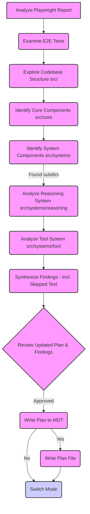

# ART Framework Functionality Review Plan & Report (Based on E2E Tests)

## Objective

Review the provided Playwright test report (`playwright-report/index.html`), cross-reference it with the E2E tests (`e2e/pes-flow.spec.ts`) and the main codebase (`src/`), to determine the full intended functionality of the ART framework as covered by these tests.

## Information Gathering Steps

The following steps were taken to gather context:

1.  Analyzed Playwright Report (`playwright-report/index.html` content provided by user).
2.  Examined E2E Test Specification (`e2e/pes-flow.spec.ts`).
3.  Explored Codebase Structure (`src/`).
4.  Identified Core Components (`src/core`).
5.  Identified System Components (`src/systems/reasoning`, `src/systems/tool`).

## Plan Diagram

## Synthesized Findings

Based on the analysis, the E2E tests cover the following functionality:

1.  **PES Flow Execution:** The tests verify the fundamental **P**rompt-**E**xecute-**S**ynthesize cycle. The framework can accept a user prompt via an API.
2.  **Reasoning & Planning:** The framework processes the prompt using a reasoning system (`ReasoningEngine`, `PromptManager`, `OutputParser`) which can interpret the user's intent and plan necessary actions, including identifying when a tool is needed.
3.  **Tool Integration & Execution:** The tests confirm the framework can successfully identify the need for, find (via `ToolRegistry`), and execute at least one specific tool (the Calculator tool via `ToolSystem`) based on the user's query.
4.  **Response Synthesis:** After execution (including potential tool use), the framework synthesizes a final response and returns it in a structured format (`AgentFinalResponse`) via the API, including metadata like status and thread ID.
5.  **Storage Abstraction:** The tests demonstrate that the core flow works with different storage backends (`InMemoryStorageAdapter`, `IndexedDBStorageAdapter`), indicating an abstraction layer for state and conversation management.
6.  **Skipped Test (Persistence):** A specific test (`should persist conversation history between requests`) intended to verify conversation history persistence across requests using `IndexedDBStorageAdapter` is currently **skipped** (`test.fixme`). This means the E2E suite does *not* currently validate this persistence functionality.
7.  **Reporting:** The existence of the `playwright-report/index.html` file confirms that these E2E tests were executed using Playwright and a report was generated.

## Next Steps

The plan and findings have been reviewed and approved. The next step is to switch to a different mode (e.g., 'code' mode) to potentially address the skipped test or implement other improvements based on this review.

## 1. Introduction

*   **Purpose:** To review the functionality of the ART framework as covered by the existing Playwright E2E tests (`e2e/pes-flow.spec.ts`) and the provided test report (`playwright-report/index.html`), cross-referencing with the codebase structure.
*   **Methodology:** Analysis of the provided test report HTML, examination of the E2E test specification (`pes-flow.spec.ts`), and review of the codebase structure (`src/`, `src/core/`, `src/systems/reasoning/`, `src/systems/tool/`).
*   **Scope:** Assessment of functionality explicitly tested or implied by the E2E test suite and codebase structure. This review does *not* constitute a full functional validation against all conceptual documents or PRDs, but focuses on what the current E2E tests verify.

## 2. Conceptual Framework Summary (Inferred from Code/Tests)

*   **Vision:** ART appears to be a framework for building agents capable of reasoning and interacting with tools.
*   **Key Subsystems:** The codebase structure suggests subsystems for core agent logic, reasoning, tool management, observation, context, and UI interaction.
*   **Core Execution Pattern:** The E2E tests specifically target a Prompt-Execute-Synthesize (PES) flow, where the agent receives a prompt, potentially executes tools, and synthesizes a response.

## 3. Codebase Implementation Overview

*   **`src` Structure:** Contains modules for `adapters`, `core`, `systems`, `tools`, `types`, `utils`, `errors.ts`, and `index.ts`.
*   **Key Components:**
    *   `src/core`: Contains `AgentFactory` for orchestrating agent creation and core interfaces (`ReasoningEngine`, `PromptManager`, `StateManager`, `ToolSystem`, etc.).
    *   `src/systems/reasoning`: Implements `ReasoningEngine`, `PromptManager`, and `OutputParser`.
    *   `src/systems/tool`: Implements `ToolRegistry` and `ToolSystem`.
    *   `src/tools`: Likely contains specific tool implementations (e.g., the CalculatorTool tested).
    *   `src/adapters`: Likely contains adapters for external systems like LLMs (`OpenAIAdapter` mentioned in tests) and storage (`InMemoryStorageAdapter`, `IndexedDBStorageAdapter` tested).

## 4. Alignment Analysis (E2E Tests vs. Implementation)

*   **Architectural Alignment:** The E2E tests interact with an API endpoint (`/process`) which presumably triggers the core agent flow orchestrated by `AgentFactory`. The tested components (`CalculatorTool`, storage adapters) align with the observed codebase structure.
*   **Component Responsibility Alignment:**
    *   The tests confirm the `ReasoningEngine` (via its adapter) is invoked to process queries.
    *   The `PromptManager` and `OutputParser` are implicitly tested as part of the reasoning flow.
    *   The `ToolSystem` and `ToolRegistry` are confirmed to work for the `CalculatorTool`.
    *   `StorageAdapter` implementations (`InMemory`, `IndexedDB`) are tested for basic integration.
*   **Execution Flow Alignment:** The E2E tests validate the basic PES flow: receiving a prompt, reasoning (implicitly), executing a tool (calculator test), and synthesizing a response.

## 5. Completeness Assessment (Based on E2E Tests)

*   The E2E tests cover the fundamental PES cycle and basic tool integration.
*   They verify the integration of two different storage mechanisms at a basic level.
*   **Key Gap:** Conversation history persistence across requests using persistent storage (`IndexedDB`) is explicitly **not tested** (test skipped).

## 6. Functionality & Integration Assessment (Based on E2E Tests)

*   **Component Interactions:** The tests imply successful interaction between the API endpoint, the core agent logic, the reasoning system, the tool system, and the storage adapters.
*   **Error Handling:** Basic API success/failure is checked (`response.ok()`). The tests expect no errors (`response.metadata.error` to be undefined) for the tested scenarios. Deeper error handling within components is not explicitly tested by this suite.
*   **Testing Coverage:** The E2E suite provides basic coverage for the PES flow, calculator tool usage, and storage adapter switching. It lacks coverage for conversation persistence, complex tool interactions, error scenarios, and other potential core features.
*   

*   **Caveats:** This assessment is based *only* on the provided E2E tests and report. It doesn't guarantee the correctness or completeness of the underlying implementations beyond what's tested.

## 7. Identified Gaps & Discrepancies (From E2E Test Perspective)

*   **Untested Functionality:**
    *   Conversation history persistence (skipped test).
    *   Error handling scenarios within the agent flow.
    *   Interaction with other potential tools beyond the calculator.
    *   Complex reasoning or planning scenarios.
    *   Observation management.
    *   State management details.
    *   UI System interactions.

## 8. Answers to Specific Questions

*   **Does the report show full functionality coverage?** No. The E2E tests cover the basic PES flow and calculator tool use with different storage backends, but explicitly skip testing conversation persistence and don't cover many other potential framework features.

## 9. Key Insights & Potential Challenges

*   The core PES flow and basic tool integration seem functional based on the tests.
*   The lack of a passing test for conversation persistence with IndexedDB is a significant gap in E2E validation.
*   The current E2E suite provides a foundational check but needs expansion to cover more complex scenarios and error conditions for comprehensive validation.

## 10. Conclusion & Recommendations

*   The E2E tests confirm the basic operation of the ART framework's PES flow, including simple tool use and storage adapter integration.
*   **Recommendation:** Prioritize implementing and enabling the skipped E2E test for conversation persistence (`should persist conversation history between requests`) to validate a core aspect of the storage system.
*   **Recommendation:** Expand the E2E test suite to cover more tools, complex interactions, error handling, and other core framework features identified in conceptual documents or the PRD.
*   

Older Review ( Ignore for now)