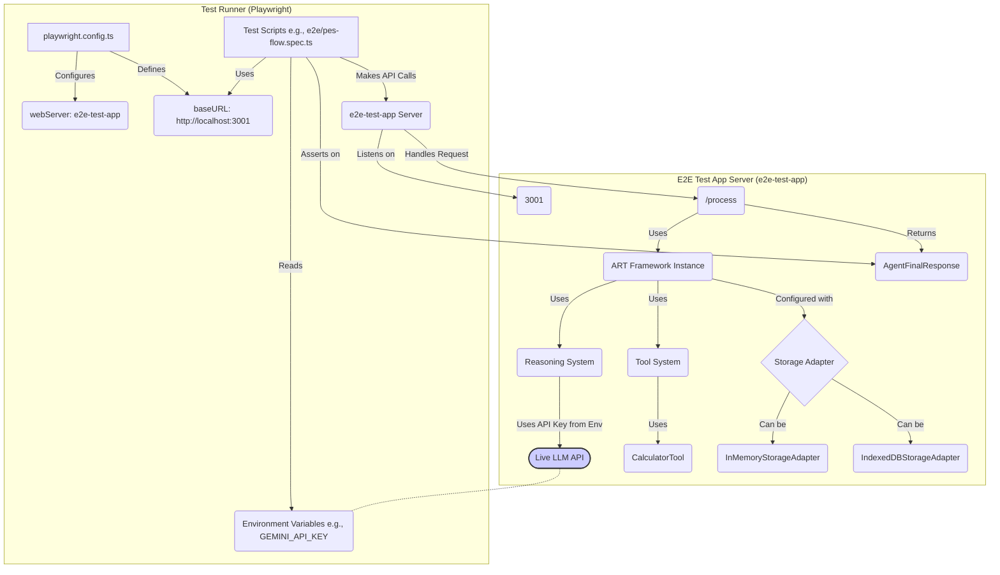
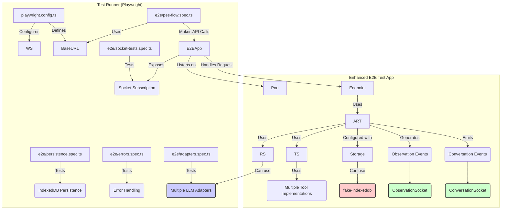

# E2E Testing Plan for ART Framework (Phase 6.1)

**Goal:** Implement Phase 6.1 of the checklist: Setup and run End-to-End (E2E) tests for the core Plan-Execute-Synthesize (PES) flow using Playwright, targeting a dedicated `e2e-test-app/` web server, utilizing live LLM API calls, and organizing tests within a new `e2e/` directory.

## Completed Tasks

1.  ✓ **Install Playwright:**
    *   Added Playwright as a development dependency to the root `package.json`.
    *   Command: `npm install --save-dev @playwright/test`

2.  ✓ **Initialize Playwright & Create Directory:**
    *   Run the Playwright installation command to download necessary browser binaries.
    *   Command: `npx playwright install`
    *   Created the `e2e/` directory at the project root to store test specifications.

3.  ✓ **Configure Playwright:**
    *   Created a `playwright.config.ts` file in the project root.
    *   Configured it to:
        *   Define the `webServer` command to start the `e2e-test-app` server.
        *   Ensure environment variables (like `GEMINI_API_KEY`) are passed through.
        *   Specify target browsers (e.g., Chromium).

4.  ✓ **Add E2E Test Script:**
    *   Added a new script to the `scripts` section of the root `package.json`.
    *   Example: `"test:e2e": "playwright test"`

5.  ✓ **Create Dedicated E2E Test App (`e2e-test-app/`):**
    *   Created the `e2e-test-app/` directory.
    *   Initialized a new Node.js/TypeScript project within it.
    *   Installed dependencies: `express`, `@types/express`, `typescript`, `@types/node`, `art-framework@file:../`, `dotenv`, `ts-node`.
    *   Created `e2e-test-app/tsconfig.json` configured for a Node.js ESM server.
    *   Updated `e2e-test-app/package.json` with `"type": "module"` and added `build`, `start`, `dev` scripts.
    *   Created `e2e-test-app/src/` directory.
    *   Implemented a minimal Express server with a `/process` endpoint that initializes ART.

6.  ✓ **Update Root Playwright Configuration (`playwright.config.ts`):**
    *   Configured the `webServer` section to run the `dev` script of the `e2e-test-app`.
    *   Set the `baseURL` to the test app's URL.

7.  ✓ **Write Basic E2E Test Specification (`e2e/pes-flow.spec.ts`):**
    *   Created the test file `e2e/pes-flow.spec.ts`.
    *   Used Playwright's `request` context to make POST requests to the `/process` endpoint.
    *   **Implemented Tests:**
        *   ✓ InMemoryStorageAdapter: Simple query
        *   ✓ InMemoryStorageAdapter: Tool query (Calculator)
        *   ✓ IndexedDBStorageAdapter: Simple query
        *   ✓ IndexedDBStorageAdapter: Tool query (Calculator)
        *   ✓ Conversation persistence between requests (using fake-indexeddb)

8.  ✓ **Updated Checklist & Changelog:**
    *   Modified status of basic tasks in PRD checklist.
    *   Added entry to changelog detailing the setup.

## Remaining Tasks & Improvement Plan

1.  **Address Skipped Persistence Test:**
    *   [✓] Integrate fake-indexeddb into the e2e-test-app server environment.
    *   [✓] Modify the test app to use fake-indexeddb when storageType: 'indexeddb' is requested during tests.
    *   [✓] Update the test.fixme to a regular test with logic to make sequential requests to the same threadId.
    *   [✓] Verify conversation history persists between requests (via the updated test).

2.  **Add Reasoning Adapter Coverage:**
    *   [ ] Modify e2e-test-app to accept an optional provider choice parameter:
        ```typescript
        // Example implementation for e2e-test-app/src/index.ts
        app.post('/process', async (req, res) => {
          const { query, storageType, provider = 'gemini' } = req.body;
          // Use provider to configure the appropriate adapter
        });
        ```
    *   [ ] Implement conditional test execution for reasoning adapters:
        *   [✓] Gemini (default - already implemented and used in all tests)
        *   [ ] OpenAI (optional - activated via test tag or environment variable)
        *   [ ] Anthropic (optional - activated via test tag or environment variable)
        *   [ ] OpenRouter (optional - activated via test tag or environment variable)
        *   [ ] DeepSeek (optional - activated via test tag or environment variable)
    *   [ ] Add configuration to skip non-Gemini adapter tests by default:
        ```typescript
        // Example for e2e/pes-flow.spec.ts
        test.describe('OpenAI adapter tests', () => {
          // Skip these tests unless ENABLE_OPENAI_TESTS=true
          test.skip(process.env.ENABLE_OPENAI_TESTS !== 'true', 
            'OpenAI tests disabled. Set ENABLE_OPENAI_TESTS=true to enable');
          
          test('processes a basic query using OpenAI', async ({ request }) => {
            // Test with OpenAI adapter
          });
        });
        ```
    *   [ ] Create a separate test file for comprehensive adapter testing (e.g., `e2e/adapters.spec.ts`)
    *   [ ] Document how to enable specific adapter tests:
        ```bash
        # Example commands to run specific adapter tests
        ENABLE_OPENAI_TESTS=true npm run test:e2e -- --grep "OpenAI adapter"
        ENABLE_ANTHROPIC_TESTS=true npm run test:e2e -- --grep "Anthropic adapter"
        ```

3.  **Add Observation System Verification:**
    *   [ ] Modify e2e-test-app's `/process` endpoint to return generated Observation records.
    *   [ ] Add assertions to verify presence and types of key observations:
        *   [ ] INTENT
        *   [ ] PLAN
        *   [ ] THOUGHTS
        *   [ ] TOOL_EXECUTION
        *   [ ] ERROR (when applicable)

4.  **Add Error Handling Tests:**
    *   [ ] Create test cases for error conditions:
        *   [ ] Invalid tool name
        *   [ ] Invalid tool arguments
        *   [ ] Tool execution errors
        *   [ ] LLM API errors
        *   [ ] Output parsing errors
    *   [ ] Assert that metadata.status is 'error' and verify error messages.

5.  **Add Tool Edge Case Tests:**
    *   [ ] Test CalculatorTool with:
        *   [ ] Scope variables
        *   [ ] Complex numbers
        *   [ ] Blocked functions (testing allowlist)
        *   [ ] Error messages from mathjs

6.  **Add Context System Tests:**
    *   [ ] Verify different threadIds remain isolated.
    *   [ ] Test configuring threads with different enabledTools.
    *   [ ] Verify agent respects thread-specific configurations.

7.  **Add UI Socket Tests:**
    *   [ ] Test ObservationSocket subscription and event reception.
    *   [ ] Test ConversationSocket subscription and event reception.

8.  **Documentation Updates:**
    *   [ ] Update PRD checklist with detailed test coverage.
    *   [ ] Update this plan document after completing each major section.
    *   [ ] Add detailed examples of test assertions for each test type.

**Prerequisites (Expanded):**

*   Necessary LLM API keys must be available as environment variables in the shell where the E2E tests will be executed:
    *   `GEMINI_API_KEY` (current implementation)
    *   `OPENAI_API_KEY` (for OpenAI adapter tests)
    *   `ANTHROPIC_API_KEY` (for Anthropic adapter tests)
    *   `OPENROUTER_API_KEY` (for OpenRouter adapter tests)
    *   `DEEPSEEK_API_KEY` (for DeepSeek adapter tests)
*   Node.js dependencies to be added:
    *   `fake-indexeddb` (for persistence testing)

**Mermaid Diagram of E2E Setup (Live LLM via Test App):**



**Future Enhancement Diagram (Extended Test Coverage):**

