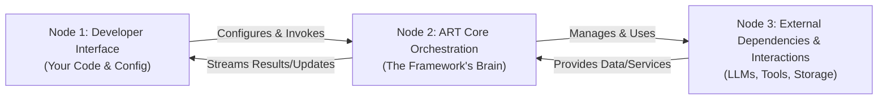

# ✨ ART: Agentic Runtime Framework 

**ART is a powerful, modular, and browser-first TypeScript framework for building sophisticated LLM-powered agents capable of complex reasoning, planning, and tool usage.**

It provides the building blocks for creating robust agentic systems that can run entirely client-side, emphasizing user privacy, offline capability, and deep observability, while also supporting server-side deployments.

[](https://opensource.org/licenses/MIT)
[](http://makeapullrequest.com)

[](https://www.patreon.com/HashanWickramasinghe)

## Overview

Existing agent frameworks often rely on server-side components, limiting their use in web applications where user privacy or offline functionality is critical. ART is engineered to address this gap by providing a comprehensive, standalone toolkit designed for the browser, while remaining powerful enough for server-side execution.

**Core Goals:**
*   **Browser-First:** Enable complex agent logic to run directly in the user's browser, enhancing privacy and reducing server costs.
*   **Modularity:** Offer distinct, replaceable components for storage, reasoning, and tools.
*   **Observability:** Provide deep, real-time insights into the agent's internal thought process.
*   **Developer Experience:** Deliver a layered API that is simple for basic use cases yet powerful enough for advanced customization.

## Key Features

#### Reasoning & Orchestration
*   **Swappable Agent Cores:** Start with the default Plan-Execute-Synthesize (`PESAgent`) pattern and seamlessly switch to or create custom reasoning patterns (e.g., ReAct, Chain of Thought).
*   **Streaming-First:** Native support for streaming LLM responses, enabling real-time, interactive user experiences.
*   **Dynamic Prompt Management:** A powerful system for constructing prompts from blueprints with dynamic context injection.
*   **Agent Persona Customization:** Easily define your agent's identity and default system prompt through a simple configuration object.
*   **Rich Observability:** A detailed, typed `Observation` system provides transparent insights into every step of an agent's operation for debugging, monitoring, and visualization.

#### Connectivity & Data
*   **Multi-Provider Support:** A centralized `ProviderManager` allows runtime selection and configuration of multiple LLM providers (OpenAI, Anthropic, Gemini, OpenRouter, and local models via Ollama).
*   **Pluggable Storage:** A flexible `StorageAdapter` interface allows easy integration with any storage backend (default support for IndexedDB, InMemory, and Supabase).
*   **Schema-Driven Tooling:** A robust tool integration system with automatic schema validation and secure execution.
*   **Dynamic Tool Loading (MCP):** Support for the Model Context Protocol (MCP) enables agents to dynamically discover and use tools from compliant external servers.

#### Developer Experience
*   **Browser-First Design:** Built to run fully in the browser, enabling privacy-preserving and offline-capable applications.
*   **Flexible UI Integration:** A typed, publish/subscribe socket system allows for reactive UI updates with fine-grained event filtering.
*   **TypeScript-Native:** Engineered from the ground up with TypeScript for a robust, type-safe development experience.

## Architecture: The 3 Nodes

ART's architecture is best understood as three interconnected nodes:



*   **Node 1: Developer Interface (Your Code & Config):** This is your interaction point with ART. You use `createArtInstance` to configure the framework, selecting your storage, LLM providers, and tools. You then invoke the agent via the `art.process()` method.
*   **Node 2: ART Core Orchestration (The Framework's Brain):** This is the internal engine that manages the agent's lifecycle. It orchestrates state, reasons with LLMs, constructs prompts, executes tools, and broadcasts updates to your UI. The selected `Agent Core` (e.g., `PESAgent`) dictates the high-level reasoning strategy used here.
*   **Node 3: External Dependencies & Interactions (The Outside World):** This node represents the external services ART connects to. This includes LLM APIs (like OpenAI), your custom tool logic, and storage backends (like IndexedDB or a remote database).

## Installation

```bash
npm install art-framework
# or
pnpm install art-framework
# or
yarn add art-framework
```

## Quick Start

This example demonstrates setting up a simple agent that uses OpenAI, runs in-memory, and answers a query.

```typescript
import { createArtInstance } from 'art-framework';
import type { ArtInstanceConfig } from 'art-framework';

async function runSimpleAgent() {
  // 1. Define the configuration for the ART instance
  const config: ArtInstanceConfig = {
    // Use 'memory' for simple tests, or 'indexedDB' for browser persistence
    storage: { type: 'memory' },

    // Configure your LLM providers. The key ('openai' here) is a friendly name.
    providers: {
      openai: {
        // The adapter handles communication with the provider
        adapter: 'openai', // Use the name of the built-in adapter
        // Pass API key securely (use env vars or a secrets manager in production)
        apiKey: 'YOUR_OPENAI_API_KEY',
      },
      // You could add other providers here, e.g., 'anthropic', 'gemini'
    },

    // Register any tools you want the agent to use
    // tools: [new CalculatorTool()],
  };

  // 2. Create the ART instance
  const art = await createArtInstance(config);
  console.log('ART instance created successfully!');

  // 3. Start a conversation and process a query
  try {
    const result = await art.process({
      query: 'What is the capital of France?',
      // Use a provider and model configured above
      threadConfig: {
        runtimeProvider: {
          provider: 'openai',
          model: 'gpt-4o-mini',
        },
      },
      // (Optional) A unique ID for the conversation thread
      threadId: 'quickstart-thread-1',
    });

    // 4. Log the result
    console.log('Agent Response:', result.responseText);
    // console.log("Full Result:", result); // You can inspect the full object for more details
  } catch (error) {
    console.error('Agent processing failed:', error);
  }
}

runSimpleAgent();
```

*(Note: Replace `'YOUR_OPENAI_API_KEY'` with your actual key. In a real application, load this from a secure source like environment variables or a secrets manager.)*

## Documentation

*   **[Comprehensive Developer Guide](docs/README.md):** The primary guide covering concepts, architecture, and API usage. **(Start Here!)**
*   **[How-To Guides](docs/how-to):** Practical guides for specific tasks, such as [Customizing the Agent's Persona](docs/how-to/customizing-agent-persona.md).
*   **[API Reference](docs/components/README.md):** Auto-generated API documentation.
*   **[Examples](./examples):** Find practical examples, including a full React chatbot implementation.

## Contributing

Contributions are welcome! Please refer to the [Contributing Guide](./CONTRIBUTING.md) for details on how to submit issues, feature requests, and pull requests.

## License

ART Framework is released under the [MIT License](https://opensource.org/licenses/MIT).
