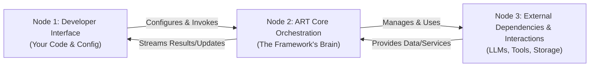

# ✨ ART: Agent Runtime Framework 

**ART is a powerful, modular, and browser-first JavaScript/TypeScript framework for building sophisticated LLM-powered intelligent agents capable of complex reasoning, planning, and tool usage.**

It provides the building blocks for sophisticated agent systems that can run entirely client-side, emphasizing privacy, offline capability, and observability, while also supporting server integration.

[](https://opensource.org/licenses/MIT)
[](http://makeapullrequest.com)

[](https://www.patreon.com/HashanWickramasinghe)
<!-- Add other relevant badges here -->

## Overview

Existing agent frameworks often require server-side components, limiting their use in purely web-based applications where privacy or offline capabilities are crucial. ART addresses this by offering a comprehensive, standalone toolkit designed for the browser environment, leveraging WebAssembly (WASM) where feasible for local processing (LLMs, vector stores) and providing robust components for building production-ready agents.

**Core Goals:**
*   **Browser-First:** Enable complex agent logic directly in the user's browser.
*   **Modularity:** Offer distinct, replaceable components (storage, providers, agent logic).
*   **Observability:** Provide deep insights into the agent's internal workings.
*   **Developer Experience:** Offer a layered approach, simple for basic use, powerful for advanced customization.

**Target Audience:** Web developers (JavaScript/TypeScript) building applications requiring agentic capabilities (chatbots, assistants, automation tools) directly within the browser, ranging from simple integrations to complex, custom agent behaviors.

## Key Features

*   **Browser-First Design:** Built to run fully in the browser, enabling privacy-preserving and offline-capable applications (when used with local models/WASM).
*   **Modular Architecture:** Comprises specialized subsystems with clear boundaries, enabling mix-and-match capabilities and easy extension. (See Architecture below).
*   **Decoupled Orchestration:** Agent reasoning patterns (like Plan-Execute-Synthesize) are decoupled from execution mechanics, allowing patterns to be swapped or customized.
*   **Real-time Streaming:** Natively supports streaming LLM responses for interactive, real-time user experiences.
*   **Flexible Prompt Management:** Advanced system using blueprints and dynamic context injection for fine-grained control over prompt construction.
*   **Dynamic Provider Management:** Centralized `ProviderManager` allows runtime selection and configuration of multiple LLM providers (OpenAI, Anthropic, Gemini, DeepSeek, OpenRouter, local models via adapters).
*   **Flexible State Management:** Pluggable `StorageAdapter` interface allows integration with various storage backends (IndexedDB, server APIs, custom solutions).
*   **Rich Observability:** Detailed, typed `Observation` system provides transparent insights into agent operations for debugging, monitoring, and visualization.
*   **Robust Tool Integration:** Schema-driven tool system (Schema-Registry-Executor) with validation and secure execution.
*   **Flexible UI Integration:** Typed socket system (publish/subscribe) for reactive UI updates with fine-grained filtering.
*   **Multiple Reasoning Patterns:** Supports Plan-Execute-Synthesize (PES) as default, with the ability to implement and integrate custom patterns like ReAct, Chain of Thought (CoT), etc.

## Architecture: The 3 Nodes

ART's architecture can be understood as three interconnected nodes:



*   **Node 1: Developer Interface (Your Code & Config):** This is where you interact with ART. You use `createArtInstance` to configure the framework, selecting your desired agent core (e.g., `PESAgent`), storage adapter, provider configurations, and tools. You then interact with the created `ArtInstance` (e.g., calling `art.process()`).
*   **Node 2: ART Core Orchestration (The Framework's Brain):** This is the internal engine that manages the agent's execution flow based on your configuration. It handles state management (via `StateManager` & `ConversationManager`), interacts with LLMs (via `ProviderManager` & `ReasoningEngine`), manages prompt construction (`PromptManager`), executes tools (`ToolSystem`), logs events (`ObservationManager`), and broadcasts updates for the UI (`UISystem`). The selected `Agent Core` (e.g., `PESAgent`) dictates the high-level reasoning pattern used here.
*   **Node 3: External Dependencies & Interactions (The Outside World):** This node represents the external services and logic ART connects to. This includes:
    *   **LLM Providers:** APIs (OpenAI, Anthropic, etc.) or local models accessed via specific `ProviderAdapter` implementations managed by the `ProviderManager`.
    *   **Tools:** Your custom tool logic, implemented according to the `IToolExecutor` interface and managed by the `ToolSystem`.
    *   **Storage:** Databases, browser storage (like IndexedDB), or remote APIs accessed via a `StorageAdapter`.

*(For more details, see the [Comprehensive Developer Guide](link/to/ART-Guide.html) or the [Architecture Overview Section](link/to/ART-Guide.html#architecture))*

## Installation

```bash
npm install art-framework
# or
yarn add art-framework
```

## Quick Start

This example demonstrates setting up a simple agent using the `PESAgent`, persisting history in `IndexedDB`, and configuring the `OpenAIAdapter` via the `ProviderManager`.

```typescript
import {
    createArtInstance,
    PESAgent,                 // Default Agent Core
    IndexedDBStorageAdapter,  // Browser-persistent storage
    OpenAIAdapter,            // OpenAI Provider Adapter
    ProviderManagerConfig,    // Type for configuring providers
    RuntimeProviderConfig,    // Type for runtime provider settings
    // Import any tools you want to use, e.g.: import { YourTool } from './your-tool';
} from 'art-framework';

async function runSimpleAgent() {
    // 1. Define Provider Configuration for the ProviderManager
    const providerConfig: ProviderManagerConfig = {
        availableProviders: [
            {
                name: 'openai',           // Unique name for this provider config
                adapter: OpenAIAdapter,   // The adapter class
                // Default options for this adapter (can be overridden at runtime)
                defaultOptions: { /* e.g., specific parameters if needed */ }
            }
            // Add other providers like GeminiAdapter, AnthropicAdapter here
            // { name: 'gemini', adapter: GeminiAdapter }
        ]
        // Optional global settings like rate limits can be defined here
    };

    // 2. Configure and create the ART instance
    const art = await createArtInstance({
        agentCore: PESAgent,                                         // Use the Plan-Execute-Synthesize agent
        storage: new IndexedDBStorageAdapter({ dbName: 'artQuickstartHistory' }), // Use IndexedDB for storage
        providers: providerConfig,                                   // Pass the provider manager config
        // tools: [new YourTool()],                                  // Register any tools here
    });

    // 3. Define a unique thread ID for the conversation
    const threadId = 'quickstart-thread-' + Date.now();

    // 4. Set the runtime provider configuration for this specific thread
    // This tells ART which provider and model to use for this conversation.
    const runtimeConfig: RuntimeProviderConfig = {
        providerName: 'openai', // Use the 'openai' provider defined above
        modelId: 'gpt-4o-mini',   // Specify the desired model
        adapterOptions: {       // Pass API key securely (use env vars in production)
            apiKey: 'YOUR_OPENAI_API_KEY'
        }
    };
    await art.stateManager.setThreadConfigValue(threadId, 'runtimeProviderConfig', runtimeConfig);

    console.log(`Starting agent process for thread: ${threadId}`);

    try {
        // 5. Process a user query
        // The agent core will automatically load the runtimeProviderConfig from the thread's state.
        const result = await art.process({
            query: "What is the capital of France and what is its population?",
            threadId: threadId,
            // Optional: userId, sessionId, traceId for tracking
            // Optional: configOverrides to temporarily change config for this call
        });

        // 6. Log the result
        console.log("Agent Response Text:", result.responseText); // Direct access to the final text response
        console.log("Full Result:", result); // Explore the full result object (metadata, observations, etc.)

    } catch (error) {
        console.error("Agent processing failed:", error);
    }
}

runSimpleAgent();
```

*(Note: Replace `'YOUR_OPENAI_API_KEY'` with your actual key, preferably loaded from environment variables in a real application. This example uses `IndexedDBStorageAdapter` for browser-based persistence and the new `ProviderManager` system.)*

## Documentation

*   **[Comprehensive Developer Guide](link/to/ART-Guide.html):** The primary guide covering concepts, architecture, scenarios, and API usage. **(Start Here!)**
*   **[Core Concepts](link/to/ART-Guide.html#core-concepts):** Understand fundamental ideas like Threads, Observations, Adapters, and Sockets within the main guide.
*   **[Architecture Overview](link/to/ART-Guide.html#architecture):** Learn about the 3-node architecture and design principles in the main guide.
*   **[Usage Scenarios / Tutorials](link/to/ART-Guide.html#scenarios):** Step-by-step examples for common tasks (Chatbot, Custom Tools, Custom Adapters).
*   **[API Reference](Docs/API/):** (Coming Soon) Auto-generated API documentation.

## Contributing

Contributions are welcome! Please refer to the Contributing Guide (TODO: Create and Link Contributing.md) for details on how to submit issues, feature requests, and pull requests.

## License

ART Framework is released under the [MIT License](https://opensource.org/licenses/MIT).
