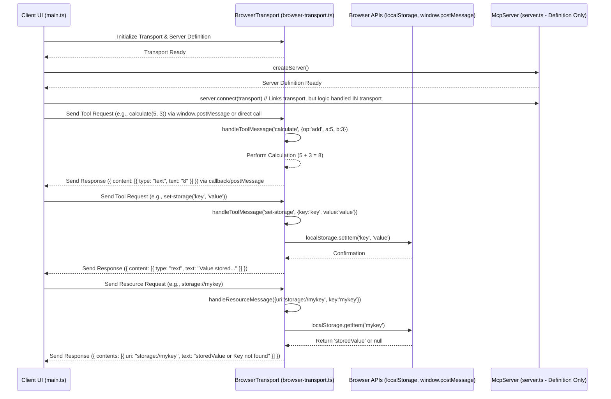

# WASM MCP Server Proof-of-Concept: Implementation Analysis

This document provides a detailed analysis of the WASM MCP Server Proof-of-Concept (PoC) implementation, based on the provided documentation and code snippets. The focus is on understanding the core components and their interactions, particularly the `McpServer` definition (`server.ts`) and the `BrowserTransport` (`browser-transport.ts`), to evaluate its potential applicability within the ART framework.

## 1. Architecture Overview

This PoC demonstrates running MCP functionalities within a web browser environment, potentially targeting WebAssembly (WASM) for the server logic, although the provided transport implementation runs directly in JavaScript.

The key components are:
*   **Client UI (`main.ts`):** Handles user interactions, gathers input, and initiates requests.
*   **BrowserTransport (`browser-transport.ts`):** Acts as the central communication hub *and* the primary execution engine for tools and resources in this specific PoC implementation. It uses browser APIs like `window.postMessage` for potential cross-context communication (e.g., with a WASM module or iframe) and `localStorage` for the storage mechanism.
*   **McpServer Definition (`server.ts`):** Defines the structure, tools, and resources of the MCP server using the `@modelcontextprotocol/sdk`. However, in this PoC, the actual execution logic defined here (like the in-memory `Map` for storage) is *not* directly used; the `BrowserTransport` intercepts and handles requests instead.
*   **Browser APIs:** Standard web APIs like `localStorage` and `window.postMessage` are leveraged by the transport layer.

**Interaction Flow:**

The typical flow involves the UI sending a request message (for a tool or resource) via the `BrowserTransport`. Instead of forwarding this request to a separate server process (like a WASM module or backend), this specific `BrowserTransport` implementation intercepts the message, parses it, executes the corresponding logic directly (performing calculations or interacting with `localStorage`), and then sends the response back to the UI.



## 2. Core Component Analysis

### 2.1. `server.ts` (MCP Server Definition)

**Purpose:** Defines the structure, metadata, tools, and resources of the MCP server using the `@modelcontextprotocol/sdk`.

**Implementation Details:**
*   **`createServer()` function:** Responsible for instantiating and configuring the `McpServer`.
*   **`McpServer` Instantiation:**
    ```typescript
    const server = new McpServer({
      name: "WASM MCP Server",
      version: "1.0.0"
    });
    ```
    Sets the basic identification for the server.
*   **Tool Registration (`server.tool`):**
    *   **`calculate` tool:**
        *   Schema: Uses `zod` to define expected parameters (`operation`: enum, `a`: number, `b`: number).
        *   Callback: Defines the *intended* logic for arithmetic operations, including division-by-zero error handling.
    *   **`set-storage` tool:**
        *   Schema: Defines `key` (string) and `value` (string).
        *   Callback: Defines the *intended* logic to store the key-value pair in an in-memory `Map` (`storage.set(key, value)`).
*   **Resource Registration (`server.resource`):**
    *   **`storage` resource:**
        *   Template: `storage://{key}` defines the URI structure.
        *   Callback: Defines the *intended* logic to retrieve a value from the in-memory `Map` (`storage.get(key)`) based on the key extracted from the URI, returning "Key not found" if absent.

**Key Takeaway:** `server.ts` correctly uses the MCP SDK to *define* the server's capabilities. However, in this PoC's execution flow as revealed by `browser-transport.ts`, the callback functions defined here are bypassed. The definitions (schemas, names, templates) are still relevant for structuring requests, but the execution happens elsewhere.

### 2.2. `browser-transport.ts` (Communication & Execution Layer)

**Purpose:** Implements the `Transport` interface from the MCP SDK to handle communication within the browser environment. **Crucially, in this PoC, it also directly implements the execution logic for the defined tools and resources.**

**Implementation Details:**
*   **`BrowserTransport` Class:** Implements `Transport`.
*   **`start()`/`stop()`/`close()`:** Manage the transport lifecycle, primarily by adding/removing a `message` event listener on the `window`.
*   **`isConnected()`:** Returns the connection state (`started` flag).
*   **`onMessage(callback)`:** Allows consumers (like the `McpServer` instance or UI components) to register callbacks for incoming messages. Returns an unsubscribe function.
*   **`handleWindowMessage(event)`:** Listens for `message` events on the `window`. If the event data has `type: "mcp-message"`, it forwards the nested `message` payload to all registered `onMessage` callbacks. This is the mechanism for receiving messages from other browser contexts (e.g., the main thread receiving from a worker or iframe, or vice-versa).
*   **`send(message)`:** This is the core method where the PoC deviates from a standard transport.
    1.  Checks if connected (`started`).
    2.  **Bypasses standard forwarding:** Instead of sending the raw message to a connected server process, it inspects the `message.method` ('tool' or 'resource').
    3.  **Direct Execution:**
        *   If `method` is 'tool', it calls `handleToolMessage(message)`.
        *   If `method` is 'resource', it calls `handleResourceMessage(message)`.
    4.  **Response Handling:** It wraps the result (or error) from the handler methods into a JSON-RPC 2.0 response structure.
    5.  **Notification:** It notifies *all* registered `onMessage` callbacks with the constructed response. This simulates the server sending a response back over the transport.
*   **`handleToolMessage(message)`:**
    *   Extracts `name` and `params` from `message.params`.
    *   Uses a `switch` statement on the tool `name`:
        *   **`calculate`:** Performs the arithmetic operation directly based on `params.operation`, `params.a`, `params.b`. Includes division-by-zero check. Returns the result formatted as MCP content.
        *   **`set-storage`:** Directly calls `localStorage.setItem(params.key, params.value)`. Returns a success message formatted as MCP content.
        *   Throws an error for unknown tool names.
*   **`handleResourceMessage(message)`:**
    *   Extracts `uri` and `key` from `message.params`.
    *   Directly calls `localStorage.getItem(key)`.
    *   If the value is not found (`!value`), it throws a 'Key not found' error (which `send` catches and formats as an error response).
    *   If found, returns the value formatted as MCP resource contents.
*   **`isTestMode` Flag:** If true, `send` simply posts the message back via `window.postMessage` and calls the callbacks directly, likely for testing purposes without invoking the internal handlers.

**Key Takeaway:** The `BrowserTransport` in this PoC is overloaded. It correctly handles the transport interface requirements (`start`, `stop`, `send`, `onMessage`) but *also* contains the application logic for the MCP tools and resources, using `localStorage` as the backing store. This tightly couples the transport mechanism with the specific tool implementations for this demo.

### 2.3. `main.ts` (Client Integration)

**Purpose:** Initializes the MCP environment in the browser and connects the UI elements to interact with the MCP server via the transport.

**Implementation Details:**
*   **`setupEnvironment()`:**
    *   Creates an instance of `BrowserTransport`.
    *   Calls `transport.start()`.
    *   Calls `createServer()` from `server.ts` to get the server definition.
    *   Calls `server.connect(transport)` to link the server definition instance with the transport instance. While standard practice, in this PoC, this connection primarily serves to potentially allow the server definition object to use the transport if needed, but the core request handling is intercepted by the transport itself.
*   **`initializeCalculator()` / `initializeStorage()`:**
    *   Get references to HTML elements (inputs, buttons, output divs).
    *   Add event listeners (e.g., `onclick` for buttons).
    *   Inside event handlers:
        *   Read input values from the UI.
        *   Perform basic input validation (though Zod validation happens conceptually at the server/tool definition level).
        *   Construct the appropriate MCP tool or resource request message (likely JSON-RPC format expected by the `BrowserTransport.send` method's internal handlers).
        *   Call `transport.send(message)` to execute the request.
        *   Handle the asynchronous response (or error) received via the `transport.onMessage` callback mechanism (or potentially directly if `send` is modified to return a promise resolving with the response).
        *   Update the UI output elements with results or error messages.

**Key Takeaway:** `main.ts` acts as the client, responsible for creating the request messages and interpreting the response messages, interacting solely with the `BrowserTransport` interface.

## 3. Tools & Resources Implementation Summary

| Feature         | Definition (`server.ts`)                                  | Execution (`browser-transport.ts`)                     | Storage Mechanism |
| :-------------- | :-------------------------------------------------------- | :----------------------------------------------------- | :---------------- |
| **`calculate`** | Zod schema, arithmetic logic callback                     | Direct arithmetic calculation in `handleToolMessage`   | N/A (Stateless)   |
| **`set-storage`** | Zod schema, `Map.set` callback                          | `localStorage.setItem` in `handleToolMessage`        | `localStorage`    |
| **`storage://{key}`** | Template, `Map.get` callback                          | `localStorage.getItem` in `handleResourceMessage`    | `localStorage`    |

This table highlights the key difference: the definition uses an in-memory `Map`, while the actual execution in this PoC uses `localStorage` via the transport layer.

## 4. Key Concepts

*   **MCP SDK:** The `@modelcontextprotocol/sdk` is used correctly in `server.ts` to define the server structure (`McpServer`), tools (`server.tool`), and resources (`server.resource`). The `Transport` interface is implemented by `BrowserTransport`.
*   **Zod:** Used effectively in `server.ts` for defining the expected schemas for tool parameters, enabling input validation (although the validation might implicitly happen during the direct execution in `browser-transport.ts` if types mismatch).
*   **`localStorage`:** Chosen as the persistent storage mechanism for the `storage` tool/resource in the `BrowserTransport` implementation. This is simple but limited to string values and browser storage quotas/restrictions.
*   **Browser Environment/WASM Context:** The PoC aims to run MCP in the browser. While WASM is mentioned, the provided `BrowserTransport` code is JavaScript. A true WASM implementation would involve compiling server logic (potentially written in Rust or C++) to WASM, loading it in the browser (e.g., in a Web Worker), and having the `BrowserTransport` communicate with it via `postMessage` or SharedArrayBuffers, rather than executing the logic itself. This PoC simulates the *interface* and *interaction* pattern.

## 5. Testing Strategy Summary

The provided documentation outlines a comprehensive testing strategy:
*   **Unit Tests:** Focus on individual components like server tool registration, calculator logic, storage logic (testing the intended `Map` logic from `server.ts` and potentially the `localStorage` logic in `browser-transport.ts`), and transport connection/messaging. Jest is the suggested framework.
*   **Integration Tests:** Verify interactions, such as server-transport communication (sending a message through transport and checking the expected outcome based on the transport's internal handling) and UI-transport integration (simulating UI events and checking if the correct messages are sent/received via transport). Testing Library (`@testing-library/jest-dom`, `fireEvent`) is suggested for UI tests.
*   **End-to-End Tests:** Simulate full user workflows for calculator and storage operations.
*   **Performance Tests:** Measure the execution time for repeated calculations and storage operations.
*   **Error Testing:** Cover scenarios like invalid server config, transport errors, division by zero, invalid inputs, and key-not-found errors.
*   **Configuration:** Includes Jest setup (`jest.config.js`, `jest.setup.ts`) and CI setup (`.github/workflows/test.yml`).
*   **Coverage:** Aims for 80% coverage across branches, functions, lines, and statements.

## 6. API Reference

### Tools

*   **`calculate`**
    *   **Params:** `{ operation: "add"|"subtract"|"multiply"|"divide", a: number, b: number }`
    *   **Returns:** `{ content: [{ type: "text", text: string }] }` (Result as string)
    *   **Errors:** Division by zero, invalid operation/input.
*   **`set-storage`**
    *   **Params:** `{ key: string, value: string }`
    *   **Returns:** `{ content: [{ type: "text", text: string }] }` (Confirmation message)

### Resources

*   **`storage://{key}`**
    *   **Params:** `key` (string, extracted from URI)
    *   **Returns:** `{ contents: [{ uri: string, text: string }] }` (Stored value or "Key not found")

## 7. Conclusion & Applicability to ART

This WASM MCP Server PoC successfully demonstrates the *structure* and *interface* of an MCP server running within a browser context. The use of the MCP SDK for defining tools/resources and the implementation of a custom `BrowserTransport` are key takeaways.

However, the **most critical aspect** for understanding its applicability to ART is the **execution model**. In this PoC, the `BrowserTransport` directly handles the logic using basic JavaScript and `localStorage`.

**For ART Integration:**
1.  **Standard MCP Flow:** A more typical integration would involve the `BrowserTransport` *actually* communicating (e.g., via `postMessage`) with a separate execution context (like a Web Worker running compiled WASM code or even just more complex JavaScript logic) where the `McpServer` instance's registered callbacks would handle the requests. The transport would purely be a message forwarder.
2.  **ART's Needs:** ART likely requires more complex tools and potentially access to browser/system resources beyond simple `localStorage`. The transport mechanism needs to be robust enough to handle communication with potentially more powerful execution backends (WASM/JS modules).
3.  **This PoC's Value:** This PoC provides a valuable blueprint for:
    *   Implementing the `Transport` interface for a browser environment.
    *   Structuring the client-side interaction (`main.ts`).
    *   Defining tools/resources using the SDK (`server.ts`).

The direct execution logic within the transport should be seen as a simplification for the PoC. A production-ready implementation for ART would likely separate the transport layer from the execution logic, allowing the execution backend (WASM or JS) to be more complex and capable, while the transport focuses solely on message passing.