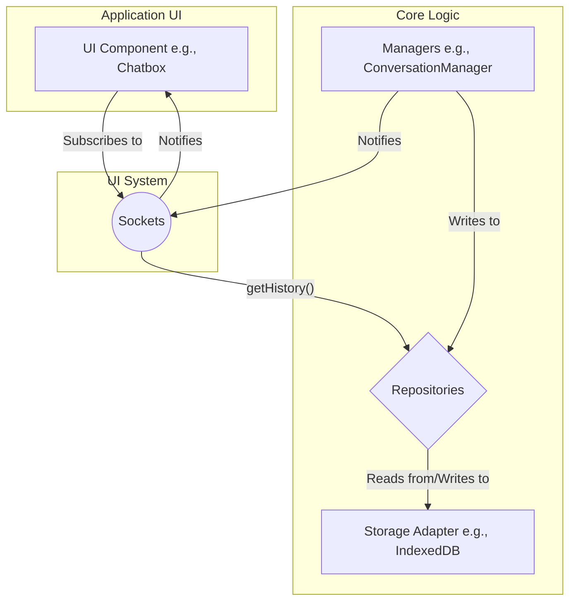
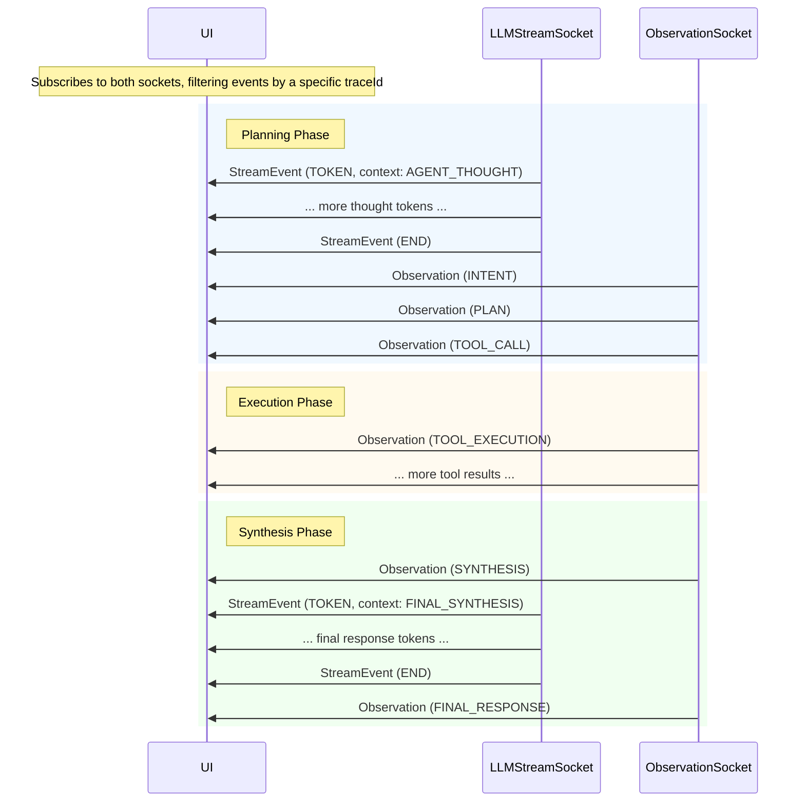

# ART Framework UI System

The UI System in the ART Framework is the bridge between the core agent logic and the user interface. It provides a reactive and robust mechanism for displaying data, capturing user interactions, and visualizing the agent's internal state in real-time. This system is designed to be flexible, allowing developers to build a wide range of UIs, from simple chat windows to complex debugging and task management dashboards.

## Core Architecture

The architecture is centered around the `UISystem`, a central hub that provides access to four specialized **sockets**. Each socket is a dedicated communication channel for a specific type of data. This separation of concerns ensures that UI components only subscribe to the data they need, making the system efficient and scalable.

All sockets are built on a publish-subscribe model. UI components can **subscribe** to a socket to receive real-time updates and can also query the socket to retrieve **historical data**.

### Data Flow Diagram

The general data flow follows a clear pattern: a manager within the framework processes data, stores it in a repository, and then notifies the corresponding socket, which in turn broadcasts the data to all subscribed UI components.



## The Sockets

The `UISystem` provides access to the following four sockets:

1.  **`ConversationSocket`**: For chat messages.
2.  **`ObservationSocket`**: For the agent's internal events and "thoughts".
3.  **`LLMStreamSocket`**: For real-time streaming of the Language Model's output.
4.  **`A2ATaskSocket`**: For monitoring tasks in multi-agent systems.

---

### 1. `ConversationSocket`

This is the primary socket for building chat interfaces. It manages the flow of messages between the user and the agent.

#### Purpose

-   Display real-time conversation history.
-   Load past messages in a conversation thread.

#### Data Transmitted: `ConversationMessage`

Each message sent through this socket is an object with the following structure:

| Field       | Type                                | Description                                                              |
| :---------- | :---------------------------------- | :----------------------------------------------------------------------- |
| `messageId` | `string`                            | A unique identifier for the message.                                     |
| `threadId`  | `string`                            | The identifier of the conversation thread.                               |
| `role`      | `enum` (`USER`, `AI`, `SYSTEM`, `TOOL`) | The sender of the message.                                               |
| `content`   | `string`                            | The textual content of the message.                                      |
| `timestamp` | `number`                            | A Unix timestamp (in milliseconds) when the message was created.         |
| `metadata`  | `object` (optional)                 | Any additional data, such as related tool call information.              |

#### Options and Props

-   **Subscription Filter**: You can subscribe to messages from a specific `role` (or an array of roles) to only receive messages from the user or the AI, for example.
-   **`getHistory(options)`**: Retrieves an array of past `ConversationMessage` objects.
    -   `threadId`: The required ID of the conversation to load.
    -   `limit`: The maximum number of messages to retrieve.

---

### 2. `ObservationSocket`

This socket provides a window into the agent's "mind," broadcasting events that occur during its execution cycle. It's invaluable for debugging and for UIs that want to show the agent's "thought process."

#### Purpose

-   Visualize the agent's step-by-step plan.
-   Display tool calls and their results.
-   Debug errors and monitor the agent's state.

#### Data Transmitted: `Observation`

| Field       | Type                    | Description                                                              |
| :---------- | :---------------------- | :----------------------------------------------------------------------- |
| `id`        | `string`                | A unique identifier for the observation.                                 |
| `threadId`  | `string`                | The identifier of the conversation thread.                               |
| `traceId`   | `string` (optional)     | An identifier for tracing a request across multiple components.          |
| `timestamp` | `number`                | A Unix timestamp (in milliseconds).                                      |
| `type`      | `enum` (`INTENT`, `PLAN`, ...) | The category of the event (see `ObservationType` enum in `types/index.ts` for a full list). |
| `title`     | `string`                | A concise, human-readable summary of the observation.                    |
| `content`   | `any`                   | The main data payload, which varies depending on the `type`.             |
| `metadata`  | `object` (optional)     | Additional context, such as the source of the event.                     |

#### Options and Props

-   **Subscription Filter**: Subscriptions can be filtered by `ObservationType` (or an array of types) to listen for specific events, like `TOOL_CALL`.
-   **`getHistory(filter, options)`**: Retrieves past `Observation` objects.
    -   `filter`: An `ObservationType` or array of types.
    -   `options`: An object containing the required `threadId` and an optional `limit`.

---

### 3. `LLMStreamSocket`

This socket is designed for high-performance, real-time UI updates. It streams the raw output from the Language Model as it's being generated.

#### Purpose

-   Create a "typewriter" or streaming text effect for the agent's responses.
-   Differentiate between the agent's internal "thinking" tokens and its final response.
-   Handle stream-related events like metadata and errors.

#### Data Transmitted: `StreamEvent`

| Field       | Type                                  | Description                                                              |
| :---------- | :------------------------------------ | :----------------------------------------------------------------------- |
| `type`      | `'TOKEN'`, `'METADATA'`, `'ERROR'`, `'END'` | The type of the stream event.                                            |
| `data`      | `any`                                 | The content of the event (e.g., a `string` for `TOKEN`, an `object` for `METADATA`). |
| `tokenType` | `string` (optional, enum-like)        | A specific classification for `TOKEN` events (e.g., `AGENT_THOUGHT_LLM_RESPONSE`). |
| `threadId`  | `string`                              | The identifier of the conversation thread.                               |
| `traceId`   | `string`                              | The identifier for the agent execution cycle.                            |
| `sessionId` | `string` (optional)                   | An identifier for a specific UI tab or window.                           |

#### Options and Props

-   **Subscription Filter**: Subscriptions can be filtered by the `type` of the `StreamEvent`.
-   **`getHistory()`**: Not implemented, as stream events are transient and not persisted.

---

### 4. `A2ATaskSocket`

This socket is for advanced use cases involving multiple agents. It monitors the entire lifecycle of agent-to-agent (A2A) tasks.

#### Purpose

-   Build dashboards to track the status of tasks delegated between agents.
-   Manage and visualize complex workflows in multi-agent systems.
-   Debug task failures and monitor agent workloads.

#### Data Transmitted: `A2ATaskEvent`

This event is a wrapper that contains information about the event itself (`eventType`, `timestamp`) and the full task object. The core data is the `task` property, which is an `A2ATask` object.

| Field (`A2ATask`) | Type                  | Description                                                              |
| :---------------- | :-------------------- | :----------------------------------------------------------------------- |
| `taskId`          | `string`              | Unique identifier for the task.                                          |
| `threadId`        | `string`              | The thread this task belongs to.                                         |
| `status`          | `enum` (`PENDING`, ...) | The current status of the task.                                          |
| `payload`         | `object`              | The task's parameters, including `taskType` and `input` data.            |
| `sourceAgent`     | `A2AAgentInfo`        | Information about the agent that created the task.                       |
| `targetAgent`     | `A2AAgentInfo` (opt)  | Information about the agent assigned to the task.                        |
| `priority`        | `enum` (`LOW`, ...)   | The priority level of the task.                                          |
| `metadata`        | `A2ATaskMetadata`     | Timestamps, retry counts, correlation IDs, etc.                          |
| `result`          | `A2ATaskResult` (opt) | The result of the task execution.                                        |

#### Options and Props

-   **Subscription Filter**: Provides a rich filtering object (`A2ATaskFilter`) that allows subscribing based on `status`, `taskType`, `sourceAgentId`, `targetAgentId`, `priority`, and `threadId`.
-   **`getHistory(filter, options)`**: Retrieves past tasks and wraps them in `A2ATaskEvent` objects.
    -   `filter`: The `A2ATaskFilter` object.
    -   `options`: An object containing an optional `threadId` and `limit`.

---

## Appendix: Detailed Data Structures

This section provides a more detailed look at the enums and complex types transmitted by the sockets.

### `ObservationType` Enum

This enum lists all possible categories for an `Observation` record. A UI can filter by these types to show specific aspects of the agent's process.

| Member                | Description                                                               |
| :-------------------- | :------------------------------------------------------------------------ |
| `TITLE`               | A concise thread title (<= 10 words) derived from intent and context.     |
| `INTENT`              | The user's inferred intent.                                               |
| `PLAN`                | The agent's step-by-step plan to address the intent.                      |
| `THOUGHTS`            | The agent's internal monologue or reasoning process.                      |
| `TOOL_CALL`           | The LLM's decision to call one or more tools.                             |
| `TOOL_EXECUTION`      | The actual execution attempt and result of a specific tool call.          |
| `SYNTHESIS`           | Events specifically related to the final response generation phase.       |
| `ERROR`               | An error encountered during any phase of execution.                       |
| `FINAL_RESPONSE`      | The final AI response message generated by the agent.                     |
| `STATE_UPDATE`        | Changes made to the agent's persistent state.                             |
| `LLM_STREAM_START`    | Logged by the Agent Core when LLM stream consumption begins.              |
| `LLM_STREAM_METADATA` | Logged upon receiving a `METADATA` stream event.                          |
| `LLM_STREAM_END`      | Logged upon receiving an `END` stream event.                              |
| `LLM_STREAM_ERROR`    | Logged upon receiving an `ERROR` stream event.                            |

### Built-in Metadata Fields

While the `metadata` property on `ConversationMessage` and `Observation` is a generic `object`, the framework uses a few conventional fields:

-   **`ConversationMessage.metadata`**:
    -   `traceId`: The trace ID of the execution cycle that produced this message.
    -   `error`: A boolean flag (`true`) indicating that this message is an error response.
-   **`Observation.metadata`**:
    -   `phase`: A string (`'planning'`, `'synthesis'`) indicating which stage of the agent execution cycle the observation was recorded in.

### The `traceId` Explained

The `traceId` is a crucial identifier for diagnostics and debugging. It is a unique ID generated at the very beginning of an `agent.process()` call and is passed down through all subsequent operations within that single execution cycle.

-   **Correlation**: It correlates all the events—observations, LLM calls, stream events, tool executions, and final messages—that belong to a single user request.
-   **Debugging**: When you inspect the history, you can filter all `Observation` and `StreamEvent` objects by a specific `traceId` to get a complete, chronological picture of everything the agent did to generate a particular response.

### How `StreamEvent` Works

The `StreamEvent` system provides a granular, real-time feed of the LLM's generation process. It's not just about receiving text; it's about receiving structured events that describe the entire lifecycle of the stream.

1.  **Initiation**: When the agent calls the LLM with `stream: true`, the connection remains open.
2.  **Event Flow**: The provider adapter (e.g., for Anthropic, OpenAI) translates the provider-specific data chunks into the standardized `StreamEvent` format.
3.  **Token Events**: For each piece of text generated, a `TOKEN` event is emitted. The `tokenType` field provides crucial context, allowing a UI to distinguish between internal thoughts (like the raw plan) and the final response meant for the user.
4.  **Metadata Events**: Periodically, and always at the end, `METADATA` events are sent, providing updates on token usage and the reason the model stopped generating.
5.  **Termination**: The stream concludes with either an `END` event (for success) or an `ERROR` event. No more events will be sent for that `traceId` after this.

This event-driven approach allows a UI to react intelligently, for example, by displaying a "thinking..." spinner for `AGENT_THOUGHT` tokens and then switching to a "typewriter" effect for `FINAL_SYNTHESIS` tokens.

### Example: Building a Comprehensive Reasoning View

A powerful feature of the UI system is its ability to combine data from multiple sockets to create a detailed, real-time view of the agent's entire thought process for a single user request. This is invaluable for building advanced UIs that offer full transparency into the agent's reasoning.

The key to this is the **`traceId`**. Every event from every socket that belongs to the same `agent.process()` cycle will share the same `traceId`, allowing a UI component to subscribe to multiple sockets and assemble a complete, chronological "reasoning block."

Here is the typical sequence of events a UI would receive and render for a single, complete agent execution that involves tool use:

1.  **Planning Phase Thoughts (`LLMStreamSocket`)**: The process begins with the agent's planning phase. The UI receives a stream of `TOKEN` events from the `LLMStreamSocket`. These tokens are the raw, unstructured reasoning of the LLM as it formulates its plan, often wrapped in `<thought>` tags by the model. A UI can identify these by checking the `callContext` (e.g., `'AGENT_THOUGHT'`) on the `StreamEvent`.

2.  **Structured Planning Observations (`ObservationSocket`)**: Once the planning stream ends, the agent parses the output and records several structured observations. The UI then receives `INTENT`, `PLAN`, and `TOOL_CALL` observations from the `ObservationSocket`. These represent the high-quality, validated outcomes of the planning phase.

3.  **Tool Execution (`ObservationSocket`)**: The agent's `ToolSystem` executes the planned tools. As each tool finishes, the UI receives one or more `TOOL_EXECUTION` observations, showing the result (success or error) and output of each call.

4.  **Synthesis Phase Thoughts (`LLMStreamSocket`)**: With the tool results in hand, the agent begins synthesizing the final answer. The UI again receives `TOKEN` events from the `LLMStreamSocket`, but this time the `callContext` will be `'FINAL_SYNTHESIS'`. This stream might include the LLM's reasoning on how to interpret the tool results before it begins generating the final user-facing text.

5.  **Final Response (`LLMStreamSocket` & `ObservationSocket`)**: The final stream of `TOKEN` events from the synthesis call constitutes the agent's answer to the user. When this stream ends, a `FINAL_RESPONSE` observation is recorded, containing the complete, persisted `ConversationMessage`.

#### Visualizing the Event Flow

This diagram illustrates how a UI component would receive this interleaved sequence of events from the two sockets to build a complete reasoning view.



By handling these events in order, a UI can create a rich, step-by-step visualization that shows not just *what* the agent did, but *why* it did it.
### Example: Subscribing to TITLE updates

A UI component can subscribe to the `ObservationSocket` to receive `TITLE` events and set the thread title reactively:

```ts
const unsubscribe = art.uiSystem.getObservationSocket().subscribe(
  (obs) => {
    if (obs.type === 'TITLE' && obs.content?.title) {
      updateThreadTitle(obs.content.title);
    }
  },
  'TITLE',
  { threadId }
);

// Later, to stop listening
unsubscribe();
```


---

### `StreamEvent.type`

| Type       | Description                                                                                              |
| :--------- | :------------------------------------------------------------------------------------------------------- |
| `TOKEN`    | A chunk of text generated by the LLM.                                                                    |
| `METADATA` | Information about the LLM call (e.g., token counts, stop reason), typically sent once at the end.        |
| `ERROR`    | An error occurred during the LLM call or stream processing. The `data` will contain the `Error` object.    |
| `END`      | Signals the successful completion of the stream. The `data` is typically `null`.                         |

### A2A Task Details

#### `A2ATaskStatus` Enum

| Status        | Description                                                       |
| :------------ | :---------------------------------------------------------------- |
| `PENDING`     | Task has been created but not yet assigned to an agent.           |
| `IN_PROGRESS` | Task has been assigned to an agent and is being processed.        |
| `COMPLETED`   | Task has been completed successfully.                             |
| `FAILED`      | Task has failed during execution.                                 |
| `CANCELLED`   | Task has been cancelled before completion.                        |
| `WAITING`     | Task is waiting for external dependencies or manual intervention. |
| `REVIEW`      | Task is being reviewed for quality assurance.                     |

#### `A2ATaskPriority` Enum

| Priority | Description        |
| :------- | :----------------- |
| `LOW`    | Low priority.      |
| `MEDIUM` | Medium priority.   |
| `HIGH`   | High priority.     |
| `URGENT` | Urgent priority.   |

#### `A2ATask.payload` Parameters

| Field          | Type     | Description                                               |
| :------------- | :------- | :-------------------------------------------------------- |
| `taskType`     | `string` | The type of task to be executed (e.g., 'analyze').       |
| `input`        | `any`    | Input data required for the task.                         |
| `instructions` | `string` | (Optional) Instructions or configuration for the task.    |
| `parameters`   | `object` | (Optional) Additional parameters specific to the task type. |

#### `A2ATask.metadata` Fields

The `metadata` object within an `A2ATask` contains various timestamps and configuration details for managing the task's lifecycle.

| Field                   | Type       | Description                                                         |
| :---------------------- | :--------- | :------------------------------------------------------------------ |
| `createdAt`             | `number`   | Timestamp when the task was created.                                |
| `updatedAt`             | `number`   | Timestamp when the task was last updated.                           |
| `startedAt`             | `number`   | (Optional) Timestamp when the task processing started.              |
| `completedAt`           | `number`   | (Optional) Timestamp when the task was completed or failed.         |
| `delegatedAt`           | `number`   | (Optional) Timestamp when the task was delegated to a remote agent. |
| `initiatedBy`           | `string`   | (Optional) The user or system that initiated the task.              |
| `correlationId`         | `string`   | (Optional) ID for tracking related tasks across the system.         |
| `retryCount`            | `number`   | (Optional) Number of retry attempts made for this task.             |
| `maxRetries`            | `number`   | (Optional) Maximum number of retry attempts allowed.                |
| `timeoutMs`             | `number`   | (Optional) Timeout duration in milliseconds.                        |
| `estimatedCompletionMs` | `number`   | (Optional) Estimated completion time provided by a remote agent.    |
| `tags`                  | `string[]` | (Optional) Tags or labels for categorizing the task.                |
